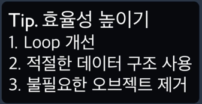
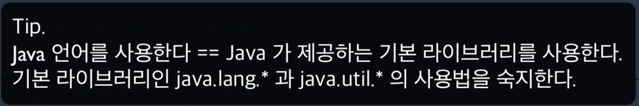

# 프로그래머스 커뮤러닝

## 기지국 설치 문제 풀이

그리디 문제이다.



문제링크: https://programmers.co.kr/learn/courses/10302/lessons/62946

```java
import java.util.LinkedList;
import java.util.Queue;

public class Solution {

    public int solution(int n, int[] stations, int w) {
        int answer = 0;
        Queue<Integer> sq = new LinkedList<>();
        for (int s : stations) {
            sq.offer(s);
        }
        int position = 1;
        while (position <= n) {
            if (sq.isEmpty() && sq.peek() - w <= position) {
                position = sq.poll() + w + 1;
            } else {
                position += w * 2 + 1;
                answer += 1;
            }
        }
        return answer;
    }
}
```

위 코드의 경우 효율성 테스트를 통과하지 못한다.   
보통 루프에서 이러한 원인이 발생한다.   
현재 루프는 기지국을 설치할 아파트를 전파 범위를 뛰어가며 탐색하므로 시간상으로 줄일 수 없다.   
시간을 단축할 수 있는 요소는 `primitive` 타입이 아닌 `object`타입이 사용중인 코드를 수정하는 것이다.

따라서 queue가 아닌 station의 index를 이용하는 방법이 있다.

```java
public class Solution {

    public int solution(int n, int[] stations, int w) {
        int answer = 0;
        int si = 0;
        int position = 1;
        while (position <= n) {
            if (si < stations.length && stations[si] - w <= position) {
                position = stations[si] + w + 1;
                si++;
            } else {
                answer += 1;
                position += w * 2 + 1;
            }
        }
        return answer;
    }

}
```

`object` 타입을 사용했던 부분을 `primitive` 타입을 사용하게끔 바꾼 코드이다.  
이를 통하여 효율성 테스트까지 통과할 수 있었다.

## 가장 큰 수 문제풀이

정렬문제이다  


문제 링크: https://programmers.co.kr/learn/courses/10302/lessons/62948  
숫자 배열을 문자로 변환하고, 이를 내림차순 정렬한 후 다시 조합하는 방식으로 해결한다.

```java
class Solution {

    public String solution(int[] numbers) {
        String[] strNums = new String[numbers.length];

        for (int i = 0; i < numbers.length; i++) {
            strNums[i] = "" + numbers[i];
        }

        for (int i = 0; i < strNums.length; i++) {
            for (int j = i + 1; j < strNums.length; j++) {
                String s1 = strNums[i];
                String s2 = strNums[j];
                if ((s1 + s2).compareTo(s2 + s1) < 0) {
                    strNums[i] = strNums[j];
                    strNums[j] = s1;
                }
            }
        }

        String answer = "";
        for (String s : strNums) {
            answer += s;
        }
        if (answer.charAt(0) == '0') {
            return "0";
        }
        return answer;
    }
}
```

위 코드는 정확성 테스트에서도 시간초과가 발생한다.  
무한루프 or 제한 시간을 초과한 경우이다.
`sort`가 `bubble sort`라서 너무 느린가? 이를 `quick sort`로 개선해야 되나? 등의 고민을 해본다.   
자바 라이브러리가 제공하는 `Arrays.sort()`를 사용해보는 것을 고려한다.

### 코드 보수하기 - 1 -

```java
class Solution {

    public String solution(int[] numbers) {
        String[] strNums = new String[numbers.length];

        for (int i = 0; i < numbers.length; i++) {
            strNums[i] = "" + numbers[i];
        }

        Arrays.sort(strNums, new Comparator<String>() {
            public int compare(String s1, String s2) {
                return (s1 + s2).compareTo(s2 + s1);
            }
        });

        String answer = "";
        for (String s : strNums) {
            answer += s;
        }
        if (answer.charAt(0) == '0') {
            return "0";
        }
        return answer;
    }
}
```

`Arrays.sort()`를 사용하되, `Comparator`를 이용하여 정렬 기준을 설정한다.

이제 코드를 더 보기좋고 간결하게 만들어보자

Java 8 부터는 람다를 사용할 수 있으므로

```
    Arrays.sort(strNums,new Comparator<String>(){
        public int compare(String s1,String s2){
            return (s1+s2).compareTo(s2+s1);
        }
    });
```

의 경우

```java
    Arrays.sort(strNums,(s1,s2)->(s2+s1).compareTo(s1+s2));
```

로 간결하게 개선할 수 있다.

또한

```java
    if(answer.charAt(0)=='0'){
    return"0";
    }
```

부분은

```java
    if(answer.startsWith("0"){
    return"0";
    }
```

과 같이 작성하는 것을 더 권장한다.

### 코드 보수하기 - 2 -

스트림을 이용하여 위의 코드들을 더 간결하게 만들어보자

```java
class Solution {

    public String solution(int[] numbers) {
        String answer = IntStream.of(numbers)
            .mapToObj(String::valueOf)
            .sorted((s1, s2) -> (s2 + s1).compareTo(s1 + s2))
            .collect(Collectors.joining());

        if (answer.startsWith("0") {
            return "0";
        }
        return answer;
    }
}
```

## 예산 문제

이분탐색 문제이다.  
기존에 올라와 있던 문제가 변경되어   
문제링크: https://programmers.co.kr/learn/courses/10302/lessons/62949   
새로운 문제를 풀게 되었다.

정해진 전체 국가예산에 대하여  
각 지방이 요청하는 예산 배열을 인자로 받아 문제의 조건에 맞는 상한액을 구하는 문제이다.

이분탐색의 경우 몇문제를 풀어보긴 했었는데.. 아직 잘 모르겠어서 큰일이다.

```java
import java.util.Arrays;

class Solution {

    public int solution(int[] budgets, int M) {
        Arrays.sort(budgets);

        long sum = 0;

        for (int b : budgets) {
            sum += b;
        }
        if (sum <= M) {
            return budgets[budgets.length - 1];
        }

        int answer = 0;
        int start = 0;
        int end = budgets[budgets.length - 1];
        int mid;
        while (start <= end) {
            sum = 0;
            mid = (start + end) / 2;

            for (int i = 0; i < budgets.length; i++) {
                if (budgets[i] < mid) {
                    sum += budgets[i];
                } else {
                    sum += mid;
                }
            }
            if (sum > M) {
                end = mid - 1;
            } else {
                start = mid + 1;
                answer = Math.max(answer, mid);
            }
        }
        return answer;
    }
}
```

아주 Trash같이 정말 문제만 간신히 푼듯한 풀이이다.

## 숫자 게임 문제

시뮬레이션 문제이다

문제링크: https://programmers.co.kr/learn/courses/10302/lessons/62947

```java
import java.util.Arrays;

class Solution {

    public int solution(int[] A, int[] B) {
        Arrays.sort(B);

        int answer = 0;
        for (int i = 0; i < A.length; i++) {
            for (int j = 0; j < B.length; j++) {
                if (A[i] < B[j]) {
                    answer++;
                    B[j] = 0;
                    break;
                }
            }
        }
        return answer;
    }

}
```

이중 루프로 인하여 효율성 테스트를 통과하지 못한다.

A와 B모두 오름차순한 후 루프를 거꾸로 돌면서 서로 큰값을 비교한다.

```java
class Solution {

    public int solution(int[] A, int[] B) {
        Arrays.sort(A);
        Arrays.sort(B);

        int index = B.length - 1;

        int answer = 0;
        for (int i = A.length - 1; i >= 0; i--) {
            if (A[i] < B[index]) {
                index--;
                answer++;
            }
        }
        return answer;
    }
}
```

여기 까지는 강사님의 풀이이고

```java
import java.util.Arrays;


class Solution {

    public int solution(int[] A, int[] B) {
        Arrays.sort(A);
        Arrays.sort(B);

        int i = 0;
        int j = 0;
        int answer = 0;
        while (i != A.length && j != B.length) {
            if (A[i] < B[j]) {
                answer++;
                i++;
            }
            j++;
        }
        return answer;
    }
}
```

내 풀이는 정렬한 것 까지는 똑같은데

루프를 큰 수 부터 돈다는 거가 익숙하지 않아서

순서대로 비교를 하되, A의 수보다 큰 B의 수가 발견할 때까지 index를 점점 올리다가

발견하게 되면 answer값을 증가시키는 풀이를 작성하였었다.

두 풀이 모두 복잡도는 동일하므로 크게 신경쓸 문제는 아닌 것 같다.

