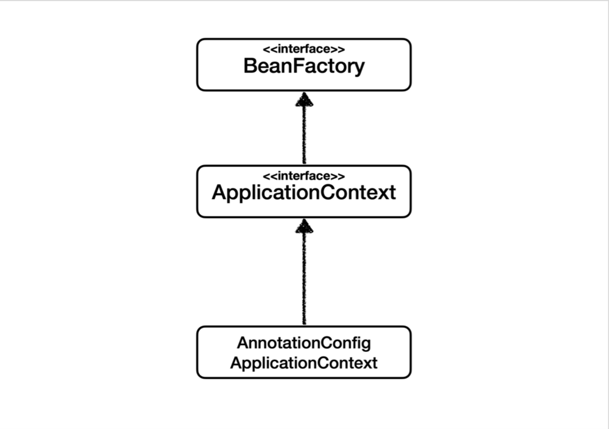
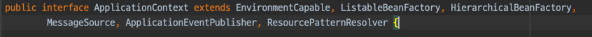
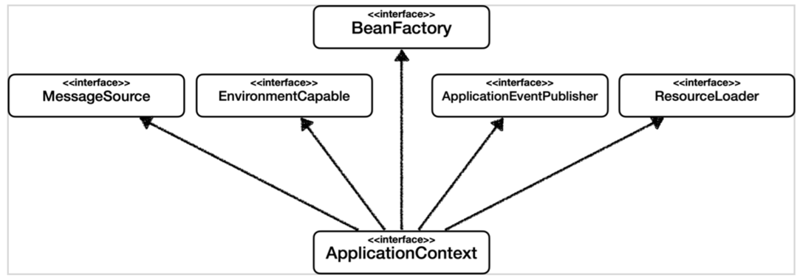
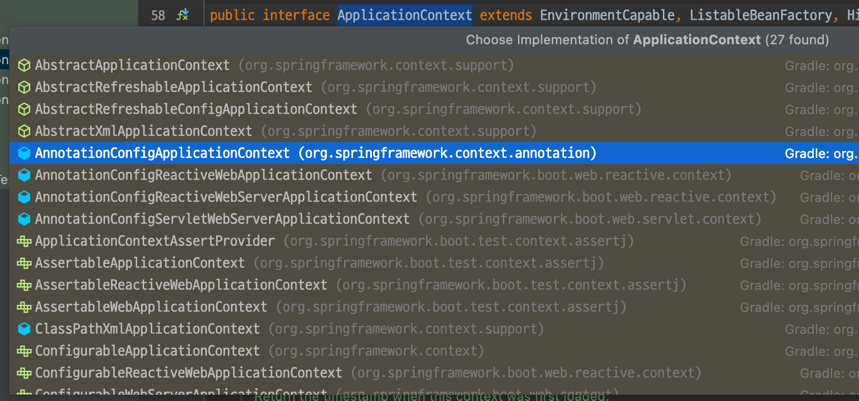
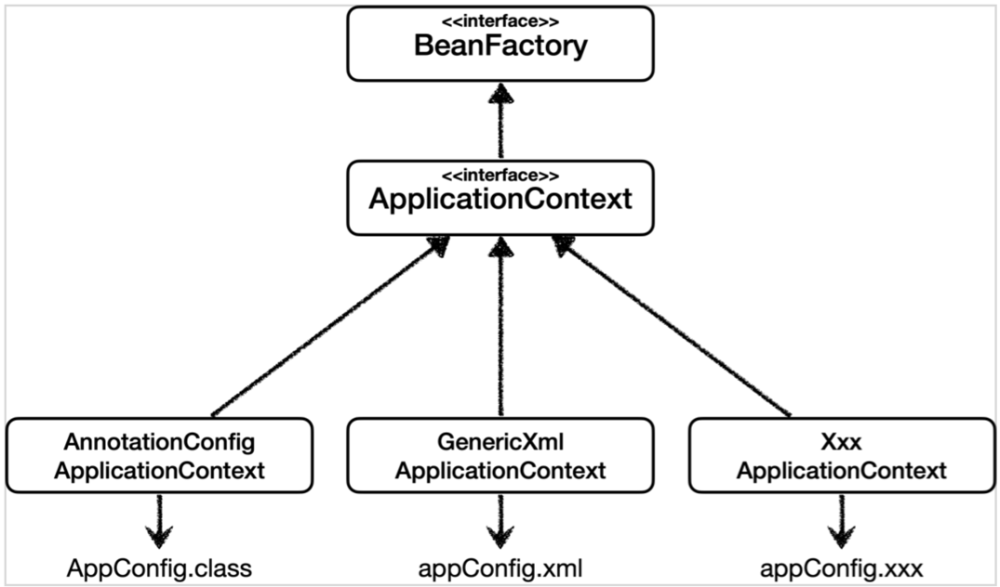
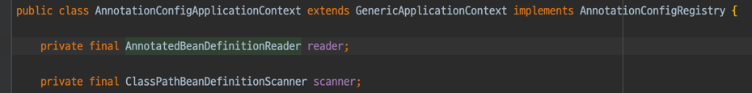
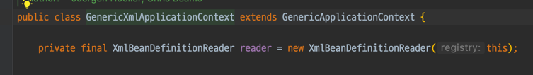
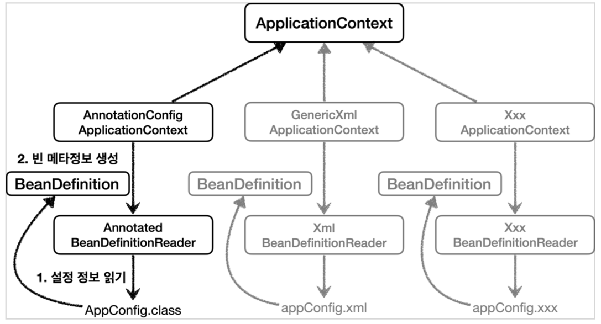
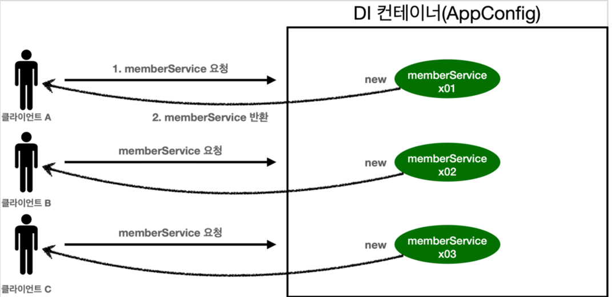
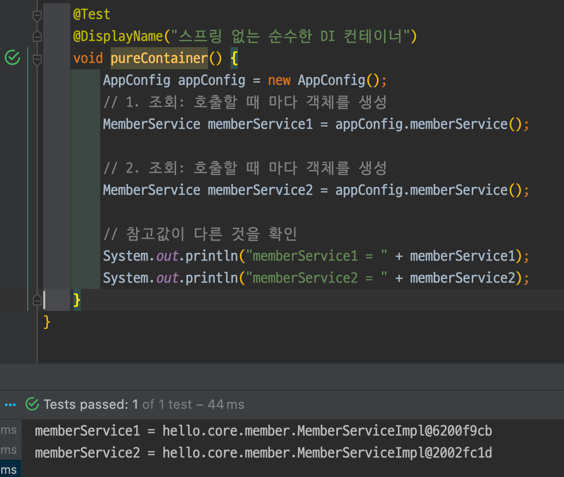

# 스프링 핵심 원리 - 기본편

## Section 4. 스프링 컨테이너와 스프링 빈

### 4.5 스프링 빈 조회 - 상속 관계 (30강)

- 대원칙: 부모 타입으로 조회하면, 자식 타입도 함께 조회한다.
- `Object`타입으로 조회하면, 모든 스프링 빈을 조회한다.

Object 타입으로 빈 조회시   
프로젝트 내부의 빈만이 아니라 스프링 프레임워크의 빈들도 모두 조회된다.

#### 정리
  - 빈 조회는 순수 자바 어플리케이션에서 스프링 컨테이너를 생성했을 때 필요한 기능이다.
  - 대원칙을 잘 알아두면 나중에 **자동 의존 관계 주입**시에 문제 없이 진행이 가능하다.

### 4.6 BeanFactory와 ApplicationContext(31강)

- `BeanFactory`
  - 29강에서 다루었던 빈 조회와 같은 기능들을 `BeanFactory`에서 제공한다.
  - 이 외에도 다른 기능들도 많이 제공한다.
- `ApplicaionContext`
  - BeanFactory의 기능을 모두 수행하는 것 뿐만 아니라 다른 부가 기능도 제공한다.
    
    
  - MessageSource: 국제화 기능(접속 지역에 따른 언어 제공)
  - EnvironmentCapable: 환경변수(로컬, 테스트 서버(개발환경), 운영 환경)들을 구분하는 기능
  - ResourcePatternResolver extends ResourceLoader: 리소스를 추상화, 편의성 제공

- 정리
  - BeanFactory나 ApplicationContext를 스프링 컨테이너라 한다.

### 4.7 다양한 설정 형식 지원 - 자바 코드, XML(32강)

ApplicationContext를 구현한 여러 구현체들

설정 정보 형식들

- AnnotationConfig
  - 지금 까지 계속 사용하던 것
- XML
  - `xml` 설정 파일을 넘기면 된다.

java코드가 아닌 파일들은 `resources`에 넣으므로 `appConfig.xml`도 여기에 생성한다.

xml기반 설정은 자바코드 기반 설정과 크게 다를게 없다.

#### 정리

- 스프링은 여러 설정 정보를 이용할 수 있을정도로 유연하다

### 4.8 스프링 빈 설정 메타 정보 - BeanDefinition(33강)

- 스프링이 다양한 설정 형식을 지원할 수 있는 이유
  - `BeanDefinition`이라는 추상화의 역할
- 스프링 컨테이너는 xml, 자바 코드를 통해 만든 `BeanDefinition` 을 읽는다
- `BeanDefinition`을 **설정 메타 정보** 라고 한다.
  - `@Bean`, `<bean>`당 하나의 메타 정보가 생성된다.
- 스프링 컨테이너는 메타 정보를 기반으로 스프링 빈을 생성한다.

- `AnnotationConfigApplicationContext`는 `AnnotatedBeanDefinitionReader`를 사용해서
- `AppConfig.class` 를 읽고 `BeanDefinition` 을 생성한다.

- `GenericXmlApplicationContext` 는 `XmlBeanDefinitionReader` 를 사용해서
- `appConfig.xml` 설정 정보를 읽고 `BeanDefinition` 을 생성한다.

`...ApplicationContext`는 각각의 `...BeanDefinitionReader`를 이용하여 `BeanDefinition`을 생성한다.

- `BeanDefinition`은 더 알아보기로 한다.

## Section 5. 싱글톤 컨테이너

싱글톤 패턴과 관련된 그 거.  

싱글톤 패턴: 객체 인스턴스가 JVM 안에 딱 하나 있는 패턴.

### 5.1 웹 애플리케이션과 싱글톤(34강)

현재 방식은 클라이언트의 요청이 올 때 마다 새로운 객체가 생성이 되는 방식이다.

요청할 때마다 새로운 객체가 생성된 것을 확인할 수 있다.
메모리 낭비가 심하다.

이를 생성된 객체 인스턴스를 공유하는 방식으로 해결할 수 있다.

