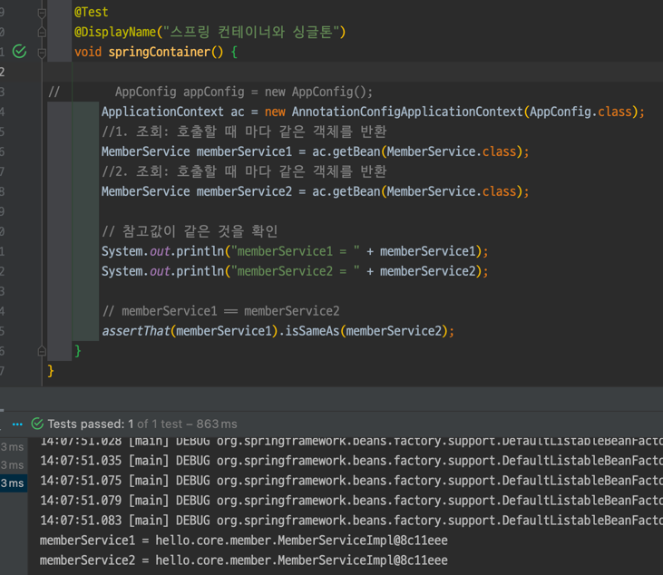
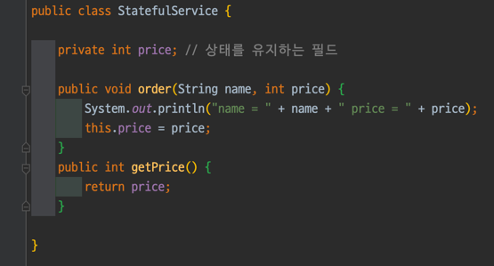
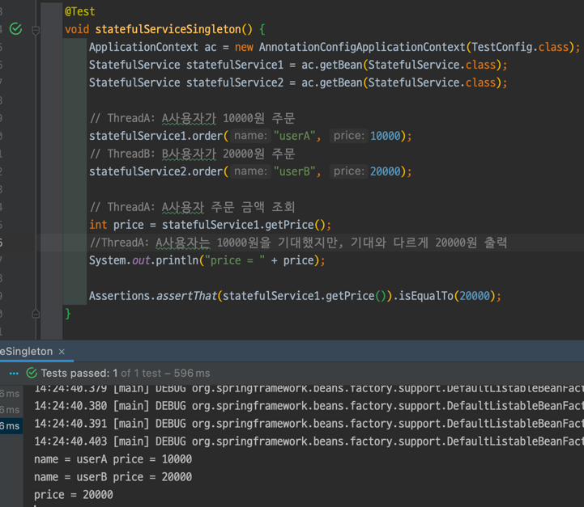
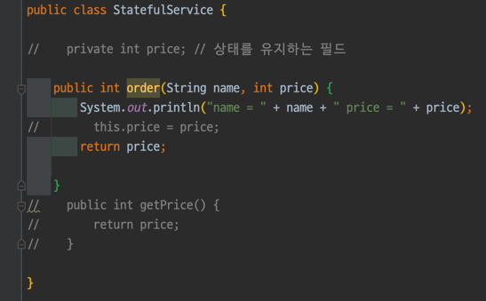
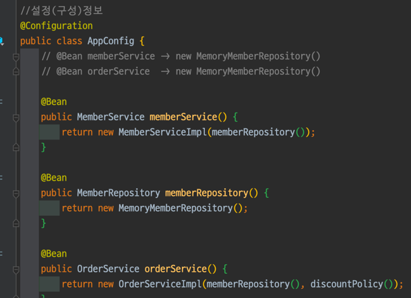
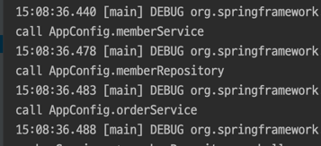

# 스프링 핵심 원리 - 기본편

## Section 5. 싱글톤 컨테이너

### 5.2 싱글톤 패턴(35강)

- 싱글톤 패턴: 클래스 인스턴스가 딱 1개만 생성되는 것을 보장하는 디자인 패턴
  - 인스턴스가 2개 생성되는 것을 막는다.
  - `private`생성자를 이용하여 외부에서 new 키워드를 사용하지 못하게 한다.

```java
public class SingletonService {

    private static final SingletonService instance = new SingletonService();


    public static SingletonService getInstance() {
        return instance;
    }

    private SingletonService() {

    }

    public void logic() {
        System.out.println("싱글톤 객체 로직 호출");
    }

}
```

- `static` 영역에 `private static final` 제어자를 이용하여 `instance` 생성한다.
  - `private static final ... instance = new ...();`
- `instance`가 필요하면 `getInstance()` 메서드를 통해서만 조회 할 수 있다.
  - `getInstance()`는 항상 같은 인스턴스를 반환한다.
- `private` 생성자를 통하여 외부에서 `new` 키워드로 객체 인스턴스가 생성되는 것을 막는다.

#### 싱글톤 패턴 테스트


- `isSameAs(...)`는 자바에서의 `==` 과 같다. 즉, 인스턴스이므로 주소가 같은지 비교한다.
- `isEqualTo(...)`는 자바에서의 `equals`와 같다. 즉, 내용을 비교한다.

#### 싱글톤 패턴의 문제점

- DIP,OCP 위반 가능성
- 테스트가 어렵고 유연성이 떨어짐

등의 단점을 스프링 컨테이너가 해결하는 모습을 지켜보자

#### 정리

- 싱글톤이란 무엇인지?
- 객체를 미리 생성해두는 방법이 가장 단순하고 안전한 방법이다.(위에 사용한 방법)

### 5.3 싱글톤 컨테이너(36강)

스프링 컨테이너는 빈 이름과 빈 객체를 싱글톤으로 생성하여 관리한다.

한

동일한 `memberService`를 반환하는 것을 볼 수 있다.

#### 정리

- 스프링은 싱글톤 방식으로 동작한다.(99.9%)
- 빈 스코프에서는 싱글톤 방식이 아닌 내용 나온다

### 5.4 싱글톤 방식의 주의점(37강)

싱글톤 패턴이나 싱글톤 컨테이너를 사용할 때 발생하는 문제점

**무상태**로 설계해야 한다.




웹에서 요청이 오면 쓰레드가 할당이 된다.   
예시의`StatefulService`` `price`는 공유되는 필드이고, 특정 클라이언트가 이 값을 변경한다.  
공유 필드는 조심해야한다. 따라서 무상태로 설계한다.

#### 무상태 설계 예시



`int userAPrice = statefulService1.order("userA", 10000);`

공유되지 않는 지역변수를 사용함으로써 이 문제를 해결했다.

#### 정리

공유 필드는 진짜 조심해야 된다.

스프링빈은 항상 무상태(stateless)로 설계하자.

### 5.5 @Configuration과 싱글톤(38강)

@Configuration은 싱글톤을 위한 것이다.

`AppConfig`를 살펴보자



2개의 `MemoryMemberRepository`가 생성되는 것 처럼 보인다.

싱글톤이 유지될까?

#### ConfigurationSingletonTest


분명 스프링 빈이 호출하여 `new`를 통하여 객체를 만들거라 생각했지만,   
결과는 모두 같은 인스턴스가 조회가 된다.

#### AppConfig에 호출 로그를 남겨보자

`AppConfig`에서 `soutm` 단축키를 이용한다.

`System.out.println("call AppConfig....");`를 각각의 `Bean`에 추가해주었다.

결과는?



각각 한번씩만 호출이 되었다!

#### 정리

뭐 어떻게 된건지 모르겠다.   
다음강의에서 확인해보자

### 5.6 @Configuration과 바이트코드 조작의 마법(39강)

순수하게 자바에서 돌아가던 것과는 다르기 때문에 마법이다.

스프링 컨테이너는 싱글톤 레지스트리이다.  
스프링 빈이 싱글톤이 되게 만들어주어야 한다.

#### configurationDeep 테스트

`AnnotationConfigApplicationContext`에 파라미터로 넘긴 값은 스프링 빈으로 등록된다.   
따라서 `AppConfig`또한 스프링 빈이 된다.

`AppConfig`의 클래스 정보를 출력하면   
`class hello.core.AppConfig$$EnhancerBySpringCGLIB$$a0a682f5` 이 나오는데,   
이는 평범한 클래스라면 `class hello.core.AppConfig`라고 나왔을 텐데 차이가 있다.

스프링이 빈에 등록할 때, CGLIB이라는 바이트 코드 조작 라이브러리를 통하여  
`AppConfig`를 상속한 다른 클래스를 스프링 빈으로 등록한 것이다.

참고 https://github.com/cglib/cglib/blob/master/cglib/src/main/java/net/sf/cglib/beans/BeanGenerator.java

   
이녀석이 메서드 시그니처(메서드 이름 + 매개변수 리스트)를 비교하여   
있으면 스프링 컨테이너에서 찾아서 반환하고,  
없으면 스프링 빈을 생성하여 스프링 컨테이너에 등록하는 방식으로 작동하는 것 같다.

superclass(부모)를 찾고 뭐하고 한다.

#### @Configuration을 지우면?

IDE가 경고를 바로 준다. `@Bean`이 직접적으로 호출 됐다고   
싱글톤이 유지되지 않는다.

뒤에서 `@Autowired` 스프링의 자동 의존관계 주입을 통해 처리할 수도 있긴하다.

#### 정리

- 싱글톤 레지스트리가 뭐지
- `@Bean`을 통해 스프링 빈 등록이 가능하지만 싱글톤을 보장하지 않는다.
- 스프링 설정 정보는 `@Configuration` 쓰자

# 모던 자바 인 액션 - 자바 스터디 공부

책을 읽기전에 본 영상 https://www.youtube.com/watch?v=PzxV-bmLSFY

스프링과 서블릿의 비동기 웹 기술은 클라이언트 커넥션 하나 당 쓰레드를 하나씩 강제로 할당한다.   
요청이 많이 들어오면 커넥션 풀이 꽉 차거나 서버의 자원을 소모해버려서 성능이 급격히 저하되거나,    
레이턴시는 높아지고 처리율은 떨어지는 '쓰레드 헬' 현상이 발생한다.

따라서, 이러한 형상을 방지하기 위해서 기존의 모놀리식 아키텍처가 아닌,    
여러 백엔드 서버를 API를 통해 호출하고, 그 결과를 조합해서 만들어내는 MSA구조 방식으로 서버를 만들게 되었다.

## [Part. V] Chapter.15 CompletableFuture와 리액티브 프로그래밍 컨셉의 기초

### 15.1 동시성을 구현하는 자바 지원의 진화

`CompletableFuture`와 `java.util.concurrent.Flow`의 궁극적인 목표는 가능한한 동시에 실행할 수 있는 독립적인 태스크를 가능하게 만들면서
멀티코어 또는 여러 기기를 통해 제공되는 병렬성을 쉽게 이용하는 것이다.

#### 15.1.1 스레드와 높은 수준의 추상화

병렬 스트림 반복은 명시적으로 스레드를 사용하는 것에 비해 높은 수준의 개념이다.   
스트림을 이용해 스레드 사용 패턴을 추상화할 수 있다.

#### 15.1.2 Executor와 스레드 풀

- 스레드의 문제
  - 자바 스레드는 직접 운영체제 스레드에 접근한다.
- 스레드 풀 장단점
  - skip

# 인터넷 Seraching - CompletableFuture란?

1. 각종 메서드
2. 기본적인 사용방법
3. 다른 Executor 넘기기
4. thenApply vs thenCompose
5. 에러 핸들링

진행중

# 토비의 스프링 3.1

## 8장 스프링이란 무엇인가?

스프링의 사상과 가치, 그리고 적용된 원칙은 무엇인가?

### 8.1 스프링의 정의

스프링의 기본적인 특징
> 자바 엔터프라이즈 개발을 편하게 해주는 오픈소스 경량급 애플리케이션 프레임워크

- 애플리케이션 프레임워크
  - 일반적인 프레임워크는 애플리케이션의 특정 계층에서 주로 동작하는 한 가지 기술 분야에 집중된다.
  - 스프링은 애플리케이션 전 영역을 포괄하는 범용적인 프레임 워크이다.
  - 애플리케이션의 전 영역을 관통하는 일관된 프로그래밍 모델과 핵심 기술을 바탕으로 한다.

- 경량급
  - EJB와 같이 과도한 엔지니어링이 적용된 기술이 아니다.

- 자바 엔터프라이즈 개발을 편하게
  - 엔터프라이즈 개발의 복잡함을 제거한다
    - 복잡하고 실수하기 쉬운 로우레벨 기술에 많은 신경을 쓰지 않아도 된다.
    - 애플리케이션의 핵심인 사용자의 요구사항, 즉 비즈니스 로직 구현에 집중할 수 있다.

- 오픈소스

### 8.2 스프링의 목적

스프링의 개발 철학과 궁극적인 목표

엔터프라이즈 개발을 편하게 하기. 원래 엔터프라이즈 개발은 편하지 않다.

#### 8.2.1 엔터프라이즈 개발의 복잡함

복잠함의 근본적인 원인

- 기술적인 제약조건과 요구사항이 늘어간다.
  - 비즈니스 로직 구현 외에도 기술적으로 고려할 사항이 많다.

- 엔터프라이즈 애플리케이션이 구현해야할 핵심기능인 비즈니스 로직의 복잡함이 증가한다.
  - 엔터프라이즈 시스템 변경에 용이해야 한다.

#### 8.2.2 복잡함을 해결하려는 도전

비즈니스 로직의 복잡함을 다루기 위한 방법과 기술적인 복잡함을 처리하는 방법이 다르다.   
성격이 서로 다른 이 두가지 복잡함을 분리하는 것이 급선무이다.

스프링과 마찬가지로 EJB도 복잡함의 분리에는 성공했지만, EJB라는 틀을 강제함으로써 더 큰 복잡함을 낳았다.

반면, 스프링은 비침투적인 방식을 채택했다.   
스프링은 스프링의 적용 사실이 코드에 직접 반영되지 않는다.

#### 8.2.3 복잡함을 상대하는 스프링의 전략

1. 기술적 복잡함을 상대하는 전략

- 서비스 추상화
  - 로우레벨 기술 구현부와 기술을 사용하는 인터페이스를 분리한다.
  - 환경과 세부 기술에 독립적인 접근(Access) 인터페이스를 제공한다.

- AOP
  - 기술관련 코드를 별도의 모듈로 관리할 수 있게 한다.

2. 비즈니스와 애플리케이션 로직의 복잡함을 상대하는 전략

- 비즈니스 로직은 애플리케이션 안에서 처리하도록 한다.
- 핵심 로직을 다루는 코드는 OOP인 자바에게 맡긴다.

3. 핵심 도구: 객체지향과 DI

- DI는 오브젝트 설계의 결과물이지만, DI를 적용하다 보면 객체지향 설계의 원칙을 따르고 장점을 살릴 수 있다.

