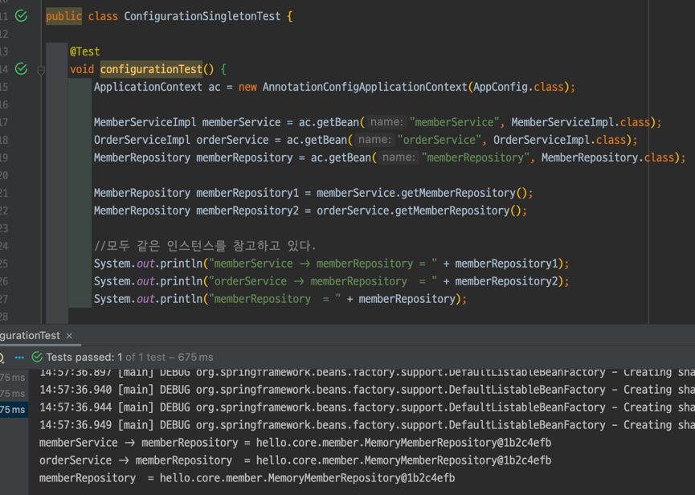

# 개요

## 스프링 핵심 원리 - 기본편

### Section 5. 싱글톤 컨테이너

#### 5.2 싱글톤 패턴(35강)

- 싱글톤 패턴: 클래스 인스턴스가 딱 1개만 생성되는 것을 보장하는 디자인 패턴
  - 인스턴스가 2개 생성되는 것을 막는다.
  - `private`생성자를 이용하여 외부에서 new 키워드를 사용하지 못하게 한다.

```java
public class SingletonService {

    private static final SingletonService instance = new SingletonService();


    public static SingletonService getInstance() {
        return instance;
    }

    private SingletonService() {

    }

    public void logic() {
        System.out.println("싱글톤 객체 로직 호출");
    }

}
```

- `static` 영역에 `private static final` 제어자를 이용하여 `instance` 생성한다.
  - `private static final ... instance = new ...();`
- `instance`가 필요하면 `getInstance()` 메서드를 통해서만 조회 할 수 있다.
  - `getInstance()`는 항상 같은 인스턴스를 반환한다.
- `private` 생성자를 통하여 외부에서 `new` 키워드로 객체 인스턴스가 생성되는 것을 막는다.

##### 싱글톤 패턴 테스트


- `isSameAs(...)`는 자바에서의 `==` 과 같다. 즉, 인스턴스이므로 주소가 같은지 비교한다.
- `isEqualTo(...)`는 자바에서의 `equals`와 같다. 즉, 내용을 비교한다.

##### 싱글톤 패턴의 문제점

- DIP,OCP 위반 가능성
- 테스트가 어렵고 유연성이 떨어짐

등의 단점을 스프링 컨테이너가 해결하는 모습을 지켜보자

##### 정리

- 싱글톤이란 무엇인지?
- 객체를 미리 생성해두는 방법이 가장 단순하고 안전한 방법이다.(위에 사용한 방법)

#### 5.3 싱글톤 컨테이너(36강)

스프링 컨테이너는 빈 이름과 빈 객체를 싱글톤으로 생성하여 관리한다.


동일한 `memberService`를 반환하는 것을 볼 수 있다.

##### 정리

- 스프링은 싱글톤 방식으로 동작한다.(99.9%)
- 빈 스코프에서는 싱글톤 방식이 아닌 내용 나온다

#### 5.4 싱글톤 방식의 주의점(37강)

싱글톤 패턴이나 싱글톤 컨테이너를 사용할 때 발생하는 문제점

**무상태**로 설계해야 한다.


웹에서 요청이 오면 쓰레드가 할당이 된다.   
예시의`StatefulService`` `price`는 공유되는 필드이고, 특정 클라이언트가 이 값을 변경한다.  
공유 필드는 조심해야한다. 따라서 무상태로 설계한다.

##### 무상태 설계 예시


`int userAPrice = statefulService1.order("userA", 10000);`

공유되지 않는 지역변수를 사용함으로써 이 문제를 해결했다.

##### 정리

공유 필드는 진짜 조심해야 된다.

스프링빈은 항상 무상태(stateless)로 설계하자.

#### 5.5 @Configuration과 싱글톤(38강)

@Configuration은 싱글톤을 위한 것이다.

`AppConfig`를 살펴보자


2개의 `MemoryMemberRepository`가 생성되는 것 처럼 보인다.

싱글톤이 유지될까?

##### ConfigurationSingletonTest



분명 스프링 빈이 호출하여 `new`를 통하여 객체를 만들거라 생각했지만,   
결과는 모두 같은 인스턴스가 조회가 된다.

##### AppConfig에 호출 로그를 남겨보자

`AppConfig`에서 `soutm` 단축키를 이용한다.

`System.out.println("call AppConfig....");`를 각각의 `Bean`에 추가해주었다.

결과는?


각각 한번씩만 호출이 되었다!

##### 정리

뭐 어떻게 된건지 모르겠다.   
다음강의에서 확인해보자

#### 5.6 @Configuration과 바이트코드 조작의 마법(39강)

순수하게 자바에서 돌아가던 것과는 다르기 때문에 마법이다.

스프링 컨테이너는 싱글톤 레지스트리이다.  
스프링 빈이 싱글톤이 되게 만들어주어야 한다.

##### configurationDeep 테스트

`AnnotationConfigApplicationContext`에 파라미터로 넘긴 값은 스프링 빈으로 등록된다.   
따라서 `AppConfig`또한 스프링 빈이 된다.

`AppConfig`의 클래스 정보를 출력하면   
`class hello.core.AppConfig$$EnhancerBySpringCGLIB$$a0a682f5` 이 나오는데,   
이는 평범한 클래스라면 `class hello.core.AppConfig`라고 나왔을 텐데 차이가 있다.

스프링이 빈에 등록할 때, CGLIB이라는 바이트 코드 조작 라이브러리를 통하여  
`AppConfig`를 상속한 다른 클래스를 스프링 빈으로 등록한 것이다.

참고 https://github.com/cglib/cglib/blob/master/cglib/src/main/java/net/sf/cglib/beans/BeanGenerator.java

   
이녀석이 메서드 시그니처(메서드 이름 + 매개변수 리스트)를 비교하여   
있으면 스프링 컨테이너에서 찾아서 반환하고,  
없으면 스프링 빈을 생성하여 스프링 컨테이너에 등록하는 방식으로 작동하는 것 같다.

superclass(부모)를 찾고 뭐하고 한다.

##### @Configuration을 지우면?

IDE가 경고를 바로 준다. `@Bean`이 직접적으로 호출 됐다고   
싱글톤이 유지되지 않는다.

뒤에서 `@Autowired` 스프링의 자동 의존관계 주입을 통해 처리할 수도 있긴하다.

##### 정리

- 싱글톤 레지스트리가 뭐지
- `@Bean`을 통해 스프링 빈 등록이 가능하지만 싱글톤을 보장하지 않는다.
- 스프링 설정 정보는 `@Configuration` 쓰자

## 모던 자바 인 액션 - 자바 스터디 공부

### [Part. V] Chapter.15 CompletableFuture와 리액티브 프로그래밍 컨셉의 기초

