# 스프링 핵심 원리 - 기본편

## Section 6. 컴포넌트 스캔

### 6.1 컴포넌트 스캔과 의존관계 자동 주입 시작하기(40강)

등록해야할 빈이 늘어나고, 설정 정보의 크기도 커지기 시작하면 누락이 되거나, 반복 작업량이 늘어난다.

스프링은 설정 정보가 없어도 스프링 빈을 자동으로 등록하는 컴포넌트 스캔 기능을 제공한다.  
또한 의존 관계도 `@Autowired` 기능을 통해 자동으로 주입할 수 있다.

#### 사전 세팅

기존의 `AppConfig.java`는 비교를 위해 남겨두고 `AutoAppConfig.java`를 만든다.
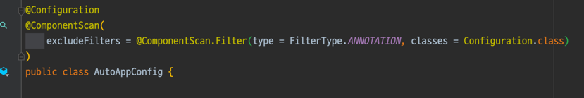     
컴포넌트 스캔에서 기존의 `AppConfig.java`를 스캔하지 않도록 필터를 설정한다.

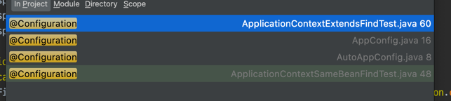

`@Configuration`이 붙은 설정 정보들이 있는 클래스들이 3개나 있었다.  
작성했던 코드들을 유지하고 컴포넌트 스캔의 효과를 알아보기 위해 `excludeFilters`를 이용했다.

#### 컴포넌트 스캔

본격적으로 컴포넌트 스캔을 알아보자.  
`@Component` 어노테이션이 붙은 클래스를 스캔해서 스프링 빈으로 등록한다.

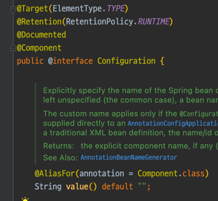

`@Configuration`도 `@Component`어노테이션이 붙어 있기 때문에 컴포넌트 스캔의 대상이다.

MemoryMemberRepository, RateDiscountPolicy 등에 `@Component`어노테이션을 붙여준다.

MemberServiceImpl의 경우엔 `AppConfig`에서 `@Bean`을 통해 직접 설정 정보를 작성하고,  
의존 관계도 직접 명시했다. 생성자에 `@Autowired`를 통해 의존관계를 자동으로 주입한다.

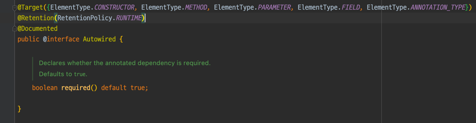

생성자의 여러 의존관계도 주입받을 수 있다.
> `@Autowired`의 대상은 생성자, 메서드, 파라미터, 필드, 어노테이션 타입이다.   
> 추가 공부 해보자

##### AutoAppConfig 테스트

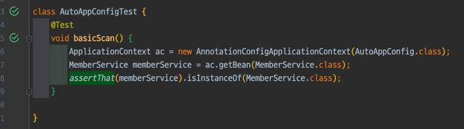

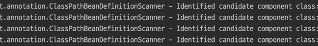

로그에서도 컴포넌트 스캔이 잘 이루어진 것을 볼 수 있다.
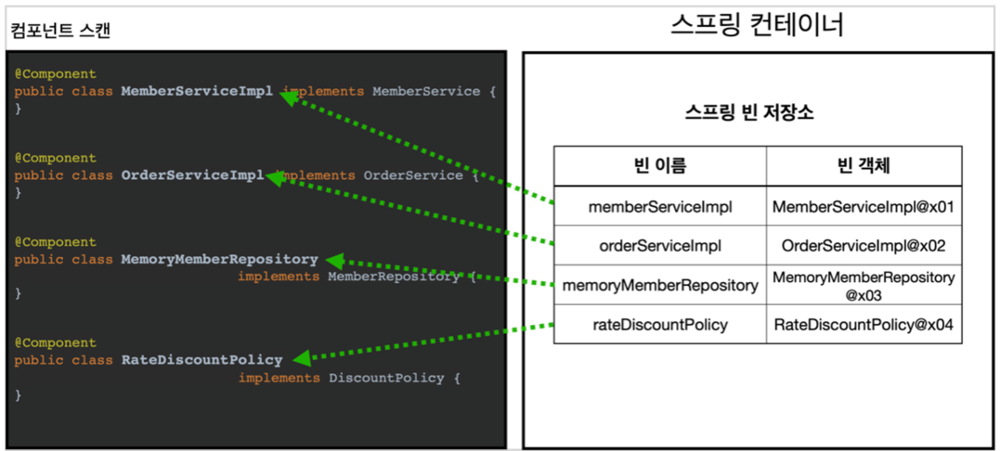

기존 `ApplicationContextInfoTest.java`에서 빈 이름과 빈 객체가 생성 되었는지 확인했던 테스트 코드를 실행해 보려 했는데 이 기능은 설정정보를 XML로
설정했을 때 `getBeanDefinition` 메서드를 사용할 수 있어서 가능했고
`AnnotationApplicationConext`에서는 불가능했다.

### 6.2 탐색 위치와 기본 스캔 대상(41강)

#### 탐색할 패키지의 시작 위치 지정

현재 `AutoAppConfig.java`의 `@ComponentScan`의 default 스캔 범위는 속해있는 패키지다.

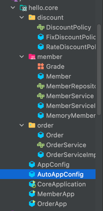

최근의 관례는 설정 정보 클래의 위치를 프로젝트 최상단에 두는 것이다. 스프링 부트를 사용하게 되면 스프링 부트의 시작 정보인 `@SpringBootApplication`를
프로젝트 시작 루트 위치에 둔다. 그림에서는 `CoreApplication.java`이다.

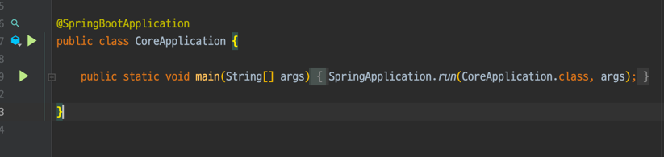

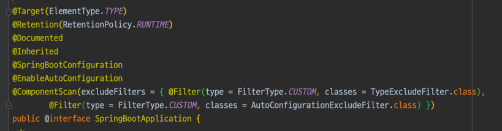

`CoreApplication.java`의 `@SpringBootApplication` 어노테이션을 보면
`@ComponentScan`이 있는 것을 볼 수 있다.

#### 컴포넌트 스캔 기본 대상

- @Component : 컴포넌트 스캔에서 사용
- @Controller : 스프링 MVC 컨트롤러에서 사용 // 현재 프로젝트엔 없다.
  - 스프링 MVC 컨트롤러로 인식
- @Service : 스프링 비즈니스 로직에서 사용
  - 비즈니스 계층을 인식하는데 도움이 된다
- @Repository : 스프링 데이터 접근 계층에서 사용
  - 스프링 데이터 접근 계층으로 인식하고, 데이터 계층의 예외를 스프링 예외로 변환해준다.
- @Configuration : 스프링 설정 정보에서 사용
  - 프링 설정 정보로 인식하고, 스프링 빈이 싱글톤을 유지하도록 추가 처리

### 6.3 필터(42강)

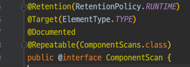

`@ComponentScan` 어노테이션에서 윗 부분을 복사해서 `hello/core/scan/filter/MyIncludeComponent.java`
에 다음과 같이 입력한다.

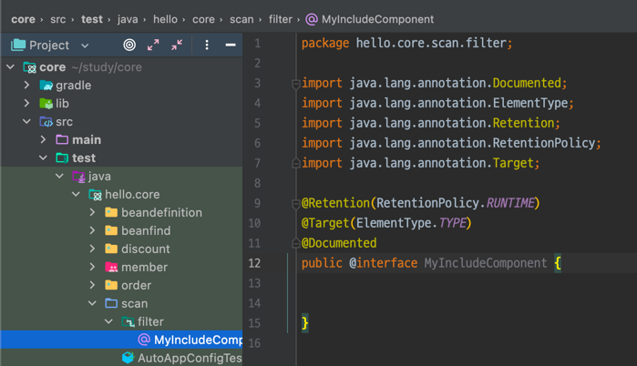

그냥 직관적으로 Include는 포함, Exclued는 제외 한다.

### 6.4 중복 등록과 충돌(43강)

컴포넌트 스캔으로

- 자동 빈 등록 vs 자동 빈 등록
- 수동 빈 등록 vs 자동 빈 등록

과 같은 상황이 발생할 수 있다.

#### 자동 빈 등록 vs 자동 빈 등록 시

`ConflictingBeanDefinitionException` 발생한다.

#### 수동 빈 등록 vs 자동 빈 등록 시

수동 등록 빈이 자동 등록 빈을 오버라이딩 한다.

`Overriding bean definition for bean 'memoryMemberRepository' with a different definition: replacing`

하지만 최근 스프링부트는
` Consider renaming one of the beans or enabling overriding by setting spring.main.allow-bean-definition-overriding=true`
같이

오류를 발생시킨다.

---

# 운영체제와 정보기술의 원리

## 1장 컴퓨터 및 정보기술의 역사

생략

## 2장 운영체제 개요

### 2.1 운영체제의 정의

운영체제(Operating System)은 컴퓨터 하드웨어 바로 윗단에 설치되는 소프트웨어이다.   
시스템이란 용어는 기반이나 틀이 되는 하드웨어를 지칭할 때 주로 사용되는데, 소프트웨어인 운영체제에 시스템이라는 용어가 사용된 것은 하드웨어가 운영체제와 한 몸이 되어야만
사용자에게 쓰일 수 있는 진정한 컴퓨터 시스템이 되기 때문이다.

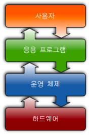

메모리에 상주하는 운영체제의 부분을 커널(kernel)이라고 부르며, 이를 좁은 의미의 운영체제라고 부른다.  
커널은 운영체제 코드 중에서도 핵심적인 부분을 뜻한다.

넓은 의미의 운영체제는 커널뿐 아니라 시스템을 위한 유틸리티들을 광범위하게 포함하는 개념이다.  
이와 같은유틸리티들은 항상 메모리에 올라가 있는 것이 아닌 별도의 프로그램으로서,   
시스템을 위한 유틸리티로 운영체제에 함께 설치되기 때문에 넓은 의미로는 운영체제에 포함시킨다.

### 2.2 운영체제의 기능

컴퓨터의 하드웨어와 사용자 사이에 운영체제가 존재하므로,

- 하드웨어를 위한 역할
- 사용자를 위한 역할

이 있다.

핵심 기능은 컴퓨터 시스템 내의 자원을 효율적으로 관리하는 것이다. 따라서 운영체제를 자원관리자(resource manager)라고 부른다.  
여기서 자원이란 CPU, 메모리, 하드디스크 등 하드웨어 자원과 소프트웨어 자원을 통칭해서 부른다.

### 2.3 운영체제의 분류

동시 작업 지원 여부

- 단일작업(single tasking)용 OS
- 다중작업(multi tasking)용 OS

#### 다중 작업용 운영체제의 개념

운영체제가 다중 작업을 처리할 때 여러 프로그램이 CPU와 메모리를 공유한다.

- CPU는 짧은 시간 규모로 여러 프로그램들이 CPU에서 번갈아 실행된다.
  - 작업시간을 여러 프로그램들이 조금씩 나누어 쓰는 시스템(time sharing system)이라고 한다.
- 메모리의 경우

skip

------- 

### 2.4 운영체제의 예

MS 윈도우와 유닉스

### 2.5 운영체제의 자원 관리 기능

- CPU를 관리하는 방법
  - CPU 스케쥴링(CPU scheduling) 매 시점 어떠한 프로세스에 CPU를 할당해 작업을 처리할 것인지 결정하는 일
    - 대표적 기법으로는 FCFS, 라운드 로빈, 우선순위 기법이 있다.

#### CPU 스케쥴링 기법

- 선입선출(FCFS) 기법
- 라운드 로빈
  - CPU를 한 번 할당받아 사용할 수 있는 시간을 일정하게 고정된 시간으로 제한한다.
- 우선순위 기법
  - CPU 사용을 위해 대기 중인 프로세스들에 우선순위를 부여한다.

#### 효율적인 메모리 관리

내일 마저 보기

