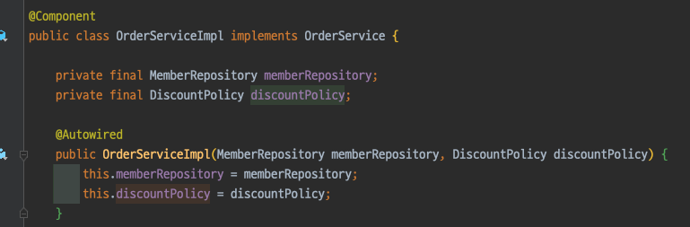
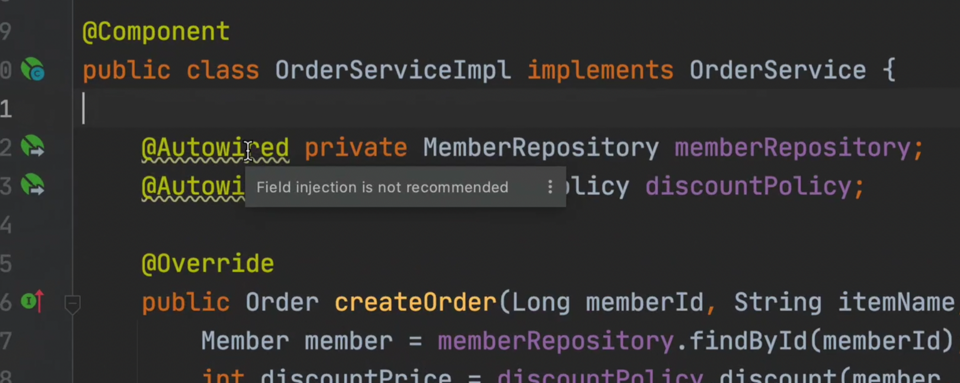
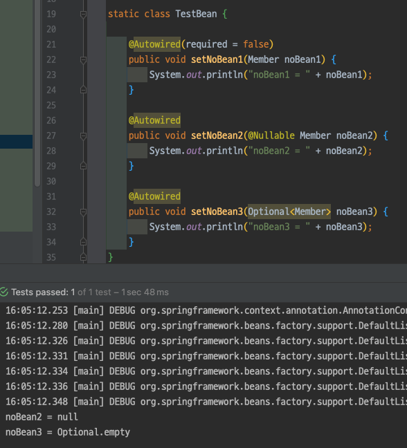
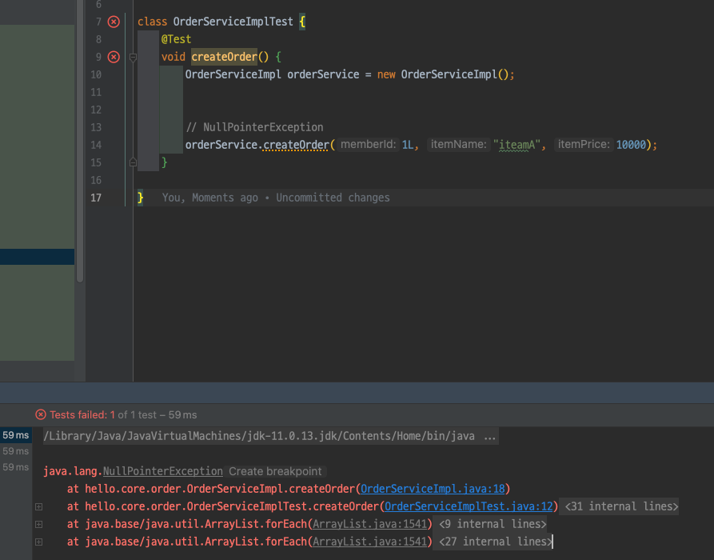
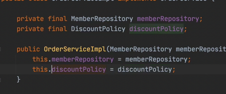
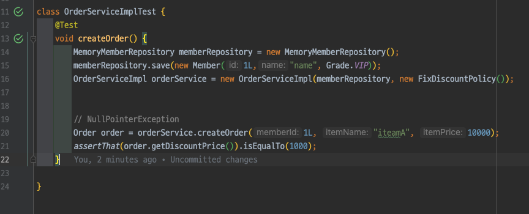
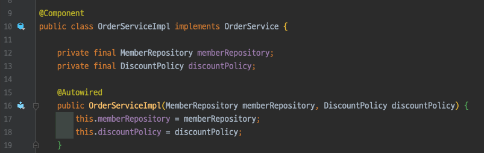
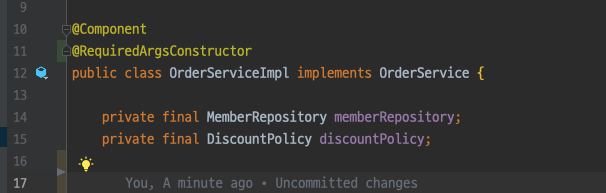
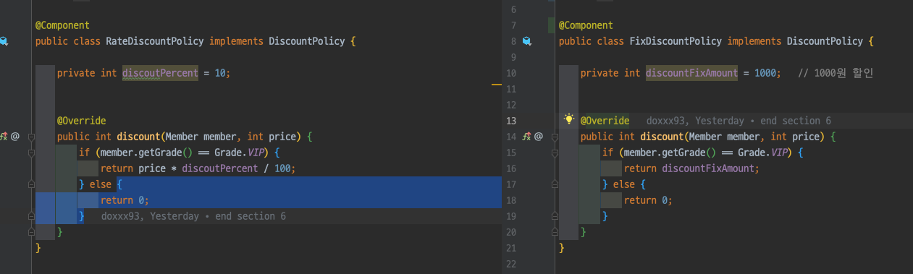
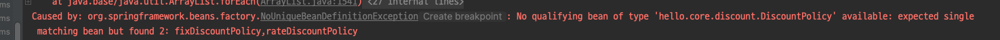

# 스프링 핵심 원리 - 기본편

## Section 7. 의존관계 자동 주입

### 7.1 다양한 의존관계 주입 방법(44강)

의존관계 주입에는 4가지 방법이 있다.

- 생성자 주입
- 수정자 주입(setter 주입)
- 필드 주입
- 일반 메서드 주입

> 토비의 스프링 참고하기
>
> 스프링의 라이프 사이클 = 1. 빈 생성 단계, 2. 의존 관계 주입 단계

#### 생성자 주입

지금 까지 해왔던 방법

##### 특징

- 생성자 호출 시점에 딱 1번만 호출되는 것을 보장한다.
- **불변, 필수** 의존관계에 사용한다.
  - 값을 더이상 바꿀 일 없을 때



`private final`은 반드시 값이 있어야 함을 의미한다.

> 생성자가 단 1개만 있으면 `@Autowired`를 생략해도 자동으로 주입된다.
> 단, 스프링 빈 만 해당된다.

위의 코드에서 `@Autowired`를 생략해도 잘 동작한다.

#### 수정자 주입

setter라 불리는 필드 값을 변경하는 수정자 메서드를 통해서 의존관계를 주입하는 방법

##### 특징

- **선택, 변경** 가능성이 있는 의존관계에 사용
- 자바빈 프로퍼티 규약의 수정자 메서드 방식을 사용하는 방법이다.

##### 참고

자바 빈 프로퍼티 규약.  
자바는 필드의 값을 setXxx, getXxx라는 메서드를 통해서 값을 읽고 수정하는 규칙이 있다.

예시

```java
class Data {

    private int age;

    public void setAge(int age) {
        this.age = age;
    }

    public int getAge() {
        return age;
    }
}
```

#### 필드 주입

필드에 바로 값을 주입하는 방법



인텔리제이가 하지 말랜다.

##### 특징

- 외부에서 변경이 불가능해서 테스트하기 어렵다.
- DI 프레임워크가 없으면 아무것도 할 수 없다.
  - 순수 자바 테스트 코드에서는 `@Autowired`가 동작하지 않는다.
- 애플리케이션의 실제 코드와 관계 없는 테스트 코드
- 스프링 설정을 목적으로 하는 @Configuration 같은 곳에서만 특별한 용도로 사용

#### 일반 메서드 주입

일반 메서드를 통해 주입

### 7.2 옵션 처리(45강)

`@Autowired`는 required 옵션의 기본값이 `true`이다. 따라서 자동 주입 대상이 없으면 오류가 발생한다.

자동 주입 대상을 옵션으로 처리하는 방법은

- `@Autowired(required=false)` : 자동 주입할 대상이 없으면 수정자 메서드 자체가 호출 안됨
- `org.springframework.lang.@Nullable` : 자동 주입할 대상이 없으면 `null`이 입력된다.
- `Optional<>` : 자동 주입할 대상이 없으면 `Optional.empty` 가 입력된다. (JAVA 8)

#### 결과

출력이 잘 되었다.



### 7.3 생성자 주입을 선택해라!(46강)

생성자 주입을 선택해야 하는 이유

#### 수정자 주입 의존 관계를 선택했을 경우



다음과 같이 `NullPointerException`이 발생   
`memberRepository`, `discountPolicy` 모두 의존 관계 주입이 누락되었기 때문이다.

#### 생성자 주입 의존 관계를 선택했을 경우

- 누락 방지




데이터 값이 누락되는 경우 컴파일 오류가 발생하기 때문에, IDE에서 어떤 값을 필수로 주입해야 되는지를 알려준다.

- `final` 키워드

`final` 키워드를 사용했을 때 초기 값 설정하는 경우를 제외하면, 생성자에서만 값을 넣어줄 수 있다.   
나머지 주입 방식은 생성자 이후에 호출 되므로, 필드에 `fianl`
키워드를 사용할 수 없다.

#### 정리

항상 생성자 주입을 선택하고, 가끔 옵션이 필요하면 수정자 주입을 선택해라. 필드 주입은 하지말고.

### 7.4 롬복과 최신 트랜드(47강)

기존의 이와 같은 코드에 롬복을 적용시켜보자



`@RequiredArgsConstructor` 어노테이션은 final이 붙은 필드를 모아서 생성자를 자동으로 만들어준다.    
`@RequiredArgsConstructor` 어노테이션을 통해 훨씬 간결해진 코드를 볼 수 있다.



생성자가 필요한 경우에만 직접 입력한다.

### 7.5 조회 빈이 2개 이상 - 문제(48강)

조회할 빈이 두개 이상일 때 `@Autowired`는 어떻게 될까?

기본적으로 `@Autowired`는 타입(Type)으로 조회 한다.
`DiscountPolicy`의 하위 타입에는 `RateDiscountPolicy`와 `FixedDiscountPolicy`가 있다.



`@Component` 어노테이션을 통해 둘다 스프링 빈으로 선언해보자.

`NoUniqueBeanDefinitionException` 오류가 발생한다. 에러메시지를 보자



하위 타입으로 지정하게 되면 DIP를 위배하고, 유연성이 떨어진다.

# 기타
알고리즘 문제 코드리뷰 이건 내일 마저 작성해서 올리려고 한다.