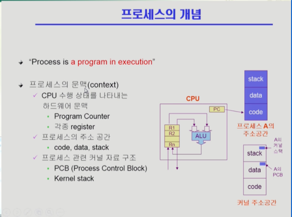
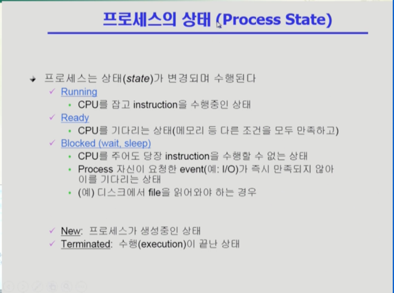
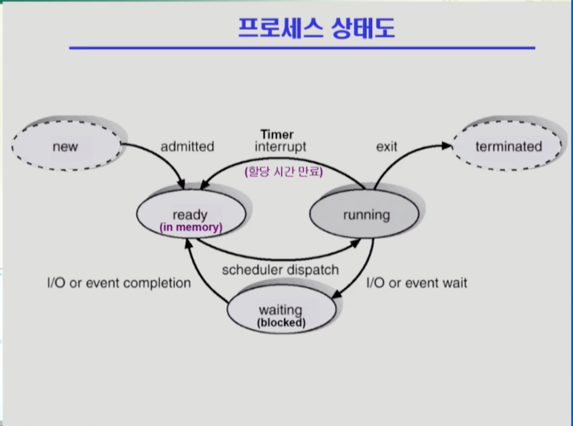

# KOCW 운영체제
## Chapter 3. Process
### 프로세스의 개념

프로세스란 실행 중인 프로그램을 뜻한다.

프로세스를 이해하기 위해서는 프로세스의 문맥을 알아야 한다.

프로세스의 문맥이란  
프로세스가 현재 어떤 상태에서 수행되고 있는지 정확히 규명하기 위해 필요한 정보를 의미한다.

> 전체 내용을 아우르는 그림이라 좀 더 학습이 필요하다. (이해 못했음)

### 프로세스의 상태

일반적으로 CPU는 하나뿐이므로 CPU를 잡고 있는 프로세스는 매 시점 하나뿐이다.

   
- 용어 설명
  - admitted: 메모리 적재
  - scheduler dispatch: CPU 획득
  - exit: 프로세스 종료

