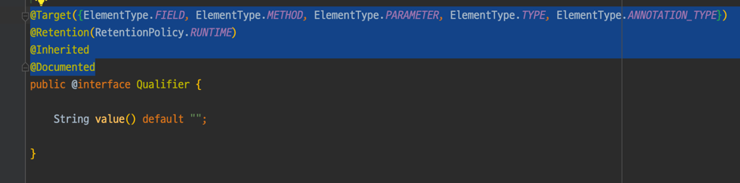
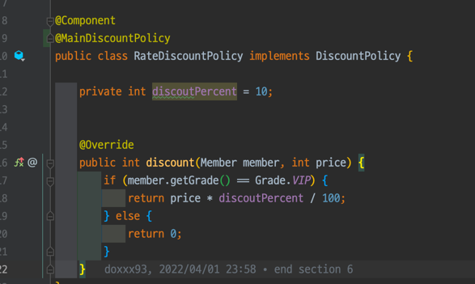

# 스프링 핵심 원리 - 기본편

## Section 7. 의존관계 자동 주입

### 7.6 @Autowired 필드 명, @Qualifier, @Primary(49강)

여러개의 빈이 선택이 될 때의 해결방법에 대해 알아보자

#### @Autowired 필드 명 매칭

1. 타입 매칭
2. 타입 매칭의 결과가 2개 이상일 때 필드 명, 파라미터 명으로 빈 이름 매칭

#### @Qualifier 를 @Qualifier끼리 매칭 -> 빈 이름 매칭

@Qualifier 는 **추가 구분자**를 붙여주는 방법이다.   
주입시 추가적인 방법을 제공하는 것이지 빈 이름을 변경하는 것은 아니다.

1. @Qualifier끼리 매칭
2. 빈 이름 매칭
3. NoSuchBeanDefinitionException 예외 발생

헷갈리면 그냥 쓰지 마라

#### @Primary 사용

편하긴한데 한계가 있다. @Primary 는 우선순위를 정하는 방법이다. 

@Autowired 시에 여러 빈이 매칭되면 @Primary 가 우선권을 갖게된다.

@Qualifier와 다르게 서로 매칭을 할 필요는 없기 때문에 좀 더 편리하다.

#### 우선순위
@Primary 보다 @Qualifier가 더 상세하게 작동한다.    
스프링에서는 자동보단 수동, 넓은 범위의 선택권보다 좁은 범위의 선택권이 우선한다.

### 7.7 어노테이션 직접 만들기(50강)

7.6에서 `@Qualifier("mainDiscountPolicy")`의 "mainDiscountPolicy"는 문자이고,   
컴파일타임에 타입체크가 되지 않는다.


`@Qualifier`의  어노테이션을 복사하여 

```java
@Target({ElementType.FIELD, ElementType.METHOD, ElementType.PARAMETER, ElementType.TYPE, ElementType.ANNOTATION_TYPE})
@Retention(RetentionPolicy.RUNTIME)
@Inherited
@Documented
```

사용자 정의 어노테이션을 만들 수 있다.



스프링이 지원하는 기능이면 굳이 쓰지 말자

### 7.8 조회한 빈이 모두 필요할 때, List, Map(51강)


