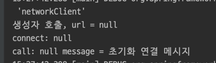

# 스프링 핵심 원리 - 기본편

## Section 8. 빈 생명주기 콜백

### 8.1 빈 생명주기 콜백 시작(53강)

어플리케이션 시작 시점에 미리 어플리케이션 서버와 DB를 연결해두게 된다.   
객체의 초기화와 종료 작업이 필요하다.

`NetworkClient`는 어플리케이션 시작 시점에 `connect()`을 호출하여 연결을 맺고,  
종료 시점에 `disconnect()`를 호출하여 연결을 끊어야 한다.



url 정보 없이 connect가 된다.

#### 스프링빈의 라이프 사이클

> **객체생성** 후 **의존관계 주입**

스프링 빈은 객체를 생성하고, 의존관계 주입이 다 끝난 다음에야 필요한 데이터를 사용할 수 있는 준비가 완료된다.

따라서 초기화 작업은 의존관계 주입이 모두 완료되고 난 다음에 호출해야 한다.

스프링은 초기화 시점을 스프링 빈에게 콜백 메서드를 통해 알려준다.

#### 스프링 빈의 이벤트 라이프사이클

스프링컨테이너생성 - 스프링빈생성 - 의존관계주입 - 초기화콜백 - 사용 - 소멸전콜백 - 스프링 종료

싱글톤의 예시이다.

- 초기화 콜백: 빈이 생성되고, 빈의 의존관계 주입이 완료된 후 호출
- 소멸전 콜백: 빈이 소멸되기 직전에 호출

> 참고) 객체의 생성과 초기화를 분리하자

- 생성자는 객체를 생성
- 초기화는 무거운 작업을 수행한다.

### 8.2 인터페이스 InitializingBean, DisposableBean(54강)

인터페이스를 통하여 초기화 콜백, 소멸전 콜백을 받는 법을 알아본다.

8.1에서 테스트 클래스를 `implements InitializingBean, DisposableBean` 만든다.


스프링의존적이다. 스프링 초창기 방법이다.

### 8.3 빈 등록 초기화, 소멸 메서드(55강)


#### 특징

- 메서드 이름을 자유롭게 설정할 수 있다.
- 스프링 코드에 의존적이지 않다.
- 외부 라이브러리에도 초기화,종료 메서드를 적용시킬 수 있다.

### 8.4 애노테이션 @PostConstruct, @PreDestroy(56강)

그냥 이거 쓰면 된다.


```java
import javax.annotation.PostConstruct;
import javax.annotation.PreDestroy;
```

자바 표준이므로 스프링이 아닌 다른 컨테이너에서 잘 작동한다.

컴포넌트 스캔과도 잘 어울린다.

하지만 외부 라이브러리에 적용이 안되므로 이럴 땐 `@Bean`의 `initMethod`,`destroyMethod`를 쓰면된다.

## Section 9. 빈 스코프

### 9.1 빈 스코프란?(57강)

- 싱글톤: 기본 스코프, 스프링 컨테이너의 시작과 종료까지 유지되는 가장 넓은 범위의 스코프이다.
- 프로토타입: 스프링 컨테이너는 프로토타입 빈의 생성과 의존관계 주입까지만 관여하고 더는 관리하지 않는 매우 짧은 범위의 스코프이다.
- 웹 관련 스코프
  - request: 웹 요청이 들어오고 나갈때 까지 유지되는 스코프이다.
  - session: 웹 세션이 생성되고 종료될 때 까지 유지되는 스코프이다.
  - application: 웹의 서블릿 컨텍스트와 같은 범위로 유지되는 스코프이다.

### 9.2 프로토타입 스코프(58강)

싱글톤 스코프의 빈은 같은 요청이 오면 같은 객체 인스턴스의 스프링 빈을 반환한다.

반면, 프로토타입 빈은 요청시에 빈을 생성하고 의존관계를 주입한다.   
스프링 컨테이너는 생성한 프로토타입 빈을 클라이언트에 반환하고, 관리는 하지 않는다.   
스프링 컨테이너에 같은 요청이 오면 항상 새로운 프로토타입 빈을 생성하여 반환한다.

#### 정리

스프링 컨테이너는 프로토타입 빈을 생성하고, 의존관계 주입, 초기화까지만 처리한다.

관리 책임은 클라이언트에게 있다. `@PreDestroy`같은 종료 메서드 호출이 되지 않는다.

### 9.3 프로토타입 스코프 - 싱글톤 빈과 함께 사용시 문제점(59강)

싱글톤 빈이 프로토타입 빈을 사용하게 된다. 싱글톤 빈은 생성 시점에만 의존관계를 주입 받기때문에  
프로토 타입 빈이 생성 되기는 하지만, 싱글톤 빈과 함께 유지된다.

하지만, 우리는 프로토타입 빈을 주입 시점에만 새로 생성하는게 아니라,  
사용할 때 마다 새로 생성해서 사용하는 것을 원한다.

### 9.4 프로토타입 스코프 - 싱글톤 빈과 함께 사용시 Provider로 문제 해결(60강)

DI까지가 아닌 DL(Dependency Lookup)만이 필요한 경우 `ObjectProvider`를 쓰면 된다.

#### 특징

- `get()` 메서드로 기능이 단순하다.
- 라이브러리가 필요하다
- 자바 표준이다.

#### 정리

프로토타입 빈은 쓸 일은 거의 없다.

프로바이더는 DL이 필요하면 언제든 쓰면 된다.

### 9.5 웹 스코프(61강)

웹 환경에서만 동작한다, 종료 메서드 호출된다.

#### 종류

- request: HTTP 요청 하나가 들어오고 나갈 때 까지 유지되는 스코프, 각각의 HTTP 요청마다 별도의 빈 인스턴스가 생성되고, 관리된다.
- session: HTTP Session과 동일한 생명주기를 가지는 스코프
- application: 서블릿 컨텍스트(`ServletContext`)와 동일한 생명주기를 가지는 스코프
- websocket: 웹 소켓과 동일한 생명주기를 가지는 스코프

### 9.6 request 스코프 예제 만들기(62강)

고객 요청이 오지 않아서 에러가 뜬다.

앞에서 배운 Provider쓸거다!

### 9.6 스코프와 Provider(63강)


requesst생성  
`MyLogger myLogger = myLoggerProvider.getObject();`

request와 uuid를 연결:

```java
    @PostConstruct
    public void init(){
        uuid=UUID.randomUUID().toString();
        System.out.println("["+uuid+"] request scope bean create:"+this);
    }
```

setURL:   
`myLogger.setRequestURL(requestURL);`

log생성(uuid 와 url이 다 있는 상황):   
`myLogger.log("controller test");`

message를 추가하여 출력:

```java
    public void log(String message){
        System.out.println("["+uuid+"]"+"["+requestURL+"] "+message);
    }
```

요청이 섞여도 uuid를 통해 구분하여 각각의 요청에 빈을 할당한다.

### 9.7 스코프와 프록시(64강)

로거의 어노테이션을  
`@Scope(value = "request",proxyMode = ScopedProxyMode.TARGET_CLASS)`  
로 바꾸면

이렇게 하면 MyLogger의 가짜 프록시 클래스를 만들어두고 HTTP request와 상관 없이  
가짜 프록시 클래스를 다른 빈에 미리 주입해 둘 수 있다.

`myLogger.getClass() = class hello.core.common.MyLogger$$EnhancerBySpringCGLIB$$5adb4a8a`

CGLIB라는 라이브러리로 내 클래스를 상속 받은 가짜 프록시 객체를 만들어서 주입한다.   
스프링 컨테이너에 "myLogger"라는 이름으로 진짜 대신에 이 가짜 프록시 객체를 등록한다.   
ac.getBean("myLogger", MyLogger.class) 로 조회해도 프록시 객체가 조회되는 것을 확인할 수 있다.

가짜 프록시 객체는 요청이 오면 내부에서 진짜 빈을 요청하는 위임 로직이 있다.

#### 특징 및 정리

Provider를 사용하든, 프록시를 사용하든 진짜 객체 조회를 꼭 필요한 시점까지 지연처리 한다는 점이다.

꼭 웹 스코프가 아니어도 프록시는 사용할 수 있다.

## Section 10. 다음으로

휴.. 고생했다..

