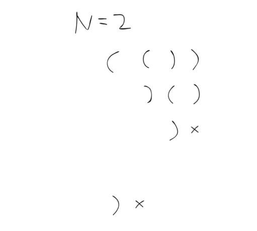
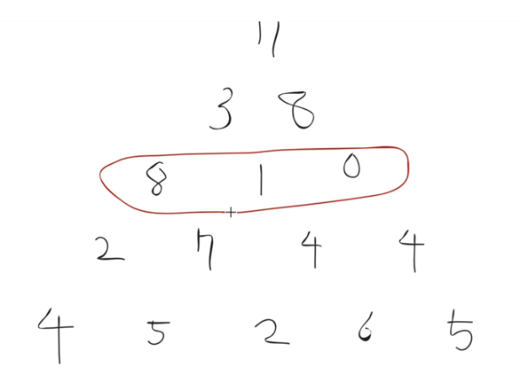

# 프로그래머스 커뮤러닝

## 해시

[프로그래머스 위장](https://programmers.co.kr/learn/courses/30/lessons/42578)

### 문제 분석

이름 보다는 종류가 중요하다.  
미리 종류가 정해져있지 않아서 배열을 여러개 만들어서 종류마다 인덱싱 하는 방법은 적절하지 않다.

따라서 인데스가 아닌 key값을 이용하는 해시를 이용한다.

배열의 특정 인덱스에 접근하기 위해 매번 탐색을 하는 것은 비효율적이므로,   
해시에서는 키 값을 이용한다.

key로 부터 해시 값을 얻어, 해시 값을 인덱스로 이용한다.

해시 값이란, 해시 함수를 통해 얻은 값이다. 해시 함수는 최대한 겹치는 값이 발생하지 않도록    
유니크한 값을 생성하는 함수이다.

해시의 자료구조 구성은 배열, 리스트, 탐색, 해시가 복합적으로 이루어져있다.

### 문제 풀이

```java
class Solution {

    public int solution(String[][] clothes) {
        Map<String, Integer> counts = new HashMap<>();

        // clothe[0]에는 용품의 이름
        // clothe[1]에는 용품의 종류
        //따라서 우리는 clothe[1]만 신경쓰면된다.
        for (String[] clothe : clothes) {
            String type = clothe[1];
            counts.put(type, counts.getOrDefault(type, 0) + 1);
        }

        int answer = 1;
        for (Integer count : counts.values()) {
            answer *= count + 1;
        }
        answer -= 1;

        return answer;
    }
}
```

`counts.put(type, counts.get(type) == null ? 0 : counts.get(type) + 1);`    
위의 코드를    
`counts.put(type, counts.getOrDefault(type, 0) + 1);`   
과 같이 Map의 메서드를 이용하여 간결하게 표현할 수 있다.

### 리팩토링

```java
import java.util.Arrays;
import java.util.HashMap;
import java.util.Map;

class Solution {

    public int solution(String[][] clothes) {
        Map<String, Integer> counts = new HashMap<>();

        int answer = Arrays.stream(clothes) // 모든 옷중에서
            .map(c -> c[1])                 // 1번 인덱스인 종류들만 꺼내서
            .distinct()                     // 중복없이
            .map(type -> (int) Arrays.stream(clothes).filter(c -> c[1].equals(type)).count())
            // 타입을 얻어오는데, 타입에 해당하는 것들만 필터하여 카운트를 얻어오면 
            .map(c -> c + 1)                // 1을 더해서
            .reduce(1, (c, n) -> c * n);    // 누적해서 곱하고

        return answer - 1;                  // 최종값에서 1을 빼어 답을 구할 수 있다.
    }
}
```

## bfs

[프로그래머스 게임 맵 최단거리](https://programmers.co.kr/learn/courses/30/lessons/1844)

### 문제 분석

시작점 위치를 0으로 두고, 좌우상하 갈 수 있는 곳을 가고 1씩 추가.

데이터 값이 어떻게 변화하는지 추적하기 보단, 규칙만을 고려한다.

모든 경우에 똑같이 적용할 수 있는 조건과, 결과 조건을 고려한다.

- 모든 경우 적용할 수 있는 조건
  - 네 방향으로 이동한다.
  - 이동한 후엔 현재 값보다 1증가(거리)
  - 벽, 맵 밖, 왔던 경로는 이동 불가
- 종료 조건
  - 이동 후 위치가 목적지

### 문제 풀이

```java
import java.util.LinkedList;
import java.util.Queue;

class Solution {

    public int solution(int[][] maps) {
        // BFS: Queue
        // 현재 위치를 큐에 적용할 것
        Queue<Position> queue = new LinkedList<>();

        int mapHeight = maps.length;
        int mapWidth = maps[0].length;
        int[][] count = new int[mapHeight][mapWidth];
        boolean[][] visited = new boolean[mapHeight][mapWidth];

        queue.offer(new Position(0, 0));
        count[0][0] = 1;
        visited[0][0] = true;

        while (!queue.isEmpty()) {
            Position current = queue.poll();

            int currentCount = count[current.y][current.x];
            // 4가지 경우
            Position moved = new Position(current + 1, current);
            if (!visited[moved.y][moved.x] && maps[moved.y][moved.x] != 1 && !(moved.x < 0
                || moved.x >= mapWidth || moved.y < 0 || moved.y >= mapHeight)) {
                count[moved.y][moved.x] = currentCount + 1;
                queue.offer(moved);
            }

            queue.offer(new Position(current - 1, current));
            queue.offer(new Position(current, current + 1));
            queue.offer(new Position(current, current - 1));
        }

        int answer = 0;
        return answer;
    }

    class Position {

        int x, y;

    }
}
```

이동 가능한지 체크하는 메서드를 Position 클래스에 생성

```java
import java.util.LinkedList;
import java.util.Queue;

class Solution {

    public int solution(int[][] maps) {
        // BFS: Queue
        // 현재 위치를 큐에 적용할 것
        Queue<Position> queue = new LinkedList<>();

        int mapHeight = maps.length;
        int mapWidth = maps[0].length;
        int[][] count = new int[mapHeight][mapWidth];
        boolean[][] visited = new boolean[mapHeight][mapWidth];

        queue.offer(new Position(0, 0));
        count[0][0] = 1;
        visited[0][0] = true;

        while (!queue.isEmpty()) {
            Position current = queue.poll();

            int currentCount = count[current.y][current.x];
            // 4가지 경우
            final int[][] moving = {{0, -1}, {0, 1}, {-1, 0}, {1, 0}};
            for (int i = 0; i < moving.length; i++) {
                Position moved = new Position(current.x + moving[i][0], current.y + moving[i][1]);
                if (!moved.isValid(mapWidth, mapHeight)) {
                    continue;
                }
                if (visited[moved.y][moved.x]) {
                    continue;
                }
                if (maps[moved.y][moved.x] == 0) {
                    continue;
                }

                count[moved.y][moved.x] = currentCount + 1;
                visited[moved.y][moved.x] = true;
                queue.offer(moved);
            }
        }
        int answer = count[mapHeight - 1][mapWidth - 1];
        if (answer == 0) {
            return -1;
        }

        return answer;
    }

    class Position {

        int x, y;

        public Position(int x, int y) {
            this.x = x;
            this.y = y;
        }

        boolean isValid(int width, int height) {
            if (x < 0 || x >= width) {
                return false;
            }
            if (y < 0 || y >= height) {
                return false;
            }
            return true;

        }

    }
}
```

### 정리

넘 어려움

## DFS

[프로그래머스 올바른 괄호의 갯수](https://programmers.co.kr/learn/courses/30/lessons/12929)

### 문제 분석

비선형 구조 탐색 -> DFS, BFS



- 순서
  - 열리는 괄호 배치
  - 닫히는 괄호 배치
  - 괄호의 개수는 n개 이하 -> 괄호의 개수를 n과 비교하는 과정 필요
  - 열리는 괄호의 개수 > 닫히는 괄호의 개수

### 문제 풀이

DFS는 Stack을 이용하여 푼다.

```java
import java.util.Stack;

class Solution {

    public int solution(int n) {
        int answer = 0;

        Stack<P> stack = new Stack<>();
        stack.push(new P(0, 0)); // 괄호의 개수 0 개부터 시작
        while (!stack.isEmpty()) {

            P p = stack.pop();

            if (p.open > n) {
                continue;
            }
            if (p.open < p.close) {
                continue;
            }

            if (p.open + p.close == 2 * n) {
                answer++;
                continue;
            }

            stack.push(new P(p.open + 1, p.close));
            stack.push(new P(p.open, p.close + 1));

        }

        return answer;
    }

    class P {

        int open, close;

        public P(int open, int close) {
            this.open = open;
            this.close = close;
        }
    }
}
```

## dp

[프로그래머스 정수 삼각형](https://programmers.co.kr/learn/courses/30/lessons/43105)

### 문제 분석

복잡한 문제를 작게 나누었다가 합치는 연산

가장 작은 단위의 삼각형으로 나누어 최대값을 구하는 것을 반복하여,   
마지막 줄에서 최대값을 구한다.



### 문제 풀이

```java
class Solution {

    public int solution(int[][] triangle) {
        int answer = 0;

        for (int i = 1; i < triangle.length; i++) {
            for (int j = 0; j < triangle[i].length; j++) {
                if (j == 0) {
                    triangle[i][j] += triangle[i - 1][j];
                } else if (j == i) {
                    triangle[i][j] += triangle[i - 1][j - 1];
                } else {
                    int left = triangle[i][j] + triangle[i - 1][j - 1];
                    int right = triangle[i][j] + triangle[i - 1][j];
                    triangle[i][j] = Math.max(left, right);
                }

                answer = Math.max(answer, triangle[i][j]);
            }
        }

        return answer;
    }
}
```

왼쪽과 오른쪽 끝값들은 받는 값이 1개씩인 것을 유의하여 반복

반대 방향 풀이

```java
class Solution {

    public int solution(int[][] triangle) {

        for (int i = triangle.length - 2; i >= 0; i--) {
            for (int j = 0; j < triangle[i].length; j++) {

                int left = triangle[i][j] + triangle[i + 1][j];
                int right = triangle[i][j] + triangle[i + 1][j + 1];

                triangle[i][j] = Math.max(left, right);

            }
        }

        return triangle[0][0];
    }
}
```

삼각형은 아래로 갈수록 넓어지기 때문에

아래에서 위로 올라오도록 코드를 짜게되면 더 간결한 코드를 작성할 수 있다.

# 모던 자바 인 액션

## Part I 기초

## Chapter 1 - 자바 8, 9, 10, 11 ： 무슨 일이 일어나고 있는가?

### TBS
- 메모리 모델
- 스레드 풀
- 병렬 실행 컬렉션
- 포크/조인 프레임워크
- RxJava(리액티브 스트림 툴킷)
- 동작 파라미터화
- 익명 클래스
- 함수형 프로그래밍
- 런타임 풋프린트 - C, C++
- WIMP

- Iterator 대신 for-each루프
- 컴퓨팅 클러스터

- 순차 처리방식, 병렬 처리방식


### 메서드 참조
