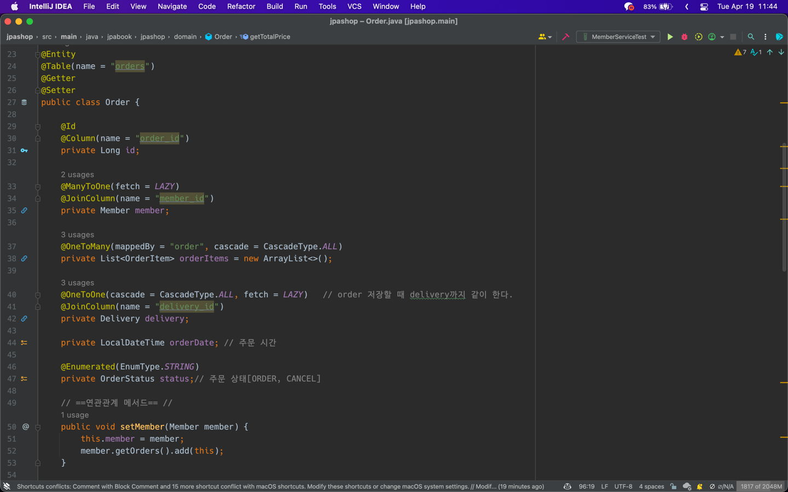

# 실전! 스프링 부트와 JPA 활용1 - 웹 애플리케이션 개발

## Section 5. 상품 도메인 개발

### 5.1 상품 엔티티 개발(비즈니스 로직 추가)(19강)

Exception trace를 위해

Stock Quantity를 외부 로직이 아닌 Item 로직에서 해결하는 것이 가장 OOP적인 방법이다.

### 5.2 상품 리포지토리 개발(20강)

```java

@Repository
@RequiredArgsConstructor
public class ItemRepository {

    private final EntityManager em;

    public void save(Item item) {
        if (item.getId() == null) {
            em.persist(item);
        } else {
            em.merge(item);
        }
    }

    public Item findOne(Long id) {
        return em.find(Item.class, id);
    }

    public List<Item> findAll() {
        return em.createQuery("select i from Item i", Item.class)
            .getResultList();
    }

}
```

### 5.3 상품 서비스 개발(21강)

## Section 6. 주문 도메인 개발

### 6.1 주문, 주문상품 엔티티 개발(22강)

#### 구현 기능

- 상품 주문
  - 회원 선택, 제품 선택, 주문 수량 + 재고 관리 기능
- 주문 내역 조회
- 주문 취소

```java
public class Order {

    public int getTotalPrice() {
        int totalPrice = 0;
        for (OrderItem orderItem : orderItems) {
            totalPrice += orderItem.getTotalPrice();
        }
        return totalPrice;
    }
}
```

람다 or 스트림을 이용하여 다음과 같이 간단하게 표현할 수 있다.
인라인(`return`) 단축키 : `option + command + N`

```java
public class Order {

    public int getTotalPrice() {
        return orderItems.stream().mapToInt(OrderItem::getTotalPrice).sum();
    }

}
```

#### 기능 설명

- 생성 메서드(`createOrder()`): 주문 엔티티를 생성할 때 사용한다.
  - 주문 회원, 배송정보, 주문상품의 정보 를 받아서 실제 주문 엔티티를 생성한다.
- 주문 취소(`cancel()`): 주문 취소시 사용한다.
  - 주문 상태를 취소로 변경하고 주문상품에 주문 취소를 알린다.
  - 만약 이미 배송을 완료한 상품이면 주문을 취소하지 못하도록 예외를 발생시킨다.
- 전체 주문 가격 조회: 주문 시 사용한 전체 주문 가격을 조회한다.
  - 전체 주문 가격을 알려면 각각의 주문상품 가격을 알아야 한다.
  - 로직을 보면 연관된 주문상품들의 가격을 조회해서 더한 값을 반환한다.
    - (실무에서는 주로 주문에 전체 주문 가격 필드를 두고 역정규화 한다.)

### 6.2 주문 리포지토리 개발(23강)

### 6.3 주문 서비스 개발(24강)



- 주문 저장할 때 `Cascade` 옵션으로 `orderItem`과 `delivery`는 자동으로 `persist`
  - 범위를 고려할 것
  - 라이프사이클을 고려할 것

- `@NoArgsConstructor(access = AccessLevel.PROTECTED)`
  - 로직이 아닌 다른 방법을 통한 생성을 방지하여 유지보수를 더 원활하게 할 수 있다.

- 주문(`order()`): 주문하는 회원 식별자, 상품 식별자, 주문 수량 정보를 받아서 실제 주문 엔티티를 생성한 후 저장한다.
- 주문 취소(`cancelOrder()`): 주문 식별자를 받아서 주문 엔티티를 조회한 후 주문 엔티티에 주문 취소를 요청한다.
- 주문 검색(`findOrders()`): `OrderSearch` 라는 검색 조건을 가진 객체로 주문 엔티티를 검색한다.

### 6.4 주문 기능 테스트(25강)

단위테스트를 하는 것이 더 좋다.

DDD의 장점은 엔티티에 비즈니스 로직이 있으므로 테스트 하기 좋음

### 6.5 주문 검색 기능 개발(26강)

JPA에서의 동적쿼리 해결 방법

쿼리의 `where`에 들어가는 녀석들 해결 방법

## Section 7. 웹 계층 개발

### 7.1 홈 화면과 레이아웃(27강)

### 7.2 회원 등록(28강)

### 7.3 회원 목록 조회(29강)

- 엔티티는 핵심 비즈니스 로직만 가지고 있고, 화면을 위한 로직은 없어야 한다.
- 화면이나 API에 맞는 폼 객체나 DTO를 사용하자.
- 그래서 화면이나 API 요구사항을 이것들로 처리하고, 엔티티는 최대한 순수 하게 유지하자.

### 7.4 상품 등록(30강)

### 7.5 상품 목록(31강)

### 7.6 상품 수정(32강)

### 7.7 변경 감지와 병합(merge)(33강)

정말 중요한 내용

변경감지 써라.

병합 동작 방식

- merge()를실행한다.
- 파라미터로 넘어온 준영속 엔티티의 식별자 값으로 1차 캐시에서 엔티티를 조회한다.
  - 만약 1차 캐시에 엔티티가 없으면 데이터베이스에서 엔티티를 조회하고, 1차 캐시에 저장한다.
- 조회한 영속 엔티티( mergeMember )에 member 엔티티의 값을 채워 넣는다.  
  (member 엔티티의 모든 값을 mergeMember에 밀어 넣는다.  
  이때 mergeMember의 “회원1”이라는 이름이 “회원명변경”으로 바뀐다.)
- 영속 상태인 mergeMember를 반환한다.


1. 준영속 엔티티의 식별자 값으로 영속 엔티티를 조회한다.
2. 영속 엔티티의 값을 준영속 엔티티의 값으로 모두 교체한다.(병합한다.)
3. 트랜잭션 커밋 시점에 변경 감지 기능이 동작해서 데이터베이스에 UPDATE SQL이 실행

> 주의: 변경 감지 기능을 사용하면 원하는 속성만 선택해서 변경할 수 있지만,  
> 병합을 사용하면 모든 속성이 변경된다.   
> 병합시 값이 없으면 null 로 업데이트 할 위험도 있다.
> (병합은 모든 필드를 교체한다.)

그냥 `Merge`쓰지마세요.

차라리 `entity`안에 메서드를 만들어라. 아니면 dto라든가.

### 7.8 상품 주문(34강)

### 7.9 주문 목록 검색, 취소(35강)

### 7.10 다음으로(36강)


