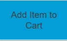

# DDD 시작하기

## 소프트웨어 개발 방법

계획 - 요구사항 분석 - 설계 - 구현(개발) - 테스트 - 오픈

## 도메인

소프트웨어로 해결하고자하는 문제영역

Domain을 추상화 하여 Model, Model을 실체화 하여 소프트웨어

### Domain Model

- Model: 대상 도메인에 대한 추상적 표현으로 소프트웨어로 만들기 위해서 필요
- Domain Model: 도메인 개념을 추상화 한 것
  - 도메인을 이해하기 위한 개념 모델
  - 개발을 위해서는 구현 모델 필요
- Domain object: 도메인 모델을 소프트웨어에서 동작할 수 있도록 나타낸 것

### Ubiquitous language

### Model-Driven Design - tactical design, building block -

- Entity: 식별자를 가지며 영속성이 필요한 객체
- Value Object: 식별자가 없으며 영속성이 필요 없는 객체, 수정할 수 없고 필요한 만큼 복제하여 전달하여 사용
- Service: 특정 엔티티나 값 객체에 속할 수 없는 도메인의 개념 표현,
  - 주로 여러 객체에 걸쳐서 일어나는 행위를 담당하고 상태정보를 관리하지 않음
- Aggregate: 객체의 소유권과 경계를 정의하고 데이터를 변경할 때 하나의 단위로 간주되는 관련된 객체들의 집합
  - 외부에서 접근할 수 있는 창구인 `root`를 가짐
- Factory: 복잡한 객체 생성의 절차를 캡슐화
- Repository: 객체의 저장을 담당, 이미 존재하는 도메인 객체의 참조를 얻는 로직을 캡슐화

- Bounded context: 모델이 적용되는 컨텍스트를 명시적으로 정의.
  - 각 모델을 명확하게 구분하기 위해 가상의 경계선을 둘러 명확하게 분리
  - 분할된 컨텍스트의 특징은 특정한 문맥에 따라 도메인의 요소를 해석
- continuous integration: 모델은 단일화 유지를 위해 지속적으로 통합을 통해 모델단편화 검증
- context map: 분할된 컨텐스트 간의 관계를 표현
- 공유 커널: 양쪽 컨텍스트에서 명확하게 공유되는 부분을 정의하고   
  양쪽 팀이 공동으로 수정에 대한 책임 및 테스트에 대한 책임을 지도록 하는 패턴
- 고객-공급자: 컨텍스트간에 명확하게 공급자-소비자 관계
  - 공급자는 소비자와 적극적으로 협상하고 예산을 투입하여 소비자를 지원
- 순응: 현재 주어진 기능에 순응
- 변질 방지 레이어(Anti-corruption Layer): 한쪽 모델을 다른 모델에서 사용할 수 있도록 번역하고 인터페이스를 제공하여,   
  양쪽 컨텍스트에 어떠한 수정도 없이 컨텍스트 통합
- 분할방식: 접점을 없애고 분할하는 것을 고려 선택
- 오픈 호스트 서비스: 보편적으로 외부에 공개할 만한 서비스들을 모아 `OPEN HOST SERVICE`로 만드는 방안

### 이벤트 스토밍

### Event Sourcing
[마이크로소프트 azure - 이벤트소싱패턴](https://docs.microsoft.com/ko-kr/azure/architecture/patterns/event-sourcing)

### CQRS(Command Query Responsibility Segregation)

상태 변화를 일으키는 Command와 Query를 분리하라

#### Event Sourcing + CQRS

# 마이크로서비스 개발을 위한 Domain Driven Design
[마이크로서비스 개발을 위한 Domain Driven Design](https://www.youtube.com/watch?v=QUMERCN3rZs)

- 주황색: 이벤트를 도출할 때
  - 과거형, 수동형 사용
  - Ubiquitous Language 사용
  - Notification, State transfer

- 파란색: 커맨드
  - 이벤트를 일으키는 트리거

# LeetCode 문제풀이

