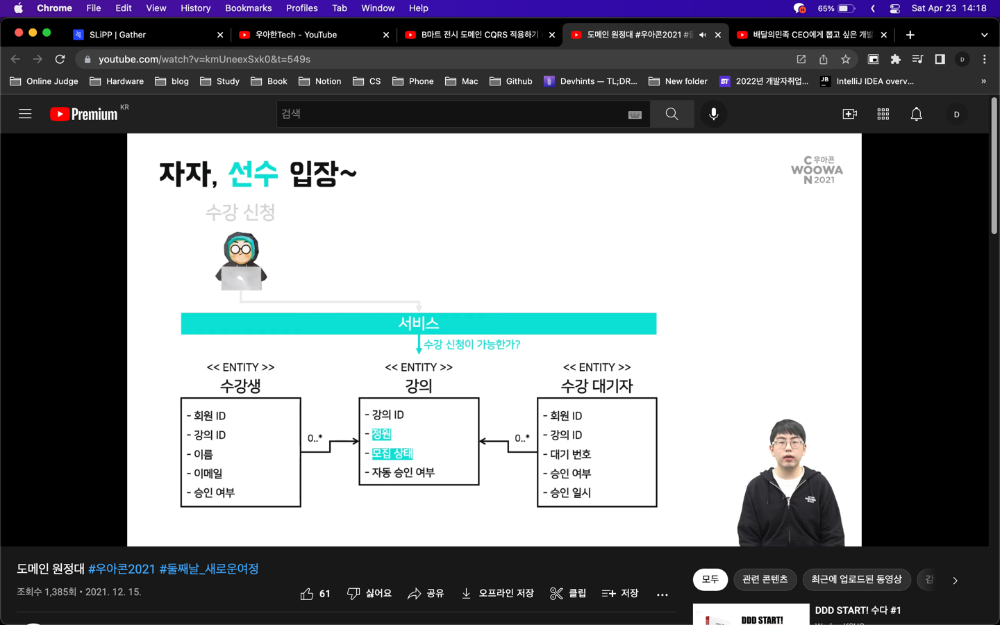

# 도메인 원정대

[도메인 원정대](https://www.youtube.com/watch?v=kmUneexSxk0&t)

## 도메인

## 바운디드 컨텍스트
해결 영역 - 관심사를 분리하고 격리하여 문제 해결에 집중할 범위를 정한다.

## 애그리거트
- 시스템이 기대하는 책임을 수행하며 일관성을 유지하는 단위
- 일관성은 항상 참이어야 하는 속성을 유지함으로써 달성된다.
- 명령을 수행하기 위해 함께 조회하고 업데이트해야하는 최소 단위

### 루트 엔티티
