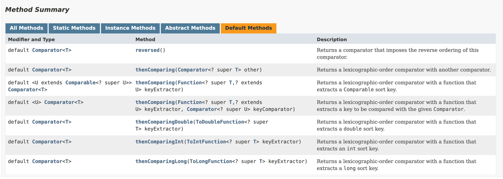

# 모던 자바 인 액션

## Chapter 3. 람다 표현식

### 3.5 형식 검사, 형식 추론, 제약

람다의 실제 형식

#### 3.5.1 형식 검사

```java
public class Lambdas {

    // 1. filter 메서드의 선언을 확인한다.
    public static List<Apple> filter(List<Apple> inventory, ApplePredicate p) {
        // 2. filter 메서드는 두 번째 파라미터로 
        List<Apple> result = new ArrayList<>();
        for (Apple apple : inventory) {
            if (p.test(apple)) {
                result.add(apple);
            }
        }
        return result;
    }
}    
```

### 3.8 람다 표현식을 조합할 수 있는 유용한 메서드

디폴트 메서드로 람다 표현식을 조합할 수 있다.

#### 3.8.1 Comparator 조합


`Comparator` 인터페이스는 `reversed()`, `thenComparing()` 등의 `Default Method`를 갖고있다.

#### 3.8.2 Predicate 조합

`Predicate` 인터페이스는 `and`, `negate`, `or` 세개의 `Default Method`를 갖고있다.

#### 3.8.3 Function 조합

`Function` 인터페이스는 `andThen`, `compose` 두개의 `Default Method`를 갖고있다.

### 3.9 비슷한 수학적 개념

#### 3.9.1 적분

#### 3.9.2 자바 8 람다로 연결

```java
public class Integrate {

    public static void main(String[] args) {
        Integrate integrate = new Integrate();
        double result = integrate.integrate((double x) -> x + 10, 3, 7);
        System.out.println("result = " + result);
    }


    public double integrate(DoubleFunction<Double> f, double a, double b) {
        return (f.apply(a) + f.apply(b)) * (b - a) / 2.0;
    }

    public double integrate(DoubleUnaryOperator f, double a, double b) {
        return (f.applyAsDouble(a) + f.applyAsDouble(b)) * (b - a) / 2.0;
    }
}
```

p.130의 C가 정적 메서드 f를 포함하는 클래스라 가정하면, 메서드 참조를 사용해서 더 간단하게 만들 수 있다.

이거 어떻게 해야할지..?