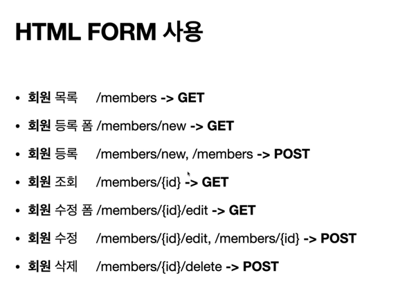
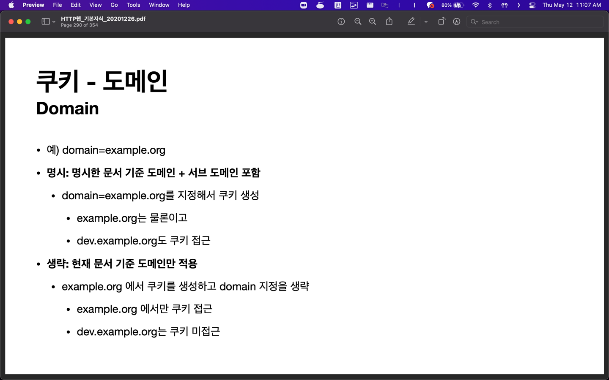
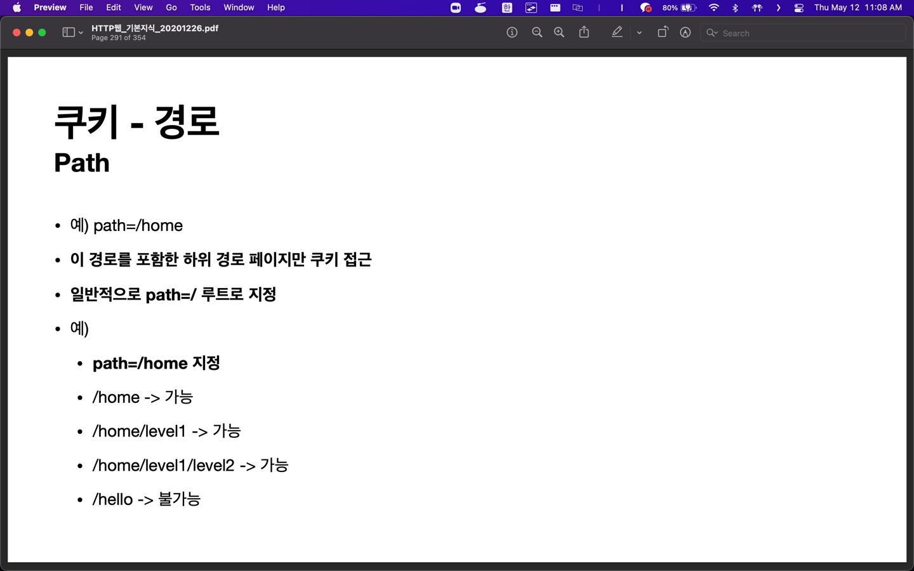
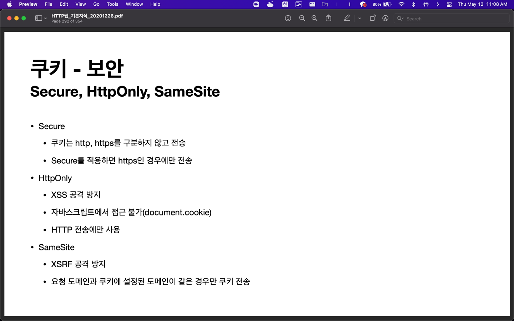

# 모든 개발자를 위한 HTTP 웹 기본 지식

## Section 1. 인터넷 네트워크

### 1.1 인터넷 통신(4강)

인터넷에서 컴퓨터 둘은 어떻게 통신할까?

### 1.2 IP(인터넷 프로토콜)(5강)

신뢰, PORT 없음

### 1.3 TCP, UDP(6강)

### 1.4 PORT(7강)

아파트(IP), 호수(PORT)

### 1.5 DNS(8강)

## Section 2. URI와 웹 브라우저 요청 흐름

### URI(9강)

URI(Uniform Resource Identifier)

- Uniform: 리소스 식별하는 통일된 방식
- Resource: 자원, URI로 식별할 수 있는 모든 것(제한 없음)
- Identifier: 다른 항목과 구분하는데 필요한 정보

URL: Uniform Resource Locator

URN: Uniform Resource Name

### 웹 브라우저 요청 흐름(10강)

## Section 3. HTTP 기본

### 모든 것이 HTTP(11강)

HyperText Transfer Protocol

### 클라이언트 서버 구조(12강)

### Stateful, Stateless(13강)

### 비 연결성(connectionless)(14강)

HTTP 지속 연결(Persistent Connections)로 문제 해결

### HTTP 메시지(15강)

## Section 4. HTTP 메서드

### HTTP API를 만들어보자(16강)

- URI는 리소스 식별이 중요하다.

- 리소스와 행위를 분리한다. 행위는 메서드가 구분한다.

### HTTP 메서드 - GET, POST(17강)

#### GET

#### POST

이 리소스 URI에 POST 요청이 오면 요청 데이터를 어떻게 처리할지 리소스마다 따로 정해야 함

### HTTP 메서드 - PUT, PATCH, DELETE(18강)

#### PUT

리소스를 대체

클라이언트가 리소스를 식별

### HTTP 메서드의 속성(19강)

## Section 5. HTTP 메서드 활용

### 클라이언트에서 서버로 데이터 전송(20강)

- 2가지 데이터 전달 방식
  - 쿼리 파라미터를 통한 데이터 전송
    - GET
    - 주로 정렬 필터(검색어)
  - 메시지 바디를 통한 데이터 전송
    - POST, PUT, PATCH
    - 회원 가입, 상품 주문, 리소스 등록, 리소스 변경

### HTTP API 설계 예시(21강)

API 설계 - POST 기반 등록 - 컬렉션

API 설계 - PUT 기반 등록 - 스토어

HTML FORM 사용

url을 맞추는 걸 선호

https://restfulapi.net/resource-naming/

## Section 6. HTTP 상태코드

### HTTP 상태코드 소개(22강)

### 2xx - 성공(23강)

### 3xx - 리다이렉션1(24강)

영구적 리다이렉션

### 3xx - 리다이렉션2(25강)

일시적 리다이렉션

PRG: Post/Redirect/Get

### 4xx - 클라이언트 오류, 5xx - 서버 오류(26강)

#### 401 Unauthorized

로그인

#### 403 Forbidden

#### 404 Not Found

## Section 7. HTTP 헤더1 - 일반 헤더

### HTTP 헤더 개요(27강)

### 표현(28강)

#### Content-Type

application/json

### 콘텐츠 협상(29강)

### 전송 방식(30강)

### 일반 정보(31강)

### 특별한 정보(32강)

### 인증(33강)

#### Authorization

클라이언트 인증 정보를 서버에 전달

#### WWW-Authenticate

### 쿠키(34강)

## Section 8. HTTP 헤더2 - 캐시와 조건부 요청

### 캐시 기본 동작(35강)

### 검증 헤더와 조건부 요청1(36강)

### 검증 헤더와 조건부 요청2(37강)

### 캐시와 조건부 요청 헤더(38강)

### 프록시 캐시(39강)

### 캐시 무효화(40강)
