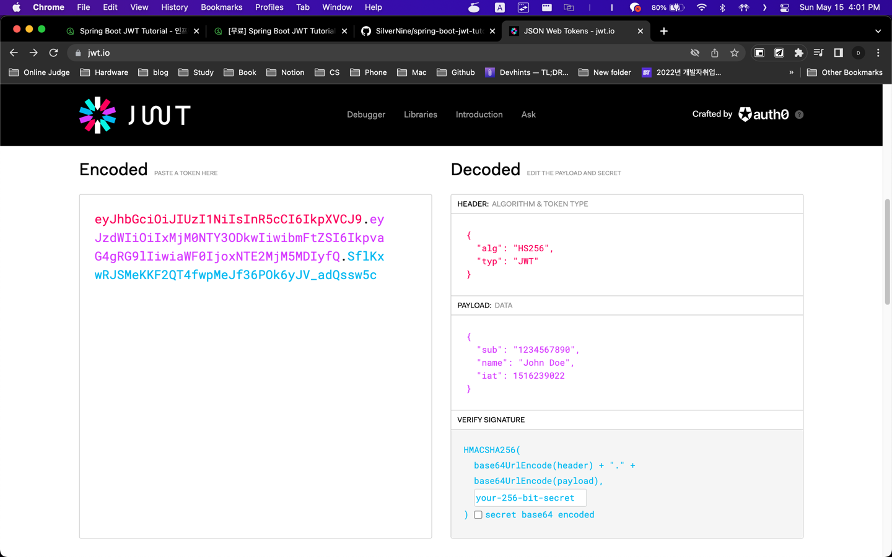

# 모던 자바 인 액션

# 자바 ORM 표준 JPA 프로그래밍 - 기본편

## Section 4. 엔티티 매핑

### 기본 키 매핑(15강)

Long형 + 대체키 + 키 생성전략 사용

#### @Id

#### @GeneratedValue

### 실전 예제 1 - 요구사항 분석과 기본 매핑(16강)

## Section 5. 연관관계 매핑 기초

### 단방향 연관관계(17강)

객체와 테이블 연관관계의 차이

객체의 참조와 테이블의 외래키를 매핑

# Spring Boot JWT Tutorial

[인프런 Spring Boot JWT Tutorial](https://www.inflearn.com/course/%EC%8A%A4%ED%94%84%EB%A7%81%EB%B6%80%ED%8A%B8-jwt/dashboard)

## 1. JWT(JSON Web Token)란

JSON 객체를 사용해서 토큰 자체에 정보를 저장하는 Web Token 입니다.

Header, Payload, Signature 3 개의 부분으로 구성되어 있으며 쿠키나 세션을 이용한 인증보다 안전하고 효율적입니다.

- Header: Signature를 해싱 하기 위한 알고리즘 정보
- Payload: 서버와 클라이언트가 서로 주고 받는 정보
- Signature: 토큰의 유효성 검증을 위한 문자열

### 1.1 장단점

- 장점
  - 중앙 인증 서버, 저장소에 대한 의존성이 없어서 수평 확장에 유리
  - Base64 URL Safe Encoding 이라 URL, Cookie, Header 어떤 형태로도 사용 가능
  - Stateless 한 서버 구현 가능
  - 웹이 아닌 모바일에서도 사용 가능
  - 인증 정보를 다른 곳에서도 사용 가능 (OAuth)

- 단점
  - Payload 의 정보가 많아지면 네트워크 사용량 증가
  - 다른 사람이 토큰을 decode 하여 데이터 확인 가능
  - 토큰을 탈취당한 경우 대처하기 어려움
    - 기본적으로는 서버에서 관리하는게 아니다보니 탈취당한 경우 강제 로그아웃 처리가 불가능
    - 토큰 유효시간이 만료되기 전까지 탈취자는 자유롭게 인증 가능
    - 그래서 유효시간을 짧게 가져가고 refresh token 을 발급하는 방식으로 많이 사용

