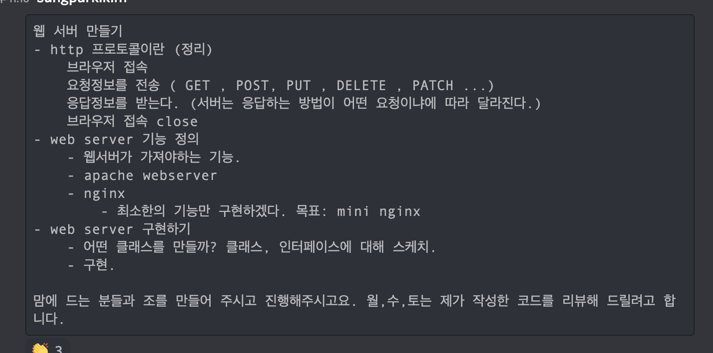

# 웹 서버 만들기
## 개요
- http 프로토콜이란
  - 브라우저 접속
  - 요청정보를 전송 ( GET , POST, PUT , DELETE , PATCH ...)
  - 응답정보를 받는다. (서버는 응답하는 방법이 어떤 요청이냐에 따라 달라진다.)
  - 브라우저 접속 close
- web server 기능 정의
  - 웹서버가 가져야하는 기능.
  - apache webserver
  - nginx
    - 최소한의 기능만 구현하겠다. 목표: mini nginx
- web server 구현하기
  - 어떤 클래스를 만들까? 클래스, 인터페이스에 대해 스케치.
  - 구현

## http 프로토콜
