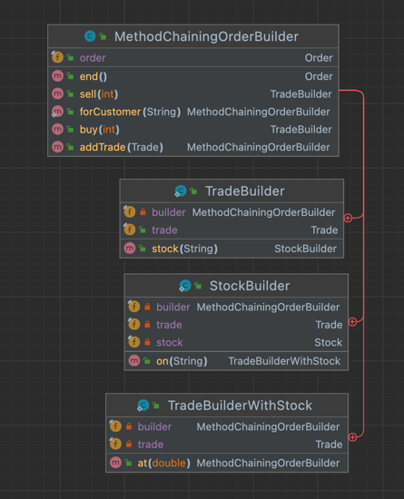
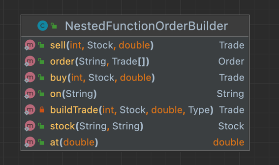
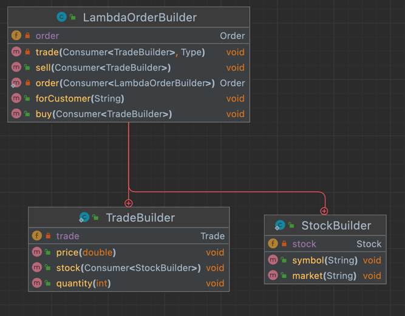
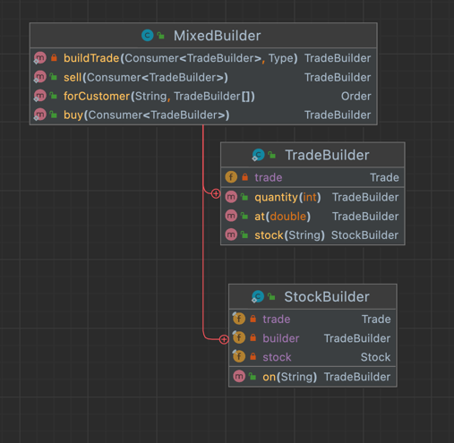

# 모던 자바인 액션

## Chapter 10. 람다를 이용한 도메인 전용 용어

### 이 장에서 다루는 내용

도메인 전용 언어(domain-specific languages, DSL)의 정의와 구성 형식

DSL을 API에 추가할 때의 장단점

JVM에서 활용할 수 있는 자바 기반 클린 DSL

자바 기반 DSL 구현 패턴과 기법

### 들어가며

- DSL을 통하여 애플리케이션 비즈니스 로직을 표현하여
  - 소프트웨어 영역에서 읽기 쉽고, 이해하기 쉬운 코드를 작성할 수 있다.
  - 개발팀과 도메인 전문가가 공유할 수 있는 생산적인 코드를 작성할 수 있다.
  - 결과적으로 버그와 오해를 방지할 수 있다.

- DSL은 특정 도메인을 대상으로 만들어진 특수 프로그래밍 언어이다.
  - 메이븐, 그래들 등은 빌드 과정을 표현하는 DSL
  - HTML은 웹 페이지의 구조를 정의하도록 특화된 DSL

내부적 DSL에서는 적절하게 클래스와 메서드를 노출시켜야한다.

외부적 DSL은 DSL문법 뿐만 아니라 DSL을 평가하는 파서도 구현해야 한다.

### 10.1 도메인 전용 언어

### 10.2 최신 자바 API의 작은 DSL

### 10.3 자바로 DSL을 만드는 패턴과 기법

도메인 모델 정의 후 사용할 DSL을 만드는 패턴을 다룬다.

- 도메인 모델
  - 주어진 시장에 주식 가격을 모델링하는 순수 자바 빈즈
  - 주어진 가격에서 주어진 양의 주식을 사거나 파는 거래(trade
  - 고객이 요청한 한 개 이상의 거래의 주문

#### 10.3.1 메서드 체인

DSL에서 가장 흔한 방식 중 하나이다.

#### 10.3.2 중첩된 함수 이용

다른 함수 안에 함수를 이용해 도메인 모델을 만든다.

m 왼쪽 하단은 NOT NULL 이란 의미이다.

선택 사항 필드가 늘어나면 현재 메서드들을 오버라이드 해서 구현 해야한다.

#### 10.3.3 람다 표현식을 이용한 함수 시퀀싱

10.3.1과 10.3.2 에서 다룬 DSL 형식의 두 가지 장점을 더한다.

메서드 체인 패턴 처럼 플루언트 방식으로 주문을 정의할 수 있고,
중첩 함수 형식 처럼 다양한 람다 표현식의 중첩수준과 비슷하게 도메인 객체의 계층 구조를 유지한다.

#### 10.3.4 조합하기

패턴을 혼용해 가독성 있는 DSL을 만들었지만 여러가지 패턴에 대한 이해가 있어야한다.

#### 10.3.5 DSL에 메서드 참조 사용하기

주문의 총 합에 적용할 세금을 계산하는 기능을 추가한다.

불리언 플래그 집합을 이용한 세금 계산 방법, 플루언트 방식을 이용한 세금 계산 방법을 거친다.

메서드 참조를 이용한 결과는 읽기 쉽고 간결하다.

