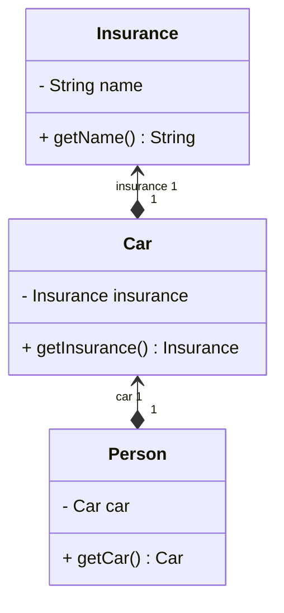
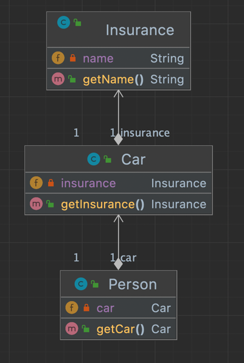
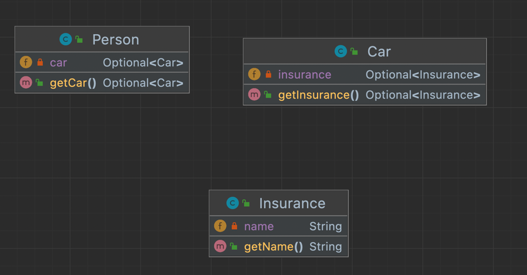

# 모던 자바인 액션

## Chapter 11. null 대신 Optional 클래스


### 11.1 값이 없는 상황을 어떻게 처리할까?

책의 중첩 구조의 UML을 보면 다음과 같다.





`person.getCar().getInsurance().getName()` 의 경우

사람이 차를 소유하지 않음을 null 참조를 반환하는 방식으로 표현한다.

null이 될수 있는 요소가 너무 많다. 어떻게 해결해야할까?

#### 11.1.1 보수적이게 NPE 줄이기

방법1. 변수를 참조할 때 마다(`null`이 나올 수 있는 요소) 중첩 `if`문을 때려박는다.  
이 방법은 가독성과 코드 구조가 망가진다.

방법2. `null` 변수가 있으면 즉시 `return`하게 한다.   
이 방법은 메서드의 출구가 `n`개 생성되어버린다.

값이 없음을 `null`로 표현하지 말자

#### 11.1.2 null 때문에 발생하는 문제

null 참조시 발생할 수 있는 문제들

- 에러의 근원: `NPE`
- 가독성
- 아무 의미가 없다: `null`은 `아무 의미`도 표현하지 않는다. 따라서 값이 없음을 표현하기에 적절하지 않다.
- 자바 철학: 자바는 포인터를 숨겼다.
- 형식 시스템에 구멍을 만든다: `null`이 퍼지기 시작하면 어떤 의미로 사용되었는지 알 수 없어진다.

#### 11.1.3 다른 언어의 예시

스킵

### 11.2 Optional 클래스 소개

위의 예제에 `Optional`을 사용하게 되면 UML 상의 `dependency`도 사라진다


### 11.3 Optional 적용 패턴

Optional로 감싼 값을 실제로 어떻게 사용할 수 있을까

```java
public final class Optional<T> {


    public static <T> Optional<T> of(T value) {
        return new Optional<>(Objects.requireNonNull(value));
    }

    public static <T> Optional<T> ofNullable(T value) {
        return value == null ? (Optional<T>) EMPTY
            : new Optional<>(value);
    }

}

public final class Objects {

    public static <T> T requireNonNull(T obj) {
        if (obj == null)
            throw new NullPointerException();
        return obj;
    }
}
```

- `of()`: null이 아닌 값으로 Optional 만들기
  - `Object`클래스의 `requireNonNull(value)`를 리턴함으로써 값이 `null`이면 `NPE`가 발생한다.

- `ofNullable`: null값으로 Optional 만들기
  - 값이 null이면 Optional 빈값이 반환된다.

#### 11.3.2, 11.3.3 map, flatMap

```java
public class OptionalExample {

    public String getCarInsuranceName(Person person) {
        Optional<Person> optPerson = Optional.of(person);
        Optional<String> name = optPerson.map(Person::getCar) // (1)
// (1) Optional<Person>에 map(Person::getCar) 호출을 시도함. flatMap()을 이용하면 문제가 해결됨.
            .map(Car::getInsurance) // (2)
// (2) Optional<Car>에 map(Car::getInsurance) 호출을 시도함. flatMap()을 이용하면 문제가 해결됨.
            .map(Insurance::getName); //(3)
// (3) Insurance::getName은 평범한 문자열을 반환하므로 추가 "flatMap"은 필요가 없음.            
        return name.orElse("Unknown");
    }
}
```
