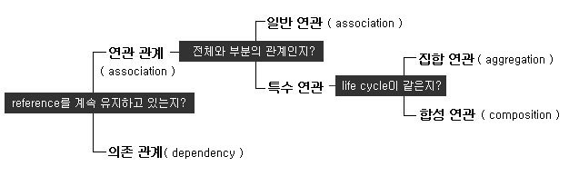

# 오브젝트

[오브젝트 1회차](https://youtu.be/sWyZUzQW3IM?list=PLBNdLLaRx_rI-UsVIGeWX_iv-e8cxpLxS)

## Philosophy: 생각하는 코드의 틀 세가지

### 가치, 원칙, X-Oriented 그리고 패턴

상대주의 - 합리주의를 기반으로

- Value: 보편적 가치
  - Communication
  - Simplicity
  - Flexibility: 유연성을 얻으려면 코드를 간단하게 작성하라.

- Principle: 그룹, 카테고리에 따라서 계층적으로 생성된다. 구성원이 "모두" 지킬 때 가치있다.
  - Local consequences: 변수의 생명주기를 짧게
  - Minimize repetition: 중복의 최소화
  - Symmetry: 짝을 만들어라(Paring, Binary)
  - Convention

모두가 원칙을 지킬 때, 지키지 않은 코드를 즉각적으로 발견하여 비용을 줄일 수 있다.

- X-Oriented
  - OOP

- Pattern: 위의 요소들이 반복적으로 사용됨에 따라 패턴이 발생하고, 그중 Best Practice를 말한다.

로직의 격리 "역할 모델"이 유일하다.

### 역할 모델, 추상화라는 관문

역할 모델에 따른 설계의 격리를 지향하라.

추상화에 대한 대표적인 기법

- Generalization: 일반화 - 수학에서 온 개념. 복잡한 현상을 공식화
- Association: 연관화
- Aggregation: 집단화 - 그룹화, 카테고리

IT에서 사용하게 된다면

- Data abstraction: 데이터적 추상화
  - Modeling: Data Model은 특정 `목표`를 위해 `필요한 것`만 추린 것.
  - Categorization: 카테고리를 통해 인식한다. "~이자, ~이자(역할)"
  - Grouping: Week Combination(약한 결합)

- Procedural abstraction - 절차적 추상화
  - 데이터 처리 방법을 함수에 위임한 것
    - 함수만을 이용하는 C와 같은 언어
  - Generalization: 일반화 - 공통된 역할로 묶는 것 상당히 어렵다
  - Encapsulation: 캡슐화 - 복잡성을 감추고, 추상화된 인터페이스만 노출한다.

  

- OOP abstraction: UML에서 사용할 수 있는 클래스간의 관계
  - Generalization: 인터페이스나 추상 클래스로 표현
  - Realization: 일반화한 것으로부터 파생되어 있는 구상 클래스를 만드는 것
  - Dependency
  - Association
  - ...

_OOP에서는 모든 추상화 기법을 다 사용한다. 그래서 어렵다._

### Timing, 프로그램이 동작하는 시간

프로그래밍의 동작 방식에 대해 알아보자

메모리에 적재가 되어서 실행이 되는 순간부터 프로그램이다.

#### Program & Timing

| Program          | Timing       |
|------------------|--------------|
| Language Code    | Lint Time    |
| Machine Language | Compile Time |
| File             |              |
| Load             |              |
| Run              | Run Time     |
| Terminate        |              |

- Language Code: 코드 품질을 위해 코드를 계속 감시하는 단계
- Machine Language: 컴파일러가 사람이 잡을 수 없는 여러가지 요인을 잡아주는 단계
- File: 코드 영구 보존
- Load: 메모리 적재
- Run: 실행
- Terminate

개발자는 Lint Time Error, Compile Time Error, Run Time Error의 세가지 에러를 살펴 볼 수 있다.

이 외에도 Context Error가 존재하지만 살펴 볼 방법이 없다.

Run Time Error는 대부분 잡을 수도 없고 재현이 힘들기 때문에 Lint Time, Compile Time에서
에러를 잡을 수 있도록 코드를 작성하는게 좋다. Run Time Error는 미리 예상하여 사전 조치를 취한 경우만
즉각 적인 모니터링이 가능하다.

### 참조의 전파, 직접 참조가 가진 문제 - Pointer to Pointer

객체지향에서 인터페이스를 정의하여 사용할 때 그 함수가 구상 클래스를 호출할 수 있는 원리.

LinkedList, Decoration Pattern 도 같은 원리로 구현되어 있다.

불변 값이 아닌 경우, 외부에서 데이터를 바꾸는 순간 모든 것이 망가지는 것을 방지한다.

연산 비용을 대가로 런타임에서의 안전을 얻을 수 있다. 책에서는 동적 바인딩이라 표현한다.

Run Time Error를 Compile Time Error로 바꿀 수 있는 것이다.

