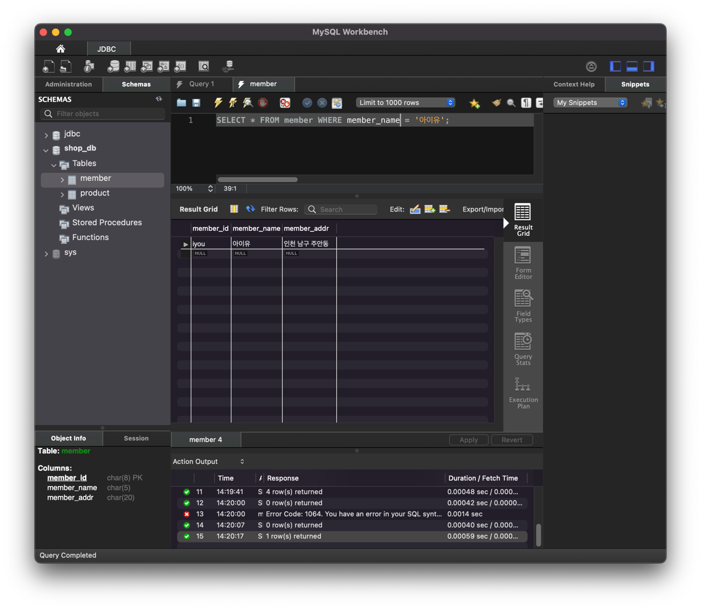

# 혼자 공부하는 SQL

## Chapter 1. 데이터베이스와 SQL

### 1.1 데이터베이스 알아보기

- Database(DB): 데이터의 집합을 의미한다.
- DBMS(Database Management System): 데이터베이스를 관리하고 운영하는 소프트웨어
- DBMS 종류: MySQL, PostgreSQL, MariaDB, Oracle 등
- SQL(Structured Query Language): DBMS에 데이터를 구축, 관리 하기 위해 사용하는 언어

- DBMS의 분류
  - 계층형: 트리형태로 처음 구성을 완료한 후에 이를 변경하기가 상당히 까다롭다.
  - 망형: 트리 하위 요소들 끼리도 연결된 유연한 구조. 모든 구조를 이해해야만 프로그램을 사용할 수 있다.
  - 관계형: RDBMS. 테이블이라는 단위로 구성되며, 테이블은 열과 행으로 이루어져있다.

- SQL (DMBS에서 사용되는 언어)
  - 국제표준화기구에서 발표한 표준 SQL을 DBMS를 만드는 회사가 각 제품의 특성을 반영한 SQL을 사용한다.

### 1.2 MySQL 설치하기

- MySQL 서버: 데이터베이스 엔진을 운영하는 프로그램
- MySQL 워크벤치: MySQL 서버에 접속하기 위한 프로그램(DBMS)
- root: 관리자 이름, 가장 높은 권한의 사용자

## Chapter 2. 실전용 SQL 미리 맛보기

### 2.1 건물을 짓기 위한 설계도: 데이터베이스 모델링

테이블 구조를 결정하는 과정

폭포수 모델(waterfall model)의 업무 분석과 시스템 설계 단계에 해당

- 폭포수 모델의 소프트웨어 개발 단계
  - 프로젝트 계획
  - 업무 분석
  - 시스템 설계
  - 프로그램 구현
  - 테스트
  - 유지보수

### 2.2 데이터베이스 시작부터 끝까지

- 데이터베이스 구축 절차
  - 데이터베이스 만들기
  - 테이블 만들기
  - 데이터 입력/수정/삭제하기
  - 데이터 조회/활용하기

#### 기본미션

### 2.3 데이터베이스 개체

#### 추가 미션!
데이터베이스에는 테이블 외에 인덱스, 뷰, 스토어드 프로시저, 트리거, 함수, 커서 등의 개체도 필요하다.

- 인덱스
  - 책의 제일 뒤에 수록 되는 '찾아보기(색인)'와 비슷한 개념이다.
- 뷰
  - 가상의 테이블로 정의할 수 있다. 뷰는 실제 데이터를 가지고 있지 않고 테이블에 링크된 개념이다.
  - 보안에 도움이 된다.
  - 긴 SQL 문을 간략하게 만들 수 있다.
- 스토어드 프로시저
  - MySQL에서 제공하는 프로그래밍 기능, 여러개의 SQL문을 하나로 묶어서 편리하게 사용할 수 있다.
  - 연산식, 조건문, 반복문 등을 사용할 수 있다.