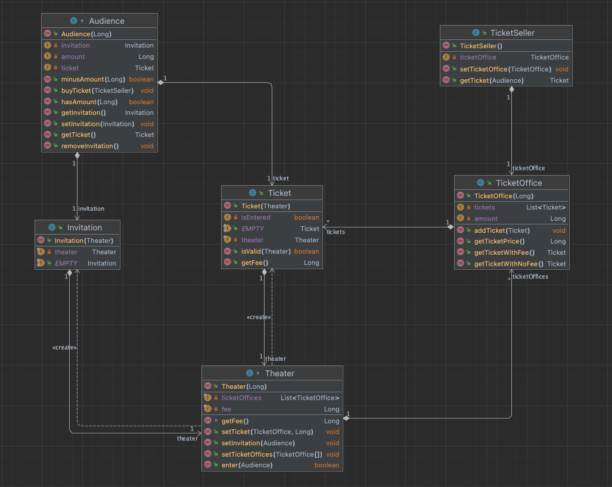

# 오브젝트

[오브젝트 1회차(2)](https://youtu.be/navJTjZlUGk)

## 값과 식별자, Value & Identifier

객체는 식별자를 통해 구분한다.

프로그램 런타임 시 메모리에 주소가 할당 된다.

이 주소값이 바로 식별자이다.

필드값이나 내부 요소가 동일한 형태를 가진 객체라도 식별자가 다르다면 동일한 객체라 볼 수 없다.

객체의 동가성을 평가하는 방법은 객체의 주소가 같은지 살펴 보는 것이다.

반면, 값을 사용하는 컨텍스트에서는 식별자와 상관 없이 데이터가 같다면 동일한 데이터라 여긴다. 객체 컨텍스트로 평가하면 식별자가 다르기 때문에 false를 반환한다. 자바에서
값을 비교하기 위해 `equals`를 사용하는 이유이다.

`JavaScript`는 처음부터 `값`으로 데이터를 비교하기 때문에 식별자로 판단할 수 없다. 특정 유형의 데이터를 `값`으로 볼지, `객체`로 볼지 판단하는 건 언어 창시자의
취향으로 정해졌다.

객체 지향에서는 식별자 사용을 지향한다. 함수형 시스템은 `값`을 지향하며, `참조`를 지향하지 않는다.

## 다형성, Polymorphism

다형성을 만족하기 위해서는 다음과 같은 두가지 요소를 충족해야한다.

### 대체가능성, Substitution

```java
    public class Test {

    public static void main(String[] args) {
        Worker worker = new Worker();
        // 출력 : working
        worker.print();
    }
}

class Worker implements Runnable {

    @Override
    public void run() {
        System.out.println("working");
    }

    public void print() {
        run();
    }
}
```

`Worker`가 `Runnable`의 인터페이스를 구성하여 Runnable 타입이 될 수 있다. `Worker`로도 인식할 수 있고, `Runnable`로도 인식할 수 있는게
바로 다형성의 특징 중 하나인 대체가능성이다. 다형성을 지원하면 동일한 객체일지라도 다양한 **형**(type)으로 받아 사용할 수 있다.

단, `Runnable`로 받을 경우 `Worker`는 `Worker`로 기능하지 못하고 `Runnable`을 기반으로 동작한다.

`Runnable` 포인터로 다루니 `Runnable`에 포함된 집합만 사용 가능하다. 예제에서는 Override로 매핑되는 `run()`만 바라볼 수 있다. 메모리
상에는 `Worker`와 `Runnable` 인스턴스가 생긴다. 형에 따라 인스턴스가 정해질 뿐이다.

JavaScript는 프로토타입 체인으로 대체가능성을 실현한다.

책에서는 동적바인딩이라고 부른다.

### 내적동질성, Internal identity

```java
public class Test {

    public static void main(String[] args) {
        Worker worker = new HardWorker();
        // 출력: HardWorking
        worker.print();
    }
}

class Worker implements Runnable {

    @Override
    public void run() {
        System.out.println("working");
    }

    public void print() {
        run();
    }
}

class HardWorker extends Worker {

    @Override
    public void run() {
        System.out.println("HardWorking");
    }
}
```

`Worker`의 `print`를 호출하는데, `print`는 `this.run()`을 실행한다.

`this.run()`은 과연 `Worker`를 가리킬까, 아니면 `HardWorker`를 가리킬까? 코드를 실행해보면 알겠지만, `HardWorker`의 `run()`이 실행
된다.

객체지향이 가진 규칙으로 어떠한 경우든 객체 생성을 주도한 대상으로 함수포인터를 유지하겠다는 원칙이다.
**형**(type)을 Worker로 본다고 할지라도 지정한 형을 참조로 사용하지 않고 객체를 만들 때 주도한 HardWorker를 그대로 참조하게 된다.

객체의 탄생이 HardWorker로 시작하였기 때문이다. 태어난 출신지를 중요시 여기는 게 객체지향의 중요한 규칙 중 하나다.

## 객체, Object

객체지향에서 객체가 갖추어야하는 두가지.

### 기능의 캡술화, Encapsulation of Functionality

외부에서 몰라도 될 세부 기능을 노출하지 않음으로써 객체를 보다 쉽게 사용하게 만든다.

이를 통하여 변화, 수정, 오류에 대한 여파를 막는다. 변화율에 따라 코드를 격리하는 이유다.

### 상태 관리, Maintenance of State

객체 지향이 레퍼런스를 가리키고 식별자를 참조하려는 이유는 상태관리 때문이다.

데이터 갱신, 외부에 notifying , observing 등 모든 상태를 관리하며, 그 중 하나가 바로 은닉이다. 생명주기 또한 상태 관리에 포함된다.

## 격리, Isolation

**객체지향이 추구하는 궁극적인 목표**

격리가 제대로 되어있는지 알아보는 가장 쉬운 방법은 다른 파일에 의하여 코드가 수정 되지 않는지 살펴보면 된다.

## Theater

