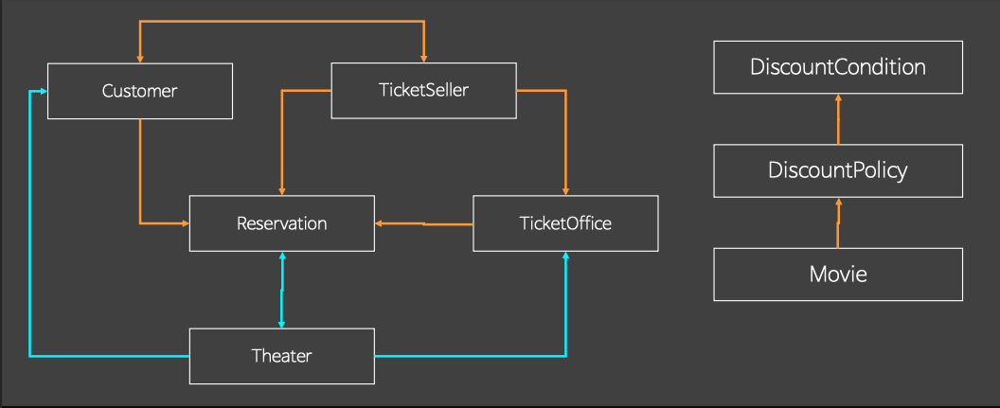
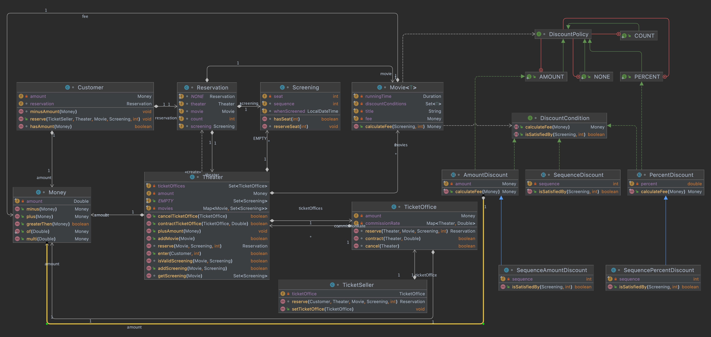
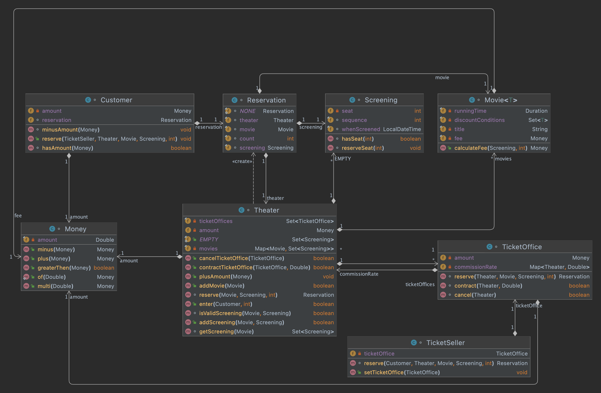
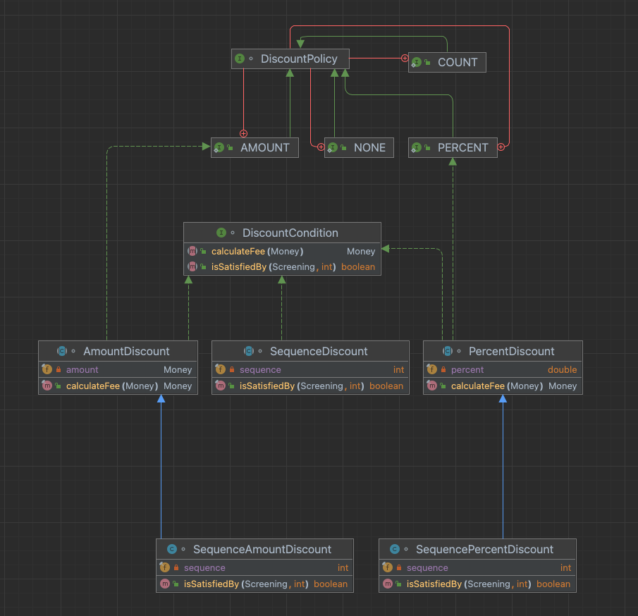

# 오브젝트

[오브젝트 2회차](https://youtu.be/ex6kP_b7Ypk)

### 들어가며. 변수, Variable

- 변수를 정의하자면 메모리에 할당한 주소가 가진 별명이다.

- 변수의 데이터 타입은 해당 메모리 주소로부터 얼마만큼의 공간을 차지하고 있는지를 의미한다.
  - 즉 변수에 할당된 `메모리의 길이`에 집중한다.
    - `int a = 7`: `a` 라는 별명을 가진 메모리에 `int`만큼 7을 할당한다.

- 객체지향에서 말하는 타입은 위의 타입과는 다르다.

## 형, Type

- 객체지향의 개념을 표현하는 단위 개념
  - 타입으로 나타낼 수 없다면 사용할 수 없다

- Role: 형을 통해 역할을 묘사한다.
- Responsibility: 형을 통해 로직을 표현
- Message: 형을 통해 메세지를 공유
  - `String`이나 `int`는 값이다. 타입이 아니다. 객체지향은 참조 컨텍스트를 이용한다.
    - 값은 본인 상태에 대한 관리를 하지않고, 캡슐화 할 수 없기 때문에 값 자체로만 의미를 갖는다.
- Protocol: 객체 간 계약을 형을 통해 공유

## 지원하는 타입들, Supported Types

### static: 단 하나의 인스턴스가 존재

- 동시성 문제를 해결해야 함
- 인스턴스 컨텍스트만을 쓰기를 바란다.
- Factory나 Utility에만 사용하자
  - Factory는 자신의 컨텍스트를 갖지 않기 때문에, Utility는 원래부터 상태를 갖지 않기 때문에 적합하다.

### enum: 제한된 수의 인스턴스가 존재

- JVM이 인스턴스를 만들고 시작한다.
- static 초기화보다 빠르게 인스턴스를 생성한다.
  - 따라서, 동시성 안정성이 보장된다.
- 값이 아닌 참조 컨텍스트이지만 `Generic Type`으로 사용할 수 없는 단점이 존재한다.

### class: 무제한의 인스턴스가 존재

> Utility 와 Method를 구분하는 방법
>
> Method에 this가 존재하지 않으면 Utility 함수이다.
> 즉시 해당 클래스에서 제거하고 유틸리티로 구분해서 사용해야 한다.
> Utility는 클래스 인스턴스에 존재하면 안된다.
>
> Utility는 인자와 지역변수만을 갖거나 모두가 공유하는 전역적인 컨텍스트를 갖는다.

## 상태에 대한 조건, Condition

> 런타임 시 조건에 따라 변할 수 있는 상태여만 분기가 의미를 갖는다.

### 조건 분기는 결코 제거할 수 없다.

- `if`문은 2단계부터 감당하기 쉽지 않다.
- 진리표를 작성하게 된다면 다를 수 있지만... 일반적으로 불가능하다.

### 조건 분기에 대한 전략 두가지

- 내부에서 응집성있게 모아두는 방식
  - 장점: 모든 경우의 수를 한 곳에 파악할 수 있다.
  - 단점
    - 분기가 늘어날 때마다 코드가 변경된다.
    - 관리할 수 있는 한계가 명확하다.

```java
class ConditionalStatementExample {

    public void conditionProcess(String condition) {
        if (condition.equals("a")) {
            a();
        } else if (condition.equals("b")) {
            b();
        } else if (condition.equals("c")) {
            c();
        } else {
            d();
        }
    }
}
```

- 외부에 분기를 위임하고 경우의 수 만큼 처리기를 만드는 방식
  - 장점: 분기가 늘어날 때마다 처리기만 추가하면 된다.
  - 단점: 모든 경우의 수를 파악할 수 없다.

```java
class ConditionalStatementExample {

    public static void main(String[] args) {
        String v = "c";
        Runnable run = null;

        if (v.equals("a")) {
            run = () -> System.out.println("a")
        } else if (v.equals("c")) {
            run = () -> System.out.println("c")
        }
    }

    //처리기
    public void conditionProcess(Runnable condition) {
        condition.run();
    }
}
```

- 전략 패턴 등 모든 디자인 패턴에서 사용하는 방식
- `if`의 변화를 클라이언트 레이어로 이전하는게 목적이다.
  - 라이브러리 레이어에서 클라이언트 레이어로 이동
  - 라이브러리 코드를 변경할 때 까지 확장할 수 없는 것을 방지

> 변화율에 따른 격리를 통하여 분기를 처리할 수 있다.

## 책임 기반, Responsibility Driven

- 시스템의 존재 가치는 사용자에게 제공되는 기능에 의해 결정된다.

> 프로그램의 가치 = 제공하는 기능에 대한 책임

- 시스템 차원의 책임을 작은 단위로 분할
  - 역할 모델의 핵심은 응집성을 높으면서 결합도가 낮도록 분리하는 행위다.
  - 책임은 Interface나 Abstract class가 아니라 함수를 의미한다.
- 해당 책임을 추상화하여 역할 정의
  - 위 코드에서 Runnable이 추상화 된 역할을 담당한다.
- 역할에 따라 협력이 정의 됨
  - 책임 단계에서 협력을 구상하면 책임이 추가될 때 협력 관계가 깨지기 쉽다.
  - 협력 관계는 책임에 대한 추상화를 통하여 자연스레 결정된다.

책임과 역할을 따로 나누는건 어려운 일이다. 하지만 연역법을 통해 추상화에 성공하면 귀납법에 의해 다른 사례를 손쉽게 만들어낼 수 있다.

## 정보 전문가 패턴, Information Expert Pattern

책 137 page

헤드퍼스트 디자인패턴 372 page 반복자 패턴

## Theater with Reservation



- Policy: `어떻게`
- Condition: `언제(조건)`

부모관계가 없는 타입을 어떻게 처리해야하는가

DiscountPolicy에 추가가 된다면 어떤 변화가 일어나는지 확인해볼 것









