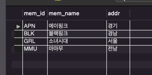

# 혼자 공부하는 SQL

## Chapter 3. SQL 기본 문법

### 3.1 SELECT ~ FROM ~ WHERE

market_db.sql 살펴보기

```mysql
DROP DATABASE IF EXISTS market_db; -- 만약 market_db가 존재하면 우선 삭제한다.
CREATE DATABASE market_db;

USE market_db;
CREATE TABLE member -- 회원 테이블
(
    mem_id     CHAR(8)     NOT NULL PRIMARY KEY, -- 사용자 아이디(PK)
    mem_name   VARCHAR(10) NOT NULL,             -- 이름
    mem_number INT         NOT NULL,             -- 인원수
    addr       CHAR(2)     NOT NULL,             -- 지역(경기,서울,경남 식으로 2글자만입력)
    phone1     CHAR(3),                          -- 연락처의 국번(02, 031, 055 등)
    phone2     CHAR(8),                          -- 연락처의 나머지 전화번호(하이픈제외)
    height     SMALLINT,                         -- 평균 키
    debut_date DATE                              -- 데뷔 일자
);
CREATE TABLE buy -- 구매 테이블
(
    num        INT AUTO_INCREMENT NOT NULL PRIMARY KEY, -- 순번(PK)
    mem_id     CHAR(8)            NOT NULL,             -- 아이디(FK)
    prod_name  CHAR(6)            NOT NULL,             --  제품이름
    group_name CHAR(4),                                 -- 분류
    price      INT                NOT NULL,             -- 가격
    amount     SMALLINT           NOT NULL,             -- 수량
    FOREIGN KEY (mem_id) REFERENCES member (mem_id)
);

INSERT INTO member
VALUES ('TWC', '트와이스', 9, '서울', '02', '11111111', 167, '2015.10.19');
INSERT INTO member
VALUES ('BLK', '블랙핑크', 4, '경남', '055', '22222222', 163, '2016.08.08');
INSERT INTO member
VALUES ('WMN', '여자친구', 6, '경기', '031', '33333333', 166, '2015.01.15');
INSERT INTO member
VALUES ('OMY', '오마이걸', 7, '서울', NULL, NULL, 160, '2015.04.21');
INSERT INTO member
VALUES ('GRL', '소녀시대', 8, '서울', '02', '44444444', 168, '2007.08.02');
INSERT INTO member
VALUES ('ITZ', '잇지', 5, '경남', NULL, NULL, 167, '2019.02.12');
INSERT INTO member
VALUES ('RED', '레드벨벳', 4, '경북', '054', '55555555', 161, '2014.08.01');
INSERT INTO member
VALUES ('APN', '에이핑크', 6, '경기', '031', '77777777', 164, '2011.02.10');
INSERT INTO member
VALUES ('SPC', '우주소녀', 13, '서울', '02', '88888888', 162, '2016.02.25');
INSERT INTO member
VALUES ('MMU', '마마무', 4, '전남', '061', '99999999', 165, '2014.06.19');

INSERT INTO buy
VALUES (NULL, 'BLK', '지갑', NULL, 30, 2);
INSERT INTO buy
VALUES (NULL, 'BLK', '맥북프로', '디지털', 1000, 1);
INSERT INTO buy
VALUES (NULL, 'APN', '아이폰', '디지털', 200, 1);
INSERT INTO buy
VALUES (NULL, 'MMU', '아이폰', '디지털', 200, 5);
INSERT INTO buy
VALUES (NULL, 'BLK', '청바지', '패션', 50, 3);
INSERT INTO buy
VALUES (NULL, 'MMU', '에어팟', '디지털', 80, 10);
INSERT INTO buy
VALUES (NULL, 'GRL', '혼공SQL', '서적', 15, 5);
INSERT INTO buy
VALUES (NULL, 'APN', '혼공SQL', '서적', 15, 2);
INSERT INTO buy
VALUES (NULL, 'APN', '청바지', '패션', 50, 1);
INSERT INTO buy
VALUES (NULL, 'MMU', '지갑', NULL, 30, 1);
INSERT INTO buy
VALUES (NULL, 'APN', '혼공SQL', '서적', 15, 1);
INSERT INTO buy
VALUES (NULL, 'MMU', '지갑', NULL, 30, 4);

SELECT *
FROM member;
SELECT *
FROM buy;
```

- `USE` 문은 DB를 선택하는 구문
- `SELECT ~ FROM ~ WHERE`은 기본 적인 SQL이다
  - `SELECT` 다음에는 열 이름
  - `FROM` 다음에는 테이블 이름
  - `WHERE` 다음에는 조건식

- 관계연산자는 `WHERE`절에서 `<, <=, >, >=, =`등의 기호
- 논리연산자는 관계연산자가 2개 이상 나오면 `AND, OR` 등으로 참/거짓을 판별
- `LIKE`는 문자열 비교시 모두 허용할 땐 `%`, 하나로 지정할 땐`_`

#### 확인문제

1. 4번 
   - 회원 테이블(member)과 구매 테이블(buy)은 서로 PK, FK 관계로 연결되어 있다.

2. 2, 3번
   - MySQL 워크벤치를 재시작하거나, 새 쿼리 창을 열면 USE를 재지정해야 한다.
3. 1번
4. 1, 3번

### 3.2 좀 더 깊게 알아보는 SELECT 문

- `ORDER BY` 결과 출력 순서를 조절한다.
  - 오름차순 `ASC`, 내림차순 `DESC`
- `LIMIT` 결과 출력 개수 제한, `ORDER BY`와 함께 사용
- `DISTINCT` 중복을 제거한다. 열 이름 앞에 붙인다.
- `GROUP BY` 데이터를 그룹으로 묶어준다.
- `HAVING`은 집계함수와 관련된 조건 제한, `GROUP BY` 다음에 나온다.

#### 확인문제
1. `SELECT`, `FROM`, `WHERE`, `ORDER BY`, `LIMIT` 순서
> 기본 미션
2. `ORDER BY`, `LIMIT`, `DISTINCT` 
3. `ASC`, `DESC`
4. `LIMIT 0, 3, 5`
5. `DISTINCT`
6. `HAVING()`

### 3.3 데이터 변경을 위한 SQL 문

- `INSERT`문은 테이블에 데이터를 입력한다.
- `AUTO_INCREMENT` 1부터 증가하는 값을 자동으로 입력, `PRIMARY KEY`로 지정
- `INSERT INTO ~ SELECT` 대량으로 데이터 입력
- `UPDATE` 기존 입력 수정 , `WHERE`와 함께 사용
- `DELETE` 행 단위 삭제, `WHERE`가 없으면 전체 행 삭제

#### 확인문제

1. 테이블 이름은 생략할 수 없다.
2. `AUTO_INCREMENT`는 직접 값을 입력할 수 없다.
   - 입력할 위치에 `NULL`이라고 표기한다.
3. `LAST_INSER_ID`
4. `INSERT INTO ~ SELECT`
5. `SET`, `WHERE`
6. `TRUNCATE`

#### 선택 미션
- 데이터 입력 기본 형식 작성하기

`INSERT INTO 테이블이름 (칼럼1, 칼럼2, ... ) VALUES ( 값1, 값2, ... )` 
- 삭제하는 기본 형식 작성하기

`DELETE FROM 테이블이름 WHERE 조건;`

## Chapter 4. SQL 고급 문법

### 4.1 MySQL의 데이터 형식

- 정수형은 소수점이 없는 숫자, `TINYINT, SMALLINT, INT, BIGINT`등
- 문자형 고정형 문자형 `CHAR` 가변형 문자형 `VARCHAR`가 있다
- 실수형 소수점 아래 7자리 까지 표현하는 `FLOAT`, 소수점 15자리 까지 표현 되는 `DOUBLE`이 있다.
- 날짜형은 날짜를 저장하는 DATE, 시간을 저장하는 TIME, 둘을 저장하는 DATETIME이 있다.
- MySQL에서 제공되는 변수앞에는 `@`를 붙인다.
- 형변환 함수에는 `CAST(), CONVERT()`가 있다.


#### 확인문제

1. `TINYINT, SMALLINT, INT, BIGINT`
2. `Out of range`
3. 데이터가 양수만 저장된다.
4. `CHAR`는 최대 255자 까지 저장된다.
5. 1,2
6. `CONVERT(), CAST()`

### 4.2 두 테이블을 묶는 조인
- 일대다 관계는 한쪽 테이블엔 하나의 값, 다른 쪽 테이블에는 여러 개의 값이 존재
- 조인은 두 개의 테이블을 서로 묶어 하나의 결과를 만듬
- 내부 조인 두 테이블에 모두 지정한 열의 데이터가 있어야 함
- 외부 조인 1개의 테이블에만 데이터가 있어도 됨
- 상호 조인 서로의 테이블의 모든 행을 조인 시킨다
- 자체 조인은 1개의 테이블만 사용한다

#### 확인문제

1. 기본키-외래키 관계
2. 1- 내부, 2-외부, 3-상호, 4-자체
3. CENTER OUTER JOIN
> 기본 미션
4. 4
5. 상호 조인, 자체 조인


### 4.3 SQL 프로그래밍
- IF문은 조건식이 참일 때 수행 하는 IF, 분기를 갖는 IF ~ ELSE가 있다.
- 변수는 DECLARE로 선언, SET으로 값 대입
- CASE 문은 2가지 이상의 분기에 처리, 다중 분기로 표현
- WHILE문은 조건식이 참인 동안 반복
- PREPARE 는 SQL을 실행하지 않고 준비후 EXECUTE를 통해 실행한다.

#### 확인문제
1. `DELIMITER`
2. `IF myNum = 100 THEN`
3. `WHEN, CASE`
4. `WHILE, ITERATE, LEAVE`


### 선택 미션

