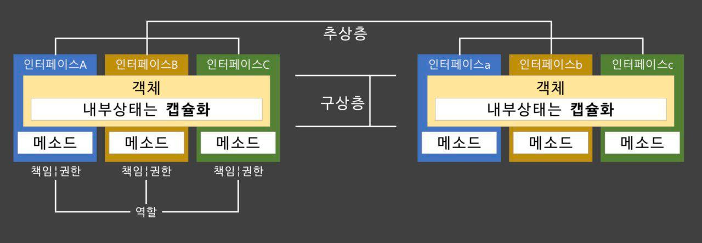
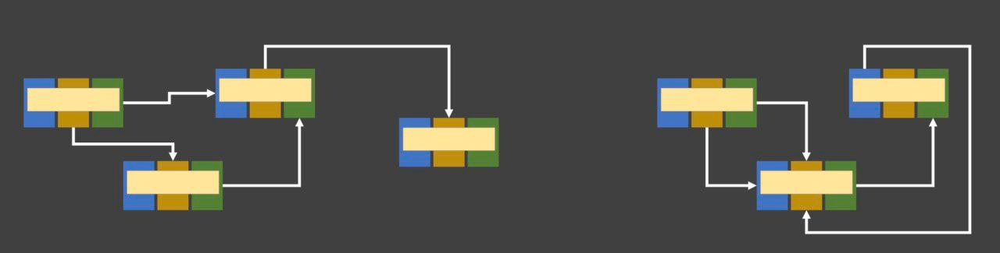
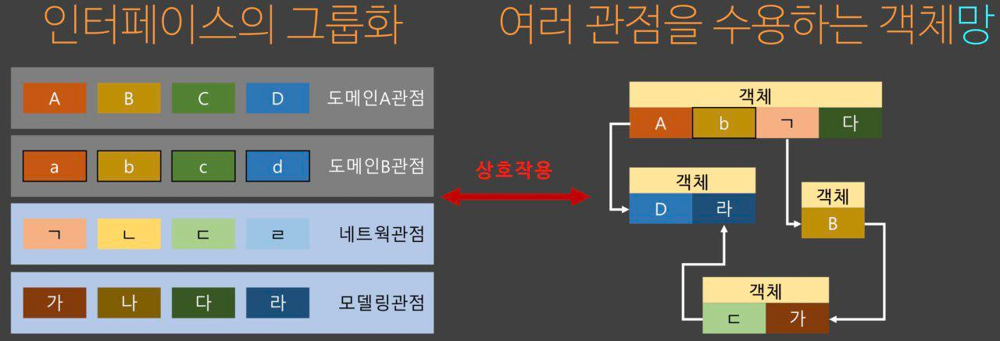
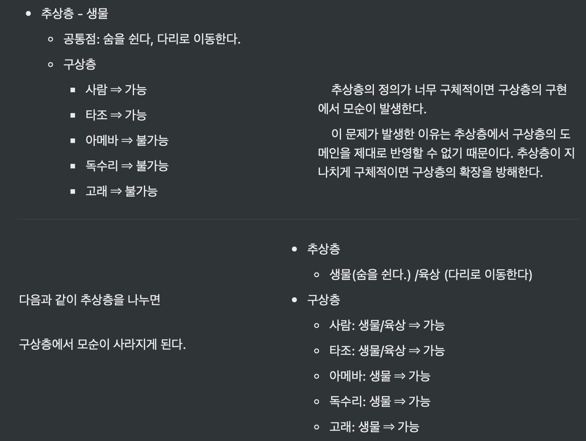
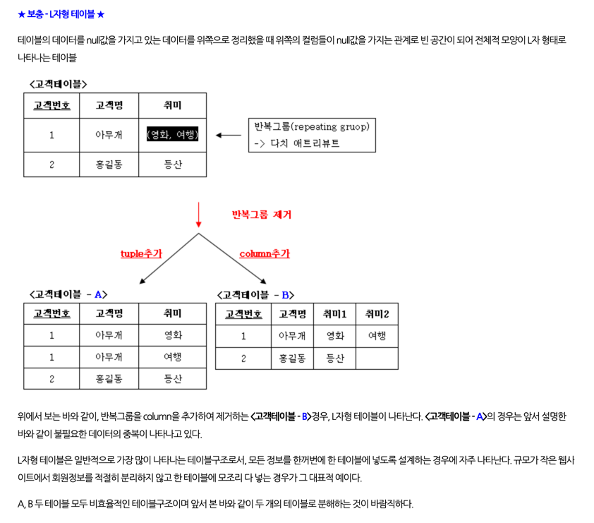
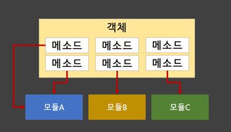
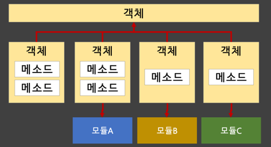
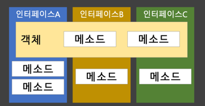
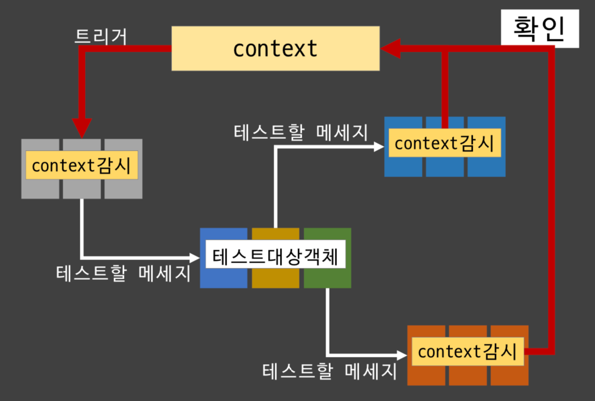

# 오브젝트

[오브젝트 3회차](https://youtu.be/Qa3dRrSbeQI?list=PLBNdLLaRx_rI-UsVIGeWX_iv-e8cxpLxS)

## 객체의 책임

- 객체는 책임을 주고 받기 위해서 메세지를 사용한다.
  - 누구에게 책임을 할당하고, 어떻게 메세지를 구성해야 하는지가 설계의 목표이다.
- 설계란 코드를 배치하는 기술이다.
  - 코드를 어떻게 배치하느냐에 따라 향후 유지보수성과 확장성에 영향을 미친다.
- 구동하는 코드를 만드는 것이 아닌 코드를 어떻게 배치하느냐가 중요하다.

### 객체지향 설계

- 코드를 절차적, 프로시저적으로 배치하지 않는다.
- 객체지향의 원리에 따라 객체에 담아서 코드를 배치한다.

### 객체지향 설계의 요령, 역할 책임 모델

- 역할: 협력 안에서 특정 객체가 차지하는 책임이나 임무
- 책임: 객체에 의해 정의되는 응집도 있는 행위의 집합
- 객체망(Object Network): 역할과 책임 모델을 기반으로 객체간 분리가 잘 되어있는 코드의 형태

## 객체망

*기본적인 객체망 모습*

- 객체의 본질적인 모습
  - 내부를 은닉하고 있는 데이터를 자기만이 컨트롤 할 수 있다.
  - 외부는 은닉하고 있는 데이터를 `public interface`를 통하여 메세지를 주고 받는다.

- 데이터를 지닌 객체의 책임
  - 은닉한 데이터 만큼 객체가 책임을 갖는다.
  - 다만 데이터는 `측면`을 반영하지 않는다.
    - `측면`은 객체를 둘러싸고 있는 인터페이스를 통해 반영된다.
- 데이터는 상황에 따라 담긴 의미가 달라지므로 객체는 다양한 측면을 지닌 여러 메서드를 갖게된다.

### 객체간 통신

- 위에서 언급한대로, 객체는 다양한 역할을 갖기 때문에 객체간 통신이 어렵다.
  - `interface`는 추상레이어로, 동일한 `interface`를 갖더라도 구상레이어에서 객체의 형태(역할의 형태)는 완전히 달라진다.
- 객체를 구성하는 각 `interface`별로 분리해서 책임과 권한을 갖고 있고 각각을 `Type`으로 인식할 수 있다.
  - 모든 `측면`의 `interface`를 한꺼번에 구현한 객체가 `역할`이다.

### 통신망의 구성

- 비선형 구조(좌측)
- 선형 구조(우측)
  - 순환 구조
  - 이 책을 공부하는 이유, 이런 일이 발생하지 않도록..

- 의존성을 제거할 수 없으니, 설계를 통해 우리가 할 수 있는 일은 오직 의존성을 단방향(simplex)으로 바꾸는 일이다.

## 객체 설계의 난점, interface 그룹화

- 도메인의 객체는 위에서도 다루었듯이, 여러 `측면`(관점)의 `interface`를 갖는다.

- 

- (우측) 각 객체들은 소속되어있는 관점에 마다 `interface`를 부분적으로 갖는다.

## 알려진 기본 설계 요령

### SOLID 원칙

#### SRP, Single Responsibility 단일 책임 원칙

p. 117

> 변화율은 코드가 변동되는 주기뿐만 아니라, 이유를 포함한다.

- 변경의 이유가 하나여야 한다.
  - 객체를 변화율에 따라서 나누어 설계해야 한다.

- 스프링의 AOP(Aspect Oriented Programming) 에서 많이 언급된다.
  - 공통 로직은 Util 클래스로 분리한다.

> 산탄총 수술shotgun surgery이 발생하지 않도록 하려면 코드를 바꾸는 이유인 트리거가 하나가 되도록 객체를 나눠서 구축해야 한다.

#### OCP, Open Closed 개방 폐쇄 원칙

- 간단하게 다형성을 의미한다.

- 직접 참조를 피하게 한다.
  - 추상형, 어뎁터, 메이저, 미디에이터 등을 참조하는 방법이 있다. -> ?

#### LSP, Liskov Substitution 리스코프 치환 원칙 (업캐스팅 안전)

- 부모 클래스 자리에 자식 클래스를 집어넣을 수 있다

- 추상층은 구상층의 확장을 표용할 수 있는 교집합을 갖고 있어야 한다.

> LSP는 RDB의 테이블 정규화에서 L자형 테이블을 제거하는 과정과 완전히 동일하다.

#### ISP, Interface Segregation 인터페이스 분리 원칙

- Interface 분리가 되어있지 않은 케이스이다.

- has a model, 소유 모델을 통한 해결

- interface 재정의, 형을 통한 해결

#### DIP, Dependency Inversion 의존성 역전 원칙

- 다운 캐스팅 금지

- 고차원 모듈은 저차원 모듈에 의존하면 안된다. 이 두 모듈 모두 추상화된 것에 의존해야 한다.
- 추상화된 것은 구체적인 것에 의존하면 안된다. 구체적인 것은 추상화된 것에 의존해야 한다.

### SOLID 원칙 외 다른 원칙

#### DI, Dependency Injection 의존성 주입

- DI를 위한 여러 방법중 IoC, Inversion of Control 제어 역전이 있다.

#### DRY, Don't Repeat Yourself 중복 방지

#### Hollywood Principle 헐리우드 원칙, 의존성 부패 방지

#### Law of demeter 디미터의 원칙, 최소 지식

책 6장

- `classA.methodA`의 최대 지식 한계
  - `classA`의 필드 객체
  - `methodA`가 생성한 객체
  - `methodA`의 인자로 넘어온 객체

- 1차원적인 관계만 이용해서 로직을 짜야 한다.
- 1차원 관계에서 해결되지 않는다면, 1차원 관계가 성립하도록 내부 객체를 랩핑한 메소드로 제공해줄 필요가 존재한다.

### 의존성 부패 방지와 최소 지식의 모순

> 두 원칙을 지키면 해당 `객체와 메세지를 주고 받는 것은 가능`하나 내부를 들여다볼 방법이 없다.

- 메세지를 보냈을 때, 잘 처리되었는지 알 방법이 없다. 내가 보낸 메세지가 객체 망 내에서 잘 전달이 되는지를 알 수 없다.
  - 메세지가 제대로 전달되고 있는지 확인할 수단이 필요하다.

> 객체지향이 가진 전체적인 문제 점

- 정적 코드 분석만으로는 객체가 제대로 작동하는지 보장할 수 없다.

### Mock 객체를 활용한 검증

- 단위 테스트 하는데 왜 Mock 객체 테스트도 해야되는지에 대한 답변

- mockery(모조객체) == context
- mock(목객체): context로 부터 생성된 객체, 간접적으로 context와 연결되어 있다.

- 테스트 대상 객체를 둘러싼 객체들을 통하여 객체망을 구성한다.(DI)
- 트리거가 되는 메세지를 전달하고, 테스트 대상 객체가 메세지를 잘 보내는지 확인한다.

> 객체 망 내의 메세지가 잘 `유통`되고 있음을 테스트할 수 있다.

- 정적 코드만으로는 다음과 같은 런타임 컨텍스트에서 이루어지는 일을 알 수 없다.
  - 객체가 필요한 시기에 생성 되어 객체망을 이루는지
  - 객체망의 구조가 적절한지

### GRASP 패턴 - 5장의 내용

#### 정보 담당자 Information Expert

- 해당 정보를 갖고 있는 객체에게 책임을 할당하라.
- 객체의 본질과 데이터 은닉을 지킬 수 있는 패턴
  - 정보 은닉성을 잘 지킬 수 있다.
- 데이터를 가지고 있는 객체가 책임도 가지고 있는게 좋다.

#### 소유 권한 Creator

- 객체 시스템의 이질적인 부분인 생성 시에도 정보전문가 패턴을 따르자.
- 어떤 객체가 대상(생성할 객체)을 포함하거나, 잘 알고 있다면 그 대상을 생성하게 시키자.
- 런타임 시 객체를 생성할 때도 해당 객체와 가장 친밀한 객체가 만드는게 낫다. 객체를 왜 만드는지 생각해봐라.

#### 컨트롤러 Controller

- 어댑터 패턴과 미디에이터 패턴의 설계판 확장으로 서브시스템으로 묶을 수 있다면 컨트롤러를 도입하자.
  - "법원", "MVC"
- 어떤 일을 중계할 때 직접 접촉하는게 나은지 판단하는 객체
- `어댑터 패턴`과 `미디에이터 패턴`이 `동시에` 필요하다면 `컨트롤러`를 사용해라.
  - 외부에 대해서는 어댑터, 내부에 대해서는 미디에이터

> 미디에이터 패턴 다수의 객체가 다수를 알아야 할 경우 객체망이 복잡하기 때문에 중간 객체인 미디에이터를 중심에 두는 패턴이다.
> 미디에이터가 전부를 알면 미디에이터를 통해서 다른 객체에게 시키고 싶은 일을 전달할 수 있다.

#### 낮은 결합도 Low Coupling

- 결합도를 낮추려면 직접적으로 아는 객체 수를 줄여야 한다.
- 하지만 더 중요한 것은 `단방향 의존성`임을 잊지 말자.
- 양방향 참조는 시한폭탄이다. 에러 분석이 힘들어 버그를 잡을 수 없는 상황이 발생한다.
  - 누구의 책임인지 알수가 없다

#### 높은 응집도 High Cohesion

- 응집도를 높이려면 객체를 도출할 때부터 변화율을 고려해야 한다.

> SRP

#### 변화 보호 Protected Variations

- 추상적인 수준에서 책임을 정의하여 다양한 구상 가능성으로부터 사용할 모듈을 보호하라.
- 인터페이스를 만드는 이유는 책임을 할당하기 위해서 일 뿐, 단순한 공통점을 찾는 게 아니다.

#### 다형성 Polymorphism

- 전략 패턴처럼 분기가 예상되는 책임이라면 다형성을 이용하라.

#### 순수 조립 Pure Fabrication

- 공통된 기능이나 순수 기능적인 객체는 따로 모아서 작성한다.
- 유틸리티는 따로 모아 분리하자.

#### 간접 참조 Indirection

- 직접 참조관계를 피하면 개별 객체의 충격을 중계 객체에서 흡수할 수 있다.

