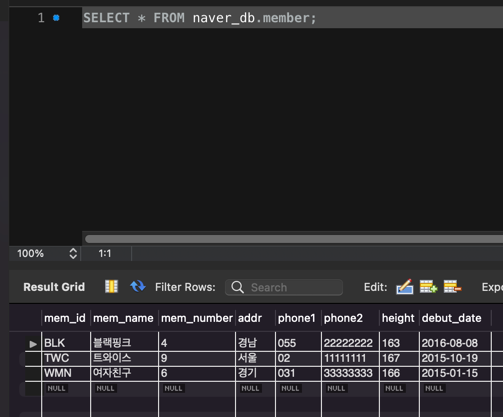

# 혼자 공부하는 SQL

## Chapter 5. 테이블과

### 5.1 테이블 만들기

> 기본 미션
>
> p. 226 - market_db의 회원 테이블(member) 생성하고, p. 229 - 데이터 입력한 후 인증샷

- `CREATE TABLE`은 테이블을 생성하는 SQL이다.
  - 테이블 이름, 열 이름, 데이터 형식 등을 지정한다.
- 열에 입력될 값을 1부터 자동 증가 시키려면, `AUTO_INCREMENT`를 입력한다.
- 열에 빈 값을 허용하지 않으려면 `NOT NULL`을 입력한다.
- 열을 기본 키로 지정하려면 `PRIMARY KEY`를 입력한다.
- 열을 외래 키로 지정하려면 `FOREIGN KEY`예약어를 입력한다.

#### 확인문제

1. `CHAR`, `VARCHAR`
2. 연결하기

- 정수형 데이터를 0부터 입력되도록 설정한다. - `UNSIGNED`
- -128~ +127까지 값이 저장된다. - `TINYINT`
- '2022-11-12'와 같은 데이터가 저장된다 - `DATE`
- 가변형 문자형으로 짧거나 긴 문자가 뒤죽박죽 입력될 때 적절하다. - `VARCHAR`

3. 3 `UNSIGNED`는 `UN`을 체크한다.
4. 3 기본 키와 외래 키는 다른 테이블에 설정한다.
5. 2, 8행 2행은 `PRIMARY KEY` 8행은 `TINYINT UNSIGNED`, `SMALLINT`등

### 5.2 제약조건으로 테이블을 견고하게

- 기본 키는 행 데이터 중에서 데이터를 구분할 수 있는 식별자 역할을 한다.
- 외래 키는 두 테이블 관계를 연결한다.
  - 외래 키가 설정된 열은 꼭 다른 테이블의 기본 키와 연결된다.
- 고유 키는 중복되지 않는 유일한 값이다. 기본 키와는 다르게 `NULL`을 허용한다.
- 체크는 입력되는 데이터를 점검하는 기능이다.
- 기본값은 값을 입력하지 않았을 때 자동으로 입력될 값을 미리 지정한다.
- `NULL`을 허용하려면 생략 또는 `NULL`, 허용하지 않으려면 `NOT NULL`을 사용한다.

#### 확인문제

1. 3 기본 키로 설정된 열은 `NULL`을 허용하지 않는다.
2. 4 `PRIMARY KEY`로 설정하면 자동으로 `NOT NULL`이 되므로 생략할 수 있다.
3. 4 `FOREIGN KEY(mem_id) REFERENCES member(mid)`
4. 1 `ON DELETE CASCADE` 2 `ON UPDATE CASCADE`
5. 1 `CHECK` 2 `DEFAULT` 3 `NOT NULL`

### 가상의 테이블: 뷰

- 모든 데이터베이스 개체는 테이블과 관련이 있다. 그 중 뷰는 테이블에 직접 접근하므로 밀접하다.
- 뷰는 가상의 테이블로, 실체는 `SELECT`문으로 구성되어 있다.
- 하나의 테이블과 관련되면 단순 뷰, 2개 이상의 테이블과 관련되면 복합 뷰라고 부른다.
  - 복합 뷰는 테이블의 데이터를 수정할 수 없다.
- 뷰는 특정 사용자가 테이블에 접근하지 못하도록 하고, 필요한 부분에만 접근하도록 함으로써 보안에 도움이 된다.

#### 확인문제

> p. 271 - 확인문제 4번 풀고 인증샷

1. 2
2. 1 뷰는 테이블에서 필요한 열만 골라 포함할 수 있다.
3. 4 별칭에 공백이 없으면 백틱(`)으로 묶지 않아도 된다.
4. 2 `CREATE OR REPLACE VIEW`
5. 1 `SHOW CREATE VIEW` 2 `WITH CHECK OPTION` 3 `CHECK TABLE`