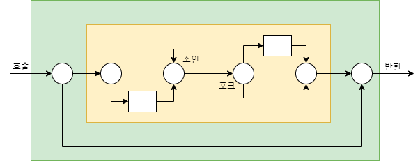
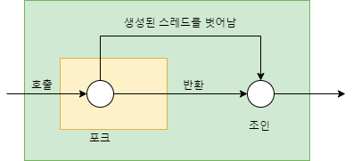
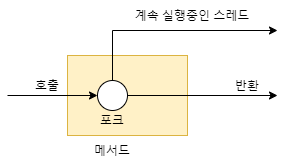
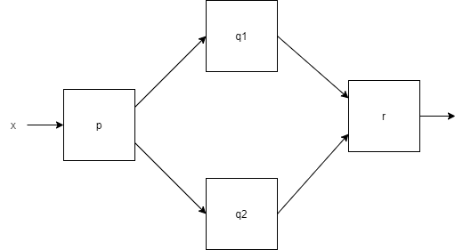

# 모던 자바 인 액션

## Chapter 15. CompletableFuture와 리액티브 프로그래밍 컨셉의 기초

### 15.1 동시성을 구현하는 자바 지원의 진화

> Runnable, Thread → ExecutorService, Callable<T>, Future<T>, 제네릭 → RecursiveTask → 람다 → 분산 비동기
> 프로그래밍

#### 15.1.1 스레드와 높은 수준의 추상화

자바 스트림을 사용하면 외부반복(명시적 루프) 대신 내부반복을 통해 쉽게 병렬성을 달성할 수 있다.

`sum = Arrays.stream(stats).parallel().sum();`

스트림을 이용해 스레드 사용 패턴을 추상화할 수 있다. 그리고 쓸모 없는 코드가 라이브러리 내부로 구현되면서 복잡성도 줄어든다.

#### 15.1.2 Executor와 스레드 풀

- 스레드의 문제
  - 자바 스레드는 직접 운영체제 스레드에 접근한다. 운영체제 스레드는 비용이 비싸며, 스레드 숫자도 제한되어 있다.
    기기마다 다른 하드웨어 스레드를 가지며, 주어진 프로그램에서 사용할 최적의 자바 스레드 개수는 사용할 수있는 하드웨어 코어 개수에 따라 달라진다.

- 스레드 풀 그리고 스레드 풀이 더 좋은 이유
  - 스레드풀을 사용하면 하드웨어에 맞는 수의 태스크를 유지함과 동시에 수 천개의 태스크를 스레드 풀에 아무 오버헤드 없이 제출할 수 있다. 큐의 크기 조정, 거부 정책, 태스크
    종류에 따른 우선순위 등 다양한 설정을 할 수있다.

- 스레드 풀 그리고 스레드 풀이 나쁜 이유
  - 스레드풀을 이용할때는 두 가지 사항을 주의해야한다.
    -k 스레드를 가진 스레드 풀은 오직 k만큼의 스레드를 동시에 실행할 수있다. sleep 중이거나 I/O block 중인 스레드가 있다면 작업 효율성이 떨어지며, 데드락에
    걸릴 수도 있다.block 할 수 있는 태스크는 스레드에 제출하지 말아야하지만 이를 항상 지키긴 어렵다.
    - 모든 스레드 풀이 종료되기 전에 프로그램을 종료하면, 워커 스레드가 다음 태스크 제출을 기다리며 종료되지 않을 수 있으므로 주의해야한다.

#### 15.1.3 스레드의 다른 추상화 : 중첩되지 않은 메서드 호출

7장(병렬 스트림 처리와 포크/조인 프레임워크)에서 사용한 동시성에서는 한 개의 특별한 속성 즉, 태스크나 스레드가 메서드 호출 안에서 시작되면 그 메서드 호출은 반환하지 않고
작업이 끝나기를 기다렸다.

이렇게 스레드 생성과 join()이 한 쌍처럼 충첩된 메서드 호출을 엄격한 포크/조인이라 부른다.

<br>
*엄격한 포크/조인*

시작된 태스크를 내부 호출이 아니라 외부 호출에서 종료하도록 기다리는 좀 더 여유로운 방식의 포크/조인을 사용해도 비교적 안전하다.

*여유로운 포크/조인*

15장에서는 다음 그림과 같이 사용자의 메서드 호출에 의해 스레드가 생성되고 메서드를 벗어나 계속 실행되는 동시성 형태에 초점을 맞춘다.


*비동기 메서드*

이렇게 메서드가 반환된 후에도 만들어진 태스크 실행이 계속되는 메서드를 비동기 메서드라 한다.

- 이 메서드를 사용할때는 다음 사항을 주의해야 한다.
  - 스레드 실행은 메서드를 호출한 다음의 코드와 동시에 실행되므로 데이터 경쟁 문제를 일으키지 않도록해야 한다.
  - 기존 실행 중이던 스레드가 종료되지 않은 상황에서 자바의 main() 메서드가 반환되면 문제가 발생할 수 있다.

--- 

### 15.2 동기 API와 비동기 API

다음과 같은 시그니처를 갖는 `f, g` 두 메서드의 호출을 합하는 예제를 살펴보자.

```java
class example {

    public static void main(String[] args) {
        int y = f(x);
        int z = g(x);
        System.out.println(y + z);
    }

    int f(int x);

    int g(int x);
}
```

`f`와 `g`를 실행하는데 오랜 시간이 걸린다고 가정하고, 서로 상호작용하지 않는다면 별도의 CPU 코어로 실행함으로 합계를 구하는 시간을 단축할 수 있다. 하지만 단순했던
코드가 다음처럼 복잡하게 변한다.

```java
class ThreadExample {

    public static void main(String[] args) throws InterruptedException {
        int x = 1337;
        Result result = new Result();

        Thread t1 = new Thread(() -> {
            result.left = f(x);
        });
        Thread t2 = new Thread(() -> {
            result.right = g(x);
        });
        t1.start();
        t2.start();
        t1.join();
        t2.join();
        System.out.println(result.left + result.right);
    }

    private static class Result {

        private int left;
        private int right;
    }
}
```

Runnalbe 대신 Future API 인터페이스를 이용해 코드를 더 단순화할 수 있다.

```java
public class ExecutorServiceExample {

    public static void main(String[] args) throws ExecutionException, InterruptedException {
        int x = 1337;

        ExecutorService executorService = Executors.newFixedThreadPool(2);
        Future<Integer> y = executorService.submit(() -> f(x));
        Future<Integer> z = executorService.submit(() -> g(x));
        System.out.println(y.get() + z.get());

        executorService.shutdown();
    }
}
```

여전히 이 코드도 명시적인 submit 메서드 호출 같은 불필요한 코드로 오염되어 있다. 명시적 반복으로 병렬화를 수행하던 코드를 스트림을 이용해 내부반복으로 바꾼 것처럼, 비동기
API라는 기능으로 API를 바꿔서 해결할 수 있다.

#### 15.2.1 Future 형식 API

대안을 이용하면 `f`, `g`의 시그니처가 다음처럼 바뀐다.

`Future<Integer> f(int x);`  
`Future<Integer> g(int x);`

호출은 다음처럼 바뀐다.

`Future<Integer> y = f(x);`  
`Future<Integer> z = g(x);`  
`System.out.println(y.get() + z.get());`

- `f`에만 future를 적용하면서 `g`를 그대로 호출할 수도 있지만, 두 가지 이유로 이런 방식을 사용하지 않는다.
  - 다른 상황에서는 g에도 future 형식이 필요할 수 있으므로 API 형식을 통일하는 것이 바람직하다.
  - 병렬 하드웨어로 프로그램 실행 속도를 극대화하려면 작고 합리적인 크기의 여러 태스크로 나누는 것이 좋다.

#### 15.2.2 리액티브 형식 API

두 번째 대안은 `f`, `g`의 시그니처를 바꿔 콜백 형식의 프로그래밍을 이용하는 것이다.

`void f(int x, IntConsumer dealWithResult);`

`f`가 값을 반환하지 않는데 어떻게 프로그램이 동작할까? `f`에 추가 인수로 콜백(람다)을 전달해서 `f`의 바디에서는 `return 문`으로 결과를 반환하는 것이 아니라
결과가 준비되면 이를 람다로 호출하는 태스크를 만드는 것이 비결이다.

```java
public class callbackStyleExample {

    public static void main(String[] args) {
        int x = 1337;
        Result result = new Result();

        f(x, (int y) -> {
            result.left = y;
            System.out.println(result.left + result.right);
        });

        g(x, (int z) -> {
            result.right = z;
            System.out.println(result.left + result.right);
        });

    }
}
```

하지만 결과가 달라졌다. `f`와 `g`의 호출 합계를 정확하게 출력하지 않고 상황에 따라 먼저 계산된 결과를 출력한다. 락을 사용하지 않으므로 값을 두번 출력할 수 있을 뿐더러
때로는 `+`에 제공된 두 피연산자가 `println`이 호출되기 전에 업데이트될 수도 있다.

- 두가지 방법으로 이를 보완할 수 있다.
  - if-then-else를 이용해 적절한 락을 이용해 두 콜백이 모두 호출되었는지 확인한 다음 원하는 기능을 수행한다.
  - 리액티브 형식의 API는 보통 한 결과가 아니라 일련의 이벤트에 반응하도록 설계되었으므로 Future를 이용하는 것이 더 적절하다.

#### 15.2.3 잠자기(그리고 기타 블로킹 동작)는 해로운 것으로 간주

스레드 풀에서 sleep중인 태스크는 다른 태스크가 시작되지 못하게 막으므로 자원을 소비한다.

이상적으로는 절대 태스크에서 기다리는 일을 만들지 말거나 코드에서 예외를 일으키는 방법으로 이를 처리할 수 있다.

태스크를 앞과 뒤 두 부분으로 나누고 블록되지 않을 때만 뒷부분을 자바가 스케줄링하도록 요청할 수 있다.

다음은 한 개의 작업을 갖는 코드 A다.

```
work1();
Thread.sleep(10000);
work2();
```

이를 코드 B와 비교하자.

```java
public class ScheduledExecutorServiceExample {

    public static void main(String[] args) {
        ScheduledExecutorService scheduledExecutorService = Executor.newScheduledThreadPool(1);

        work1();
        scheduledExecutorService.schedule(ScheduledExecutorServiceExample::work2, 10,
            timeUnit.SECONDS);

        scheduledExecutorService.shutdown();

    }

    public static void work1() {
        //...
    }

    public static void work2() {
        //...
    }
}
```

코드 A는 sleep하는 동안 스레드 자원을 점유하는 반면, B는 다른 작업이 실행될 수 있도록 허용한다.

#### 15.2.4 현실성 확인

현실적으로 '모든 것은 비동기'라는 설계 원칙을 지킬 수는 없다.

자바의 개선된 동시성 API를 이용해 유익을 얻을 수 있는 상황을 찾아보고 사용해보길 권장한다.

네트워크 서버의 블록/비블록 API를 일관적으로 제공하는 Netty 같은 새로운 라이브러리를 사용하는 것도 도움이 된다.

#### 15.2.5 비동기 API에서 예외는 어떻게 처리할까?

비동기 API에서 호출된 메서드의 실제 바디는 별도의 스레드에서 호출되며 이때 발생하는 어떤 에러는 이미 호출자의 실행 범위와는 관계가 없는 상황이 된다.

Future를 구현한 CompletableFuture에서는 런타임 get() 메서드에 예외를 처리할 수 있는 기능을 제공하며 예외에서 회복할 수 있도록 exceptionally()
같은 메서드도 제공한다.

리액티브 형식의 비동기 API에서는 return 대신 기존 콜백이 호출되므로 예외가 발생했을 때 실행될 추가 콜백을 만들어 인터페이스를 바꿔야한다.

### 15.3 박스와 채널 모델

- 박스와 채널 모델은 동시성을 설계하고 계념화하기 위한 모델이다.
- 박스와 채널 모델을 이용하면 생각과 코드를 구조화할 수 있으며, 시스템 구현의 추상화 수준을 높일 수 있다.
- 박스로 원하는 연산을 표현하면 계산을 손으로 코딩한 결과보다 더 효율적일 것이다.
- 또한 병렬성을 직접 프로그래밍하는 관점을 콤비네이터를 이용해 내부적으로 작업을 처리하는 관점으로 바꿔준다.



*간단한 박스와 채널 다이어그램*

위 태스크를 코드로 구현해보자.

```
int t = p(x);
System.out.println(r(q1(t), q2(t));
// 위 방식은 q1, q2를 차례로 호출하여 하드웨어 병렬성 활용과는 거리가 멀다.
int t = p(x);
Future<integer> a1 = executorService.submit(() -> q1(t));
Future<integer> a2 = executorService.submit(() -> q2(t));
System.out.println(r(a1.get(), a2.get());
```

박스와 채널 다이어그램의 모양상 p와 r을 Future로 감싸지 않았지만, 병렬성을 극대화하려면 모든 함수를 Future로 감싸야 한다.
많은 태스크가 get() 메서드를 호출해서 Future가 끝나기를 기다리게 되면 하드웨어의 병렬성을 제대로 활용하지 못하거나 데드락에 걸릴 수도 있다.

### 15.4 CompletableFuture와 콤비네이터를 이용한 동시성

CompletableFuture는 Future를 조합할 수 있는 기능이 있다.

ComposableFuture가 아닌 CompletableFuture라 부르는 이유는 실행할 코드 없이 Future를 만들 수 있고, complete() 메서드를 이용해 다른
스레드가 완료한 후에 get()으로 값을 얻을 수 있도록 허용하기 때문이다.

```java
public class CFComplete {

    public static void main(String[] args) throws ExecutionException, InterruptedException {
        ExecutorService executorService = Executors.newFiexedthreadPool(10);
        int x = 1337;

        CompletableFuture<Integer> a = new CompletableFuture<>();
        executorService.submit(() -> a.complete(f(x)));
        int b = g(x);
        System.out.println(a.get() + b);

        executorService.shutdown();

    }
}
```

f(x)와 g(x)를 동시에 실행해 합계를 구하는 위 코드에서, f(x)의 실행이 끝나지 않은 상황에서 get()을 기다리며 프로세싱 자원을 낭비할 수 있다.

ComposableFuture<T>의 thenCombine 메서드를 사용하면 연산 결과를 효과적으로 더할 수 있다.

`ComposableFuture<V> thenCombine(CompletableFuture<U> other, Bifunction<T, U, V> fn)`

이 메서드는 T, U 값을 받아 새로운 V값을 만든다.

```java
public class CFComplete {

    public static void main(String[] args) throws ExecutionException, InterruptedException {
        ExecutorService executorService = Executors.newFiexedthreadPool(10);
        int x = 1337;

        CompletableFuture<Integer> a = new CompletableFuture<>();
        CompletableFuture<Integer> b = new CompletableFuture<>();

        CompletableFuture<Integer> c = a.thenCombine(b, (y, z) -> y + z);
        executorService.submit(() -> a.complete(f(x)));
        executorService.submit(() -> b.complete(g(x)));

        System.out.println(c.get());
        executorService.shutdown();

    }
}
```

결과를 추가하는 세 번째 연산 c는 다른 두 작업이 끝날때까지 실행되지 않으므로 먼저 시작해서 블록되지 않는다.

이전 버전의 y+z 연산은 g(x)를 실행한 스레드에서 수행되어 f(x)가 완료될 때까지 블록될 여지가 있었다.

반면 thenCombine을 이용하면 f(x)와 g(x)가 끝난 다음에 덧셈 계산이 실행된다.

### 15.5 발행-구독 그리고 리액티브 프로그래밍

Future는 독립적 실행과 병렬성에 기반하므로, 한 번만 실행해 결과를 제공한다.

반면 리액티브 프로그래밍은 시간이 흐르면서 여러 Future 같은 객체를 통해 여러 결과를 제공한다.

또한 가장 최근의 결과에 대해 반응(react)하는 부분이 존재한다. 자바9에서는 java.util.concurrent.Flow 인터페이스에 발행-구독 모델을 적용해 리액티브
프로그래밍을 제공한다.

- `flow` API를 간단히 정리하면 다음과 같다.
  - 구독자가 구독할 수 있는 발행자
  - 이 연결을 구독(subscription)이라 한다.
  - 이 연결을 이용해 메시지(또는 이벤트)를 전송한다.

#### 15.5.1 두 플로를 합치는 예제

두 정보 소스로부터 발생하는 이벤트를 합쳐서 다른 구독자가 볼 수 있도록 발행하는 예제를 살펴보자.

스프레드 시트의 셀 C3에 "=C1+C2" 공식을 입력했을때 제공되는 동작이라고 볼 수 있다.

```java
private class SimpleCell {

    private int value = 0;
    private String name;

    public SimpleCell(String name) {
        this.name = name;
    }
}
```

`SimpleCell c2=new SimpleCell("c2");`   
`SimpleCell c1=new SimpleCell("c1");`

통신할 구독자를 인수로 받는 발행자 인터페이스와 구독자 인터페이스를 추가해보자.

```java
interface Publisher<T> {

    void subscribe(Subscriber<? super T> subscriber);
}

interface Subscriber<T> {

    void onNext(T t);
}
``` 

이 두 개념을 합쳐보면 cell은 Publisher이며 동시에 Subscriber임을 알 수 있다.

```java
public class SimpleCell implements Publisher<Integer>, Subscriber<Integer> {

    private int value = 0;
    private String name;
    private List<Subscriber> subscribers = new ArrayList<>();

    public SimpleCell(String name) {
        this.name = name;
    }

    @Override
    public void subscribe(Flow.Subscriber<? super Integer> subscriber) {
        subscribers.add(subscriber);
    }

    private void notifyAllSubscribers() {
        subscribers.forEach(subscriber -> subscriber.onNext(this.value));
    }

    @Override
    public void onNext(Integer newValue) {
        this.value = newValue;
        System.out.println(this.name + ":" + this.value);
        notifyAllSubscribers();
    }
}
```

이어서 예제를 실행해보면,

`SimpleCell c3 = new SimpleCell("c3");`   
`SimpleCell c2 = new SimpleCell("c2");`   
`SimpleCell c1 = new SimpleCell("c1");`

`c1.subscribe(c3);`   
`c1.onNext(10);`    
`c2.onNext(20);`

결과    
`//c1:10`   
`//c2:20`   
`//c3:10`

왼쪽과 오른쪽의 연산 결과를 저장할 수 있는 별도 클래스를 만들면 'C3=C1+C2'도 구현할 수 있다.

```java
public class ArithmeticCell extends SimpleCell {

    private int left;
    private int right;

    public ArithmeticCell(String name) {
        super(name);
    }

    public void setLeft(int left) {
        this.left = left;
        onNext(left + this.right);
    }

    public void setRight(int right) {
        this.right = right;
        onNext(right + this.left);
    }
}
```

데이터가 발행자(생산자)에서 구독자(소비자)로 흐름에 착안해 이를 업스트림 또는 다운스트림이라 부른다.

위 예제에서 newValue는 업스트림 onNext() 메서드로 전달되고 notifyAllSubscribers() 호출을 통해 다운스트림 onNext() 호출로 전달된다.

#### 15.5.2 역압력

매 초마다 수천개의 메시지가 onNext로 전달된다면 빠르게 전달되는 이벤트를 아무 문제 없이 처리할 수 있을까?

이러한 상황을 압력(pressure)이라 부른다. 이럴때는 정보의 흐름 속도를 제어하는 역압력 기법이 필요하다.

역압력은 Subscriber가 Publisher로 정보를 요청할 때만 전달할수 있도록 한다.

`void onSubscribe(Subscription subscription);`

위 메서드는 Subscribe 인터페이스에서 제공하며, Subscriber와 Publisher 사이에 채널이 연결되면 첫 이벤트로 이 메서드가 호출된다.

Subscription 객체는 Subscriber와 Publisher가 통신할 수 있는 메서드를 포함한다.

```java
interface subscription {

    void cancle();

    void request(long n);
}
```

Publisher는 Subscription 객체를 만들어 Subscriber로 전달하고 Subscriber는 이를 통해 Publisher로 정보를 보낼 수 있다.

#### 15.5.3 실제 역압력의 간단한 형태

한 번에 한 개의 이벤트를 처리하도록 발행-구독 연결을 구성하기 위해 다음과 같은 작업이 필요하다.

Subscriber가 onSubscribe로 전달된 Subscription 객체를 subscription 같은 필드에 로컬로 저장한다.

Subscriber가 수많은 이벤트를 받지 않도록 onSubscribe, onNext, onError의 마지막 동작에 channel, request(1)을 추가해 오직 한 이벤트만
요청한다.

요청을 보낸 채널에만 onNext, onError 이벤트를 보내도록 Publisher의 notifyAllSubscribers 코드를 바꾼다.

위처럼 역압력을 구현하려면 장단점도 생각해야 한다.

여러 Subscriber가 있을 때 이벤트를 가장 느린 속도로 보낼 것인가? 

아니면 각 Subscriber에게 보내지 않은 데이터를 저장할 별도 큐를 가질 것인가?

큐가 너무 커지면 어떻게 할까?


Subscriber가 준비가 안되었다면 큐의 데이터를 폐기할 것인가?

소실 가능 여부 등 데이터의 성격에 따라 구현도 바뀔 것이다.