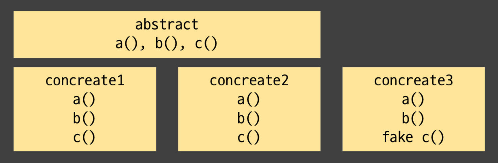
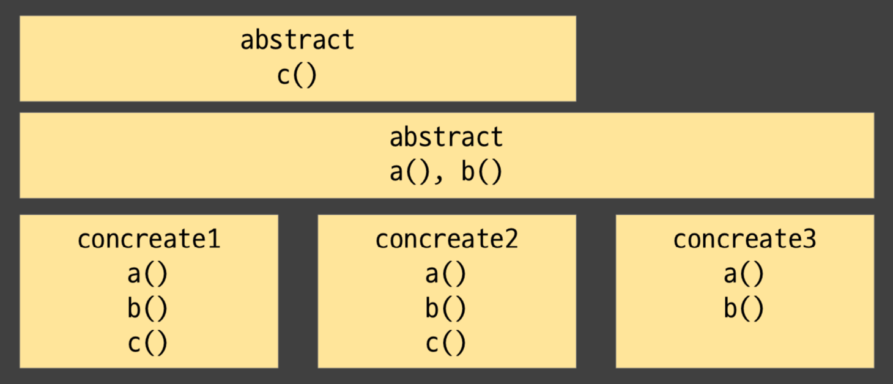
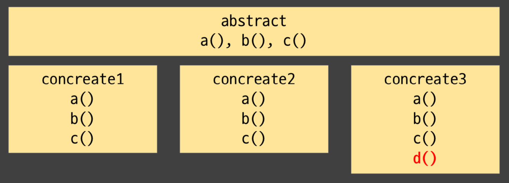
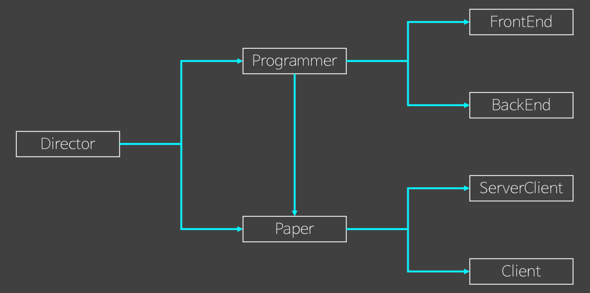
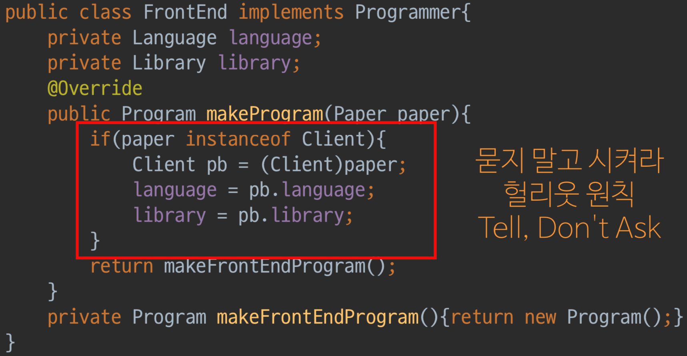

# 오브젝트

[오브젝트 4회차](https://www.youtube.com/watch?v=EZht-jB7mr0)

## LSP와 Generic

## 객체 설계 실패 원인

- 다른 객체에게 상태를 물어보면 제대로 된 설계가 이루어지지 않는다.

- `Tell, Don't Ask`에 의거하여 묻지 않고 시키려고 한다면, 자연스럽게 `디미터의 원칙`도 달성하게 된다.
  - 객체는 각자 `State of Management`를 하므로 위 원칙을 지키면 `수정에 강한 코드`를 작성할 수 있다.

- SOLID 원칙 중 리스코프 치환 원칙(LSP)와 Open-Closed 원칙(OCP)와 밀접한 관계를 갖는다.

## 리스코프 치환 원칙, LSP

- 자식 타입을 부모 타입으로 안전하게 대체할 수 있다는 원칙이다.

### 성급한 추상화



- 설계시 고려되지 않은 구상 객체 `concreate3`이 등장하는 케이스를 살펴보자
  - `concreate3`의 경우 `c()` 메서드를 갖지않아서, `fake c()` 를 갖게 하여 추상화를 유지하고자 한다.
    - `Context Error`를 발생시킨다.

### LSP에 따른 해결 방법



- `concreate3`와 같이 기존보다 스펙이 줄어드는 경우(`c()`를 갖지 않음) 상당히 탁월한 해결 방법이다.

- 스펙이 늘어나는 경우 문제가 발생한다.

#### 스펙이 늘어난 경우



- LSP를 지키려는 이유는 `DownCasting`을 막기 위해서이다.
  - `d()`를 사용하기 위해서 `DownCasting`하는 순간 OCP도 어기게 된다.

### Generic

> 해결책은 `< T:abstract >`, 바로 제네릭이다.

## 개발자의 세계

- 개발자는 **도구**인게 현실이다.



- Director는 기획서(Paper)를 받는다.
- Paper는 다향한 형식을 지닌 사양으로 구성된다.
- Director는 사양대로 Programmer를 섭외한다.
- Programmer는 Paper대로 개발하니 Paper를 알아야한다.
- 현실적으로 Programmer는 FrontEnd와 BackEnd로 나누어진다.

### 모델링을 기반으로한 코드

```java
public interface Paper {

}
```

```java

public interface Programmer {

    Program makeProgram(Paper paper);
}
```

```java
public class Client implements Paper {

    Library library = new Library("vueJS");
    Languae languae = new Language("JS");
    Programmer programmer;

    public void setProgrammer(Programmer programmer) {
        this.programmer = programmer;
    }
}
```

```java
public class ServerClient implements Paper {

    Server server = new Server("test");
    Language backEndLanguage = new Language("java");
    Language frontEndLanguage = new Language("JS");
    private Programmer backEndProgrammer;
    private Programmer frontEndProgrammer;

    public void setBackEndProgrammer(Programmer backEndProgrammer) {
        this.backEndProgrammer = backEndProgrammer;
    }

    public void setFrontEndProgrammer(Programmer frontEndProgrammer) {
        this.frontEndProgrammer = frontEndProgrammer;
    }
}
```

```java
public class FrontEnd implements Programmer {

    private Language language;
    private Library library;

    @Override
    public Program makeProgram(Paper paper) {
        if (paper instanceof Client) {
            Client pb = (Client) paper;
            language = pb.languae;
            library = pb.library;
        }
        return makeFrontEndProgram();
    }

    private Program makeFrontEndProgram() {
        return new Program();
    }
}
```

```java
public class BackEnd implements Programmer {

    private Language language;
    private Library library;

    @Override
    public Program makeProgram(Paper paper) {
        if (paper instanceof ServerClient) {
            Client pb = (ServerClient) paper;
            language = pb.languae;
            library = pb.library;
        }
        return makeBackEndProgram();
    }

    private Program makeBackEndProgram() {
        return new Program();
    }
}
```

- Paper가 Marker Interface 이므로 Paper로부터 어떤 정보도 얻을 수 없다.
- Client 혹은 ServerClient로 DownCasting을 해야만 필요한 정보를 얻을 수 있다.

```java
public class Director {

    private Map<String, Paper> projects = new HashMap<>();

    public void addProject(String name, Paper paper) {
        projects.put(name, paper);
    }

    public void runProject(String name) {
        if (!projects.containsKey(name)) {
            throw new RuntimeException("no project");
        }
        Paper paper = projects.get(name);
        if (paper instanceof ServerClient) {
            ServerClient project = (ServerClient) paper;
            Programmer frontEnd = new FrontEnd(), backEnd = new BackEnd();
            project.setFrontEndProgrammer(frontEnd);
            project.setBackEndProgrammer(backEnd);
            Program client = frontEnd.makeProgram(project);
            Program server = backEnd.makeProgram(project);
            deploy(name, client, server);
        } else if (paper instanceof Client) {
            Client project = (Client) paper;
            Programmer frontEnd = new FrontEnd();
            project.setProgrammer(frontEnd);
            deploy(name, frontEnd.makeProgram(project));
        }
    }

    private void deploy(String projectName, Program... programs) {
    }
}
```

- Director 코드에는 에러가 숨겨져 있다.
- FrontEnd는 ServerClient와 Paper를 넘겨 받을 때 Language와 Library를 세팅하지 못 하게된다.
  - if로 분기 처리하면 Compile Error가 나지 않지만 Context Error를 야기한다.
- 이처럼 if를 잘못 쓰면 OCP을 어기는 것 뿐만 아니라 심각한 오류를 만든다.
  - 사소한 문제라 생각한 DownCasting은 `Context Error`를 야기한다.

- 설계상 특별하게 신경써야할 원칙은 LSP와 OCP이다.


위의 예시는 Paper가 Marker Interface이므로 모두 `d()`의 상황이 벌어지고 있는 것이다.

### LSP 위반 시행착오



- LSP를 위반하자 OCP도 위반하게 되었다.

- 추상형에 대한 구상 지식을 가지려 했기에 DownCating이 발생했다.

```java
public interface Programmer {

    Program makeProgram(Paper paper);
}
```

```java
public class FrontEnd implements Programmer {

    private Language language;
    private Library library;

    @Override
    public Program makeProgram(Paper paper) {
        paper.setData(this);
        return makeFrontEndProgram();
    }

    void setLanguage(Language language) {
        this.language = language;
    }

    void setLibrary(Library library) {
        this.library = library;
    }

    private Program makeFrontEndProgram() {
        return new Program();
    }
}
```

```java
public class BackEnd implements Programmer {

    private Server server;
    private Language language;

    @Override
    public Program makeProgram(Paper paper) {
        paper.setData(this);
        return makeBackEndProgram();
    }

    public void setServer(Server server) {
        this.server = server;
    }

    public void setLanguage(Language language) {
        this.language = language;
    }

    private Program makeBackEndProgram() {
        return new Program();
    }
}
```

... 코드 수정 진행

> 내 코드에 `instanceof`가 있으면 `Generic`을 고려하자
>
> Generic은 UpperBound, instanceof는 UnderBound를 이용한다.

- Paper 코드에 Generic 도입

```java
public interface Paper<T extends Programmer> {

    void setData(T programmer);
}

public class Client implements Paper<FrontEnd> {

    Library library = new Library("vueJS");
    Language language = new Language("kotlinJS");
    FrontEnd programmer;

    public void setProgrammer(FrontEnd programmer) {
        this.programmer = programmer;
    }

    @Override
    public void setData(FrontEnd programmer) {
        programmer.setLibrary(library);
        programmer.setLanguage(language);
    }
}
```

- `setData()`는 바로 구상 타입에 접근할 수 있다.
- RunTime, ContextTime Error가 CompileTime Error로 붙잡을수 있게 된다.

> 앞에서 다루었던 내용들중에서 **변화율**과 **분기**의 개념이 녹아있다.

### 하지만 문제는 여전하다.

## OCP와 제네릭을 통한 해결

- 현실 세계에서의 객체 바인딩은 1:1 만으로 이루어지지 않는다.
- 1:n 관계의 n에서 구현화를 시도하면 일반화를 시킬 수 없다.
  - Element가 Collector를 아는게 그 반대에 비해 유리하다.
  - 객체지향에서는 Child가 Parent를 알게 한다.
- 의존성의 무게가 서로 다르다.

### OCP와 제네릭 도입


