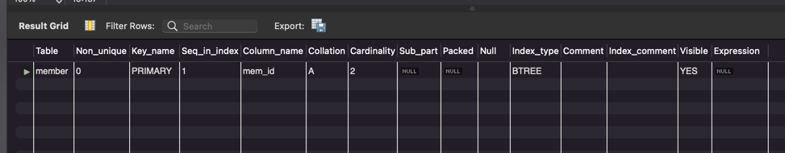

# 혼자 공부하는 SQL

## Chapter 6. 인덱스

### 6.1 인덱스 개념을 파악하자

- 인덱스의 장단점
  - 장점: SELECT 문으로 검색하는 속도가 빨라진다
    - 컴퓨터의 부담이 줄어든다
  - 단점: 인덱스도 공간을 차지해서 데이터베이스 내부 추가 공간이 필요하다
    - 약 10%

- 인덱스의 종류
  - 클러스터형 인덱스: 내용이 이미 정렬되어 있는 인덱스
    - 기본 키로 지정하면 클러스터형 인덱스가 생성되고, 해당 열로 자동 정렬된다
  - 보조 인덱스: 일반 책의 찾아보기와 같이 별도의 공간에 인덱스가 생성된다.
    - 고유 키로 지정하면 보조 인덱스가 생성되고 자동 정렬되지 않는다
  - 고유 인덱스: 값이 중복되지 않는 인덱스
    - 기본 키나 고유 키로 지정하면 값이 중복되지 않아서 고유 인덱스가 자동으로 생성된다.

#### 확인 문제

1. 2 - 인덱스는 `SELECT`문을 빠르게 처리한다.
2. 3 - 인덱스는 약 10% 추가적인 공간이 필요하다
3. 4 - 보조 인덱스는 고유 키를 설정하면 자동 생성된다.
4. 1 - 인덱스 값이 중복되는 것을 허용하는 인덱스는 단순 인덱스이다.
5. 2,4 - 클러스터형 인덱스는 테이블에 1개만 생성 가능하다.

### 6.2 인덱스의 내부 작동

- 클러스터형 인덱스와 보조 인덱스는 모두 내부적으로 B 트리(균형 트리)로 만들어진다.

#### 인덱스의 내부 작동 원리

- 균형 트리의 개념
  - 노드: 균형 트리 구조에서 데이터가 저장되는 공간
    - 루트: 최상위 노드
    - 중간: 사이의 노드
    - 리프: 제일 마지막 노드
  - 노드는 개념적인 용어이고 MySQL에서는 페이지라고 한다

- 인덱스는 내부적으로 균형 트리 구조로 구성된다.
- 전체 테이블 검색: 데이터를 처음부터 끝까지 검색하는 것이다.
  - 인덱스가 없으면 전체 페이지를 검색하는 방법밖에 없다
- 페이지 분할: 데이터를 입력할 때, 입력할 페이지에 공간이 없어서 2개 페이지로 데이터가 나눠지는 것을 말한다.
- 인덱스 검색: 클러스터형 또는 보조 인덱스를 이용해서 데이터를 검색하는 것이다.
  - 속도는 인덱스를 사용하지 않았을 때보다 빠르다

#### 확인문제
1. 4
2. 번문제
   - 노드 중 제일 상위 노드: 루트 노드
   - 노드 중 가운데 낀 노드: 중간 노드
   - 노드 중 제일 마지막 노드: 리프 노드
   - 16KB 크기의 최소한의 저장 단위: 페이지
3. 페이지 분할
4. 2,3 클러스터형 인덱스로 지정하면 오름차순으로 정렬된다. 보조 인덱스는 생성해도 정렬되지 않는다.

### 6.3 인덱스의 실제 사용

> 기본미션

>선택미션 

인덱스 생성 문법

`CREATE [UNIQUE] INDEX 인덱스_이름 ON 테이블_이름 (열_이름) [ASC | DESC]`

인덱스 제거 문법

`DROP INDEX 인덱스_이름 ON 테이블_이름`

---

- `CREATE INDEX` 문으로 인덱스를 직접 생성한다
- 기본 키 및 고유 키로 자동 생성된 인덱스는 ALTER TABLE로 제거하고, CREATE INDEX문으로 생성한 인덱스는 DROP INDEX로 제거한다.
- 단순 보조 인덱스는 중복을 허용하는 보조 인덱스이며, CREATE UNIQUE INDEX문을 사용한다.
- MySQL 워크벤치에서 SQL을 실행한 후, 실행 계획(`Command + Option + X`)

#### 확인문제

1. 2
2. 번문제
   - 인덱스를 생성하는 SQL - CREATE INDEX
   - 인덱스를 제거하는 SQL - DROP INDEX
   - 테이블에 생성된 인덱스 이름과 열을 확인하는 SQL - SHOW INDEX
   - 인덱스의 할당된 크기를 확인하는 SQL - SHOW TABLE STATUS
3. 1,2 클러스터형 인덱스는 1개, 보조 인덱스는 여러 개 만들 수 있다.
4. 1,3 SQL을 실행후 확인할 수 있다. 인덱스를 사용하면 Single Row, Index Range Scan 등의 형태
5. 1,3 인덱스는 열 단위에 생성된다. 중복도가 높으면 인덱스의 효과가 없다.

