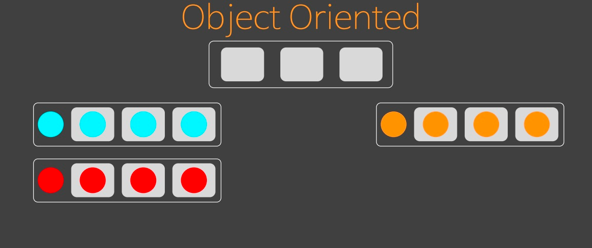
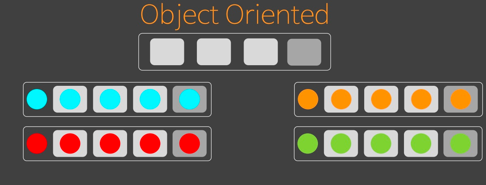
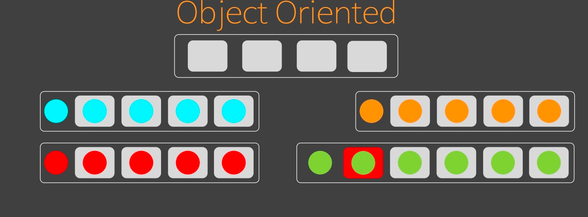

# 오브젝트

[오브젝트 5회차](https://youtu.be/6Hhj5HO0Wb4?list=PLBNdLLaRx_rI-UsVIGeWX_iv-e8cxpLxS)

## 분해, Decomposition

- 독립된 기능을 가진 부속들을 모아 하나의 결과물로 만드는 걸 `Composition`이라 부른다.
  - `Composition`은 사용된 부속들이 가진 고유한 속성이 바뀌지 않는다
  - `Assemble`은 처음부터 하나하나가 특성을 가지지 않는다.

- 우리는 Domain을 분해하여 각각 Component로 분리한 다음, Composition하고 싶다.

> ‘복잡한 현실 세계를 어떻게 Decomposition할 것인가?’

### 기능적 분해, Functional decomposition

#### Flow chart 기법

> Functional을 기능적이 아니라 함수적이라 해석해도 무방하다.
> Functional decomposition는 개발 용어 이전에 수학적 용어이기도 하다.

- 일련의 과정을 `flow`로 바라보고 기능을 분해할 수 있다는 입장.

### 추상 데이터 타입 ADT, Abstract Data Type

- ADT는 두 가지를 만족해야 성립할 수 있다.
  - 상태가 확정되어야 한다.
  - 모든 메소드가 상태 전체를 커버하는 메소드들로만 구성되어야 한다.

### 객체지향, Object Oriented

- 객체 지향은 상태가 없는 단계부터 추상화 시킨다.
- 필요한 기능을 정하고, 이를 추상화하고나서 상속받는 객체를 만든다.
- 상태에 따라서 상속 구조를 바꿔나가면서 형을 추가해 나가는 구조다.
  - 형을 통합하는 추상형도 필요하다. 반면 앞서 언급한 ADT는 형을 줄여나가는 구조다.



- 추상형은 형을 한꺼번에 인식하기 위한 대표자로 추상형을 만든다.
- `Lazy Binding`을 통해 구상형을 바라보게 하기 위한 수단이다.



- ADT에서는 상태 별로 if문으로 관리하던 것과 달리, 지금은 상태 만큼 객체의 형을 만든다.
- 그러나 기능이 추가되면 전부 수정해야 한다.
  - 성급한 추상화를 피해야한다.



- 추상 클래스로 인식하고 있다면 리스코프 치환원칙에 의해서 이 메서드를 사용할 수 있는 방법은 제한적
  - Java는 Generic을 활용한다.

## 개발자의 세계 ADT

```java
public class Paper {

    public Paper(boolean isClient) {
        this.isClient = isClient;
    }

    public final boolean isClient;
    Library library = new Library("vueJS");
    Language language = new Language("kotlinJS");
    Programmer programmer;
    Server server = new Server("test");
    Language backEndLanguage = new Language("java");
    Language frontEndLanguage = new Language("kotlinJS");
    private Programmer backEndProgrammer;
    private Programmer frontEndProgrammer;

    public void setBackEndProgrammer(Programmer programmer) {
        if (!isClient)
            backEndProgrammer = programmer;
    }

    public void setFrontEndProgrammer(Programmer programmer) {
        if (!isClient)
            frontEndProgrammer = programmer;
    }

    public void setProgrammer(Programmer programmer) {
        if (isClient)
            this.programmer = programmer;
    }
}
```

- Client와 ServerClient를 Paper로 통합한다.
  - 모든 상태를 소유할 수 있도록 변경하고, flag에 따라 분기를 나누게 된다.
- flag에 대한 여파로 내부에서 모든 상태를 커버할 수 있도록 변경해야 한다.
  - 암묵적으로 작동해야 할 상태가 정해져 있는 게 ADT가 지닌 문제이다.

```java
public class Programmer {

    public Programmer(Boolean isFrontEnd) {
        this.isFrontEnd = isFrontEnd;
    }

    public final boolean isFrontEnd;
    private Language frontLanguage;
    private Library frontLibrary;
    private Server server;
    private Language backEndLanguage;

    public Program makeProgram(Paper paper) {
        if (isFrontEnd) {
            frontLanguage = paper.getFrontEndLanguage();
            frontLibrary = paper.getFrontEndLibrary();
        } else {
            this.server = paper.getServer();
            this.backEndLanguage = paper.getBackEndLanguage();
        }
        return isFrontEnd ? makeFrontEndProgram() : makeBackEndProgram();
    }

    private Program makeFrontEndProgram() {
        return new Program();
    }

    private Program makeBackEndProgram() {
        return new Program();
    }
}
```

- Programmer는 isFrontEnd를 통해 두 가지 상태로 나눠진다.
  - FrontEnd와 BackEnd에 동일한 변수명인 language이 있었는데, 합치면서 변수명 충돌이 발생한다. 이를 해결하기 위해 관련 코드를 수정한다.
  - 통합하면서 language라는 변수명은 이제 사용할 수 없으니 frontEnd와 backEnd로 나눠서 사용해야 한다.
- 추상화의 크기가 다르면 단계가 맞지 않아서 인식하기 어렵다.
  - ADT는 시간 순으로 상태가 추가될 때마다 이름 충돌로 인해 전부 나뉘어지고, 이름을 길게 짓게 된다.

- boolean을 통해 모든 개발자를 통합한 추상형을 만들었다.
  - 두 개의 함수로 나눠져 있었지만, 이제는 if를 통해서 하나의 함수로 모여져 지식의 통합이 발생하였다.

- ADT는 형끼리 결합할 수 없다.
  - 본인 상태를 사용해서 분리하고 상태를 감추는 ADT 연쇄로 인해 Paper도 구분할 수 없으므로 통합 메소드를 통해 불러올 수 밖에 없다.
  - Programmer 상태가 frontEnd라면 Paper에게 frontEndLanguage를 요청하는 Getter를 만들게 된다.

```java
public class Paper {

    public Paper(boolean isClient) {
        this.isClient = isClient;
    }

    public final boolean isClient;
    Library library = new Library("vueJS");
    Language language = new Language("kotlinJS");
    Programmer programmer;
    Server server = new Server("test");
    Language backEndLanguage = new Language("java");
    Language frontEndLanguage = new Language("kotlinJS");
    private Programmer backEndProgrammer;
    private Programmer frontEndProgrammer;

    public void setBackEndProgrammer(Programmer programmer) {
        if (!isClient) {
            backEndProgrammer = programmer;
        }
    }

    public void setFrontEndProgrammer(Programmer programmer) {
        if (!isClient) {
            frontEndProgrammer = programmer;
        }
    }

    public void setProgrammer(Programmer programmer) {
        if (isClient) {
            this.programmer = programmer;
        }
    }

    // 추가 된 메서드
    public Language getFrontEndLanguage() {
        return isClient ? language : frontEndLanguage;
    }

    public Library getFrontEndLibrary() {
        return isClient ? library : null;
    }

    public Server getServer() {
        return isClient ? null : server;
    }

    public Language getBackEndLanguage() {
        return isClient ? null : backEndLanguage;
    }
}
```

- Paper의 기능을 확장하게되면 4개의 메서드가 추가된다.
  - isClient에 따라 메서드들이 파편화 된다.
- 작성한 메서드가 비대칭으로 작동한다면 이미 ADT로 만든 코드다.

```java
public class Director {

    private Map<String, Paper> projects = new HashMap<>();

    public void addProject(String name, Paper paper) {
        projects.put(name, paper);
    }

    public void runProject(String name) {
        if (!projects.containsKey(name)) {
            throw new RuntimeException("no project");
        }
        Paper paper = projects.get(name);
        if (paper instanceof ServerClient) {
            ServerClient project = (ServerClient) paper;
            Programmer frontEnd = new FrontEnd(), backEnd = new BackEnd();
            project.setFrontEndProgrammer(frontEnd);
            project.setBackEndProgrammer(backEnd);
            Program client = frontEnd.makeProgram(project);
            Program server = backEnd.makeProgram(project);
            deploy(name, client, server);
        } else if (paper instanceof Client) {
            Client project = (Client) paper;
            Programmer frontEnd = new FrontEnd();
            project.setProgrammer(frontEnd);
            deploy(name, frontEnd.makeProgram(project));
        }
    }

    private void deploy(String projectName, Program... programs) {
    }
}
```

- OOP 코드에서는 Director가 Paper의 타입에 따라 동작이 달랐다
- 현재는 Paper의 내부를 확인할 수 밖에 없다.
  - Paper의 상태를 노출하지 않고서는 경우에 따른 코드를 분리할 수가 없다.
  - 결국 ADT의 진짜 목적이었던 내부형을 캡슐화하는 것도 어기게 된다.

### ADT의 폐단

- 캡슐화 실패
- 데이터 은닉 실패
- context가 일치하지 않는 Getter 양산
- 본인의 상태 추상화 실패
