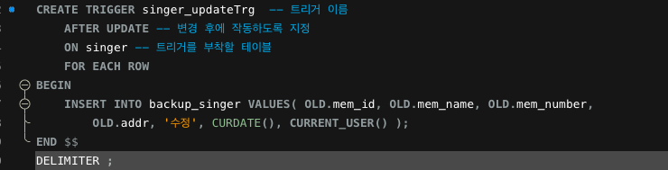
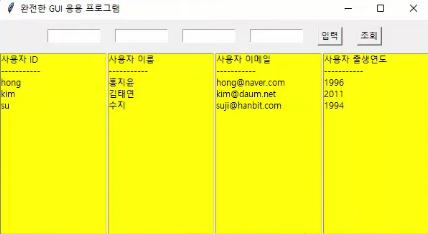

# 혼자 공부하는 SQL

## Chapter 7. 스토어드 프로시저

### 7.1 스토어드 프로시저 사용 방법

- 스토어드 프로시저는 MySQL에서 제공되는 프로그래밍 기능이다.
- 스토어드 프로시저는 BEGIN ~ END 사이에 코드를 구현한다.
- 스토어드 프로시저를 작성한 후, CALL 문을 통해서 스토어드 프로시저를 호출한다.
- 입력 매개변수는 IN을 앞에 붙여서 스토어드 프로시저에 값을 전달한다.
- 출력 매개변수는 OUT을 앞에 붙이고 스토어드 프로시저에서 계산된 결과를 돌려받는다.
- 동적 SQL은 다이나믹하게 SQL을 생성한 후 실행한다.
  - PREPARE 문과 EXECUTE문을 사용한다

#### 확인문제

1. 4 - 스토어드 프로시저는 데이터베이스 내부에 저장된다.
2. 4
3. 4 출력 매개변수는 CALL 프로시저_이름(@변수명) 형식을 사용한다
4. 2 반복문은 WHILE을 사용한다

### 7.2 스토어드 함수와 커서

- 스토어드 함수는 RETURNS 예약어를 통해서 반환될 데이터의 형식을 미리 지정해 놓아야 한다.
- 스토어드 함수의 매개변수는 모두 스토어드 함수로 값이 들어오는 입력 매개변수이다.
  - 스토어드 프로시저와 달리 출력 매개변수는 없다
- 커서는 한 행씩 처리되도록 하는 기능.
  - DECLARE로 선언할 수 있고 그 내용은 SELECT 문이다.
- 커서는 행이 끝날 때 까지 계속 반복한다. 행의 끝을 판단하기 위해 변수 endOfRow를 준비하고, TRUE인지 체크한다.

#### 확인문제

1. 4 - 스토어드 함수에서는 SELECT를 사용할 수 없다
2. RETURNS, RETURN
3. 커서 선언하기 - 반복 조건 선언하기 - 커서 열기 - 데이터 가져오기 및 데이터 처리하기 - 커서 닫기
4. LOOP, FETCH, LEAVE

### 7.3 자동 실행되는 트리거

> 기본미션

- 트리거는 테이블에서 DML문(INSERT, UPDATE, DELETE 등)의 이벤트가 발생할 때 작동한다.
- AFTER DELETE는 DELETE문이 발생된 후에 트리거를 작동하라는 의미입니다.
- 트리거는 행 데이터가 삭제 또는 수정되면 기존 데이터를 백업 테이블에 저장하도록 할 수 있다.
- 트리거에서 기존 데이터는 OLD 테이블에, 새로운 데이터는 NEW 테이블에 잠깐 저장된다.
  - 두 테이블은 MySQL이 내부적으로 관리한다.

#### 확인문제

1. 1 - SELECT는 트리거를 작동시키지 않는다.
2. 4 - 트리거는 DML 문 이벤트가 발생하면 자동으로 작동한다
3. AFTER, ROW
4. DELETE문에 작동한다.
5. TRUNCATE는 DML이 아니다.

## Chapter 8. SQL과 파이썬 연결

### 8.1 파이썬 개발 환경 준비

- PyMySQL은 파이썬과 MySQL을 연결시켜주는 외부 라이브러리이다.
- IDLE은 파이썬을 개발하는 통합 개발 환경이다
- 입력한 내용이 바로 결과로 나오는 대화형 모드와 여러줄을 입력한 후 한꺼번에 실행하는 스크립트 모드가 있다.

#### 확인문제

1. 3
2. 3
3. 4 - 파이썬은 스크립트 언어(인터프리트 언어)이다.
4. 4

### 8.2 파이썬과 MySQL의 연동

- 데이터베이스 연동은 SQL을 파이썬과 연결하는 것을 말한다.

#### 확인문제

1. 4 - commit()으로 저장후에 close()로 종료한다.
2. 4 - charset에는 utf-8을 적는다
3. 3
4. 2

### 8.3 GUI 응용 프로그램

> 선택미션
> 

- 라벨은 윈도에 문자를 표현하고 버튼을 클릭하는 기능을 제공한다
- 프레임은 화면을 나누는 기능이고, 엔트리는 입력 상자를 제공한다. 리스트 박스는 여러건의 목록을 표현한다.

#### 확인문제

1. 3 - title()은 윈도의 제목을 표시한다
2. 4 - bg는 배경색을 지정한다
3. 3 - command가 함수명을 지정하는 옵션이다
4. 3
