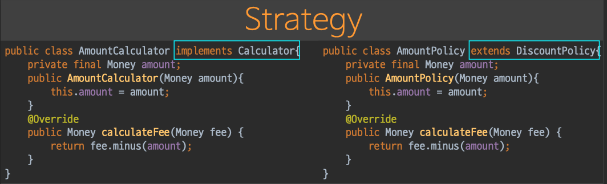
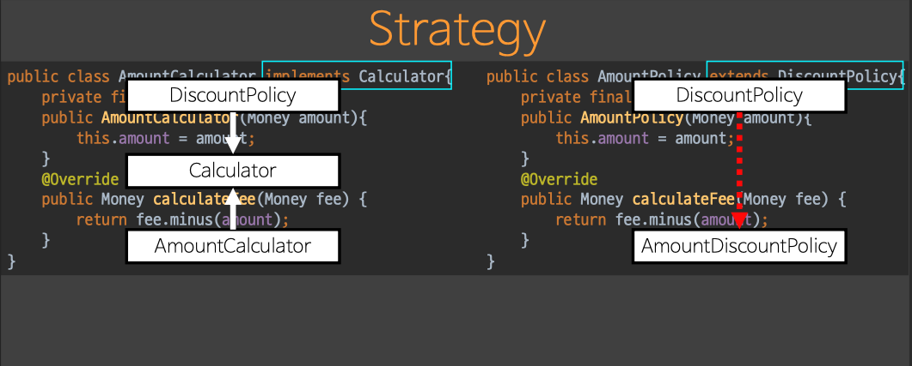
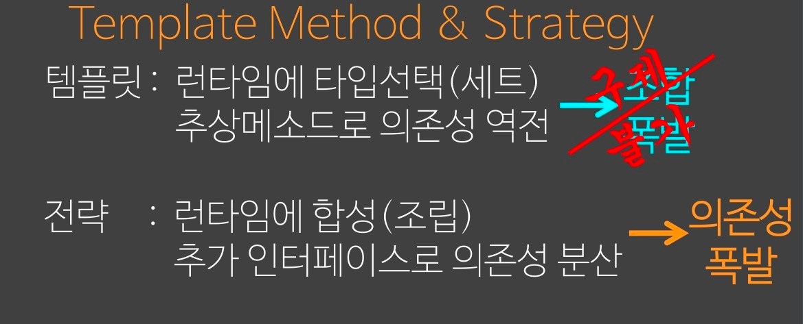
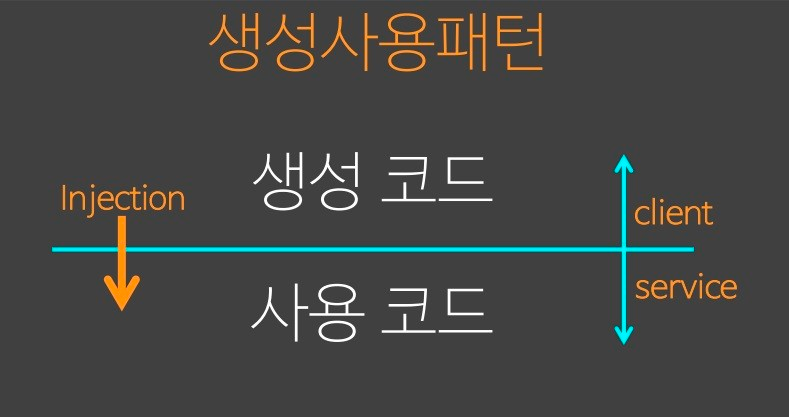
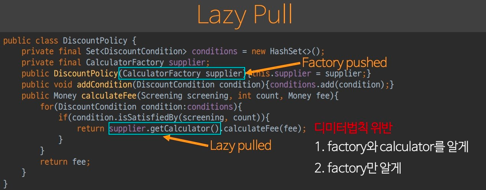
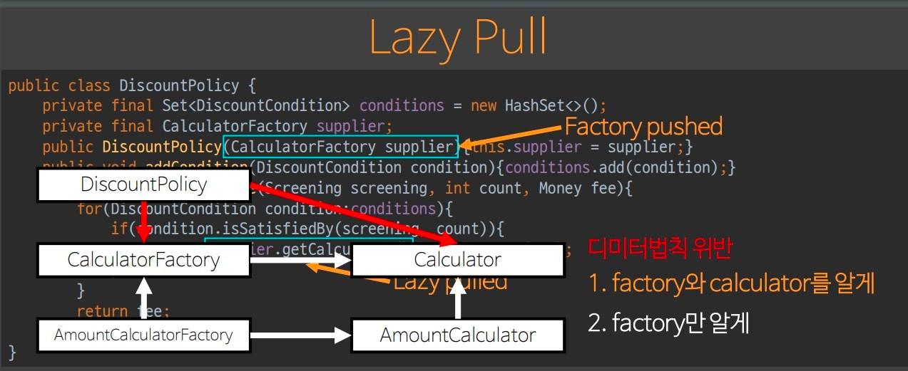
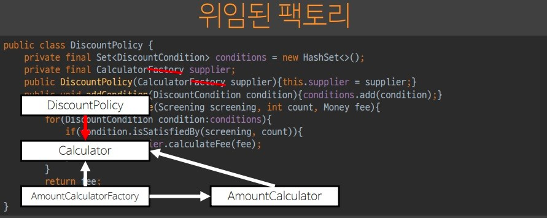
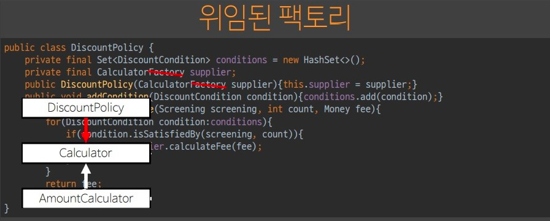
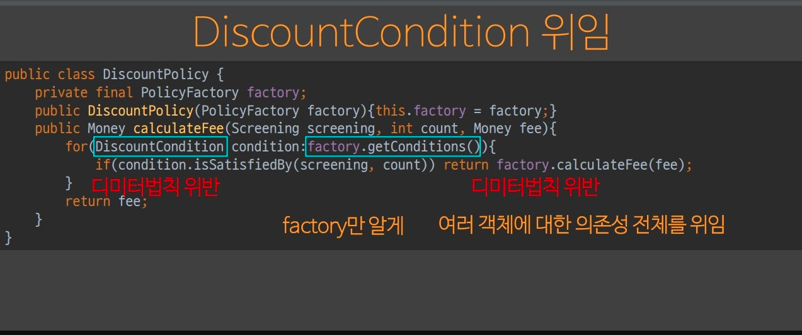

# 오브젝트

[오브젝트 6회차](https://youtu.be/xb0a2QxocaE?list=PLBNdLLaRx_rI-UsVIGeWX_iv-e8cxpLxS)

디자인 패턴에서 가장 중요한 패턴이 무엇이냐고 물으면, 단연코 추상 팩토리 메서드 패턴이다.

이와 더불어 중요한 패턴은 커맨드 패턴이다.

## 합성과 상속

합성과 상속은 템플릿 메서드 패턴과 전략 패턴이 문제를 해결하는 방식을 살펴보면 드러난다.

이와 별개로 우리가 직면한 가장 큰 문제는 의존성이다.

우리가 객체로 문제를 해결할 때 항상 객체망을 구성하게 되는데, 이는 객체가 다른 객체를 알고 있다는 뜻이다.

의존성을 적절하게 관리하는 방법은 존재하지 않는다. 의존성을 관리하는 방법은 양방향 의존성을 없애는 것이다.

합성시, 상속시 의존성이 흐르는 방향으로 하여금 문제가 발생하고, 이를 어떻게 해결하는지 살펴보자.

### Template Method, 템플릿 메서드 패턴

```java
abstract class DiscountPolicy {

    private Set<DiscountCondition> conditions = new HashSet<>();

    public void addCondition(DiscountCondition condition) {
        conditions.add(condition);
    }

    public Money calculateFee(Screening screening, int count, Money fee) {
        for (DiscountCondition condition : conditions) {
            if (condition.isSatisfiedBy(screening, count))
                // Hook
                return calculateFee(fee);
        }
        return fee;
    }

    // Hook
    protected abstract Money calculateFee(Money fee);
}
```

`DiscountPoilicy`에 대하여 템플릿 메서드 패턴을 적용했다.

`calculateFee`는 템플릿 메서드이고, `calculateFee`는 훅 또는 protocol이다.

protocol인 이유는 훅은 곧 부모와 자식간의 약속이기 때문이다.

템플릿 메서드 패턴만 상속을 활용한 좋은 패턴으로 소개하는 이유는,

이는 상속 중에서 유일하게 의존성 방향을 역전시키기 때문이다.

책에서 다루는 상속의 단점은 `자식이 부모를 아는 방향으로 의존성이 이루어져 있다`는 점이다.

일반적으로 상속을 통해 객체망을 구성하면 자식은 부모를 알고(UpCasting), 부모는 자식을 모른다(DownCasting).

상속을 사용하게 되면 자연스럽게 부모 레이어의 수정의 여파가 모든 자식에 미치게 된다.

> 템플릿 메서드 패턴은 부모- 자식간 의존성을 역전시킨다.

추상 메서드를 활용하여 interface처럼 부모가 자식을 알고 있게 만든다. 자식은 자신의 책임만 구현하면 된다.

자식의 수정은 자신에게만 영향을 미치고, 부모에는 여파가 가지 않으며, 부모에 의존하는 자식을 만들지 않아서 부모의 수정이 자식에게 영향을 미치지 않는다.

> 잠깐 정리
> 미래의 자식이 구현해야되는 제한된 책임을 훅이라 부른다.
> 훅을 사용하는 메서드를 템플릿 메서드라고 부른다.

```java
public class AmountPolicy extends DiscountPolicy {

    private final Money amount;

    public AmountPolicy(Money amount) {
        this.amount = amount;
    }

    @Override
    public Money calculateFee(Money fee) {
        return fee.minus(amount);
    }
}
```

`AmountPolicy`는 `DiscountPolicy`를 상속받고, `calculateFee`만 구현한다.

`super`도, 부모의 메서드, 필드도 사용하지 않는다.

확정된 protocol로만 부모와 통신을 하게 되므로 자연스럽게 `할리우드 원칙, Tell Don't Ask`도 지켜진다.

> 객체망에서 부모과 자식는 서로 다른 객체다.
> 실제 메모리 상에서 살펴봐도 부모 객체와 자식 객체가 각각 만들어진다.
> 그저 부모-자식 두 객체를 묶어서 pointer로 관리한다.
> 상속을 한다고 해서 자식 클래스만 메모리에 할당 되는게 아니다.
> Cascading은 부모-자식 둘 다 생성해놓았기에 가능한 일이다.
> Cascading 시 통합 포인터를 거쳐서 실제 형으로 반환한다.
> 따라서 부모와 자식일지라도 서로 다른 객체이기에 이 둘도 interface로 통신을 해야 한다.

### Strategy, 전략 패턴

객체가 안정화 되어 더 이상 확장될 가능성이 없다면, 템플릿 메서드 패턴을 사용한다.

아직 유연성이 중요하다면 전략 패턴을 사용한다.

대개 전략 패턴으로 유연성을 확보하여 코드를 작성한 뒤, 안정화 되었다고 생각이 들면 템플릿 메서드 패턴으로 바꾼다.

```java
public class DiscountPolicy {

    private final Set<DiscountCondition> conditions = new HashSet<>();
    private final Calculator calculator;

    public DiscountPolicy(Calculator calculator) {
        this.calculator = calculator;
    }

    public void addCondition(DiscountCondition condition) {
        conditions.add(condition);
    }

    public Money calculateFee(Screening screening, int count, Money fee) {
        for (DiscountCondition condition : conditions) {
            if (condition.isSatisfiedBy(screening, count))
                return calculator.calculateFee(fee);
        }
        return fee;
    }
}
```

전략 패턴은 더이상 상속이 아닌 합성의 원리를 사용하기 때문에, 객체를 소유한다.

`DiscountPolicy`는 상속을 받지 않는 단일 클래스가 되고, 상속에서 추상 메서드로 해결한 interface의 구현을 외부 객체의 도움을 받아 처리한다.

```java
public class AmountCalculator implements Calculator {

    private final Money amount;

    public AmountCalculator(Money amount) {
        this.amount = amount;
    }

    @Override
    public Money calculateFee(Money fee) {
        return fee.minus(amount);
    }
}
```



템플릿 메서드 패턴과 코드가 사실상 동일하다. 추상클래스를 interface처럼 protocol로 사용한다.



템플릿 메서드 패턴과 전략패턴은 굉장이 유사해보이지만 의존성을 해결하는 방식이 다르다.

전략 패턴은 전략 계층을 만들어 단방향 의존성으로 풀어낸다. 템플릿 메서드 패턴보다 의존성이 늘어나지만 유연성이 높아진다.

### 비교, 조합 폭발과 의존성 폭발



템플릿 메서드 패턴은 조건문을 통해 원하는 class를 선택한다.

전략 패턴은 DiscountPolicy를 생성한 뒤 합성할 객체를 조건문을 통해 주입한다.

전략 패턴은 pointer의 pointer 원리를 이용하므로 Runtime에 언제든지 Calculator를 바꿀 수 있지만, 템플릿 메서드 패턴은 형 자체를 변경해야 한다.

#### 단점

템플릿 메서드 패턴은 자식이 중첩 구조를 가질 때 경우의 수만큼 형이 계속 늘어난다.

상속을 이용해서 하나의 세트를 형으로 고정하였기에 조합 폭발이 일어난다.

이에 비해 합성인 전략 패턴은 Runtime에 필요한 객체만 주입하니 조합 폭발이 일어나지 않지만, 의존성이 폭발한다.

알아야 되는 경우의 수만큼 주입을 받아드려야 하므로 의존성 폭발이 발생한다.

상속에서 발생하는 조합 폭발은 해결할 방법이 없지만, 의존성 폭발은 해결이 가능하다.

따라서 조합 폭발이 발생하지 않을 코드는 템플릿 메서드 패턴을 사용해도 문제가 없다.

템플릿 메서드 패턴은 hook 메서드가 하나만 있을 때 사용하는 것이 좋다.

## Creational, Factory, 생성 사용 패턴과 팩토리

생성 패턴은 객체를 만들기 위한 코드와 사용하는 코드가 나뉘어 있다는 사실에서 시작한다.

생성과 사용은 생명주기가 다르기 때문에 분리하여 사용하는 것이 좋다.

변화율에 따라 코드를 나누어 관리한다.



생성 사용 패턴을 통해 생성 코드와 사용 코드를 구분하자.

생성 코드를 client로 밀어내서 service 코드를 분리한다.

그러면 client에서 service로 객체를 주입할 수 밖에 없다.

기존에는 알고리즘으로 생각했던 걸 형으로 바꾸어 생성자로 만드는 과정이 숨어있다.

생성 패턴이 어려운 이유이다.

### Injection, 인젝션

```java
public class DiscountPolicy {

    private final Set<DiscountCondition> conditions = new HashSet<>();
    private final Calculator calculator;

    public DiscountPolicy(Calculator calculator) {
        this.calculator = calculator;
    }

    public void addCondition(DiscountCondition condition) {
        conditions.add(condition);
    }

    public Money calculateFee(Screening screening, int count, Money fee) {
        for (DiscountCondition condition : conditions) {
            if (condition.isSatisfiedBy(screening, count))
                return calculator.calculateFee(fee);
        }
        return fee;
    }
}
```

독립된 책임과 역할을 가지던 DiscountPolicy이 Calculator에 대한 제어권을 상실한다.

제어권을 되찾기 위해 팩토리를 만들어보자

### Factory, 팩토리

```java
public interface CalculatorFactory {

    Calculator getCalculator();
}
```

```java
public class AmountCalculatorFactory implements CalculatorFactory {

    private final Money money;
    private AmountCalculator cache;

    public AmountCalculatorFactory(Money money) {
        this.money = money;
    }

    @Override
    synchronized public Calculator getCalculator() {
        if (cache == null)
            cache = new AmountCalculator(money);
        return cache;
    }
}
```

팩토리를 구현하는 AmountCalculatorFactory를 보면 money를 미리 받는다.

Calculator는 원할 때 상대방이 만들어서 제공한다.

게다가 한 번 만들어진 객체를 재활용할 수 있도록 내부적으로 캐시 정책도 사용한다.

```java
public class DiscountPolicy {

    private final Set<DiscountCondition> conditions = new HashSet<>();
    private final CalculatorFactory supplier;

    public DiscountPolicy(CalculatorFactory supplier) {
        this.supplier = supplier;
    }

    public void addCondition(DiscountCondition condition) {
        conditions.add(condition);
    }

    public Money calculateFee(Screening screening, int count, Money fee) {
        for (DiscountCondition condition : conditions) {
            if (condition.isSatisfiedBy(screening, count)) {
                return supplier.getCalculator().calculateFee(fee);
            }
        }
        return fee;
    }
}
```

#### Lazy Pull



DiscountPolicy는 본인이 원할 때 호출할 수 있도록 팩토리로 주입 받는다.

Calculator를 원할 때 사용하게 되었다.

pointer의 pointer를 사용하고 있어 DiscountPolicy는 팩토리가 어떤 Calculator를 주는지 모른다.

지연 연산을 통해 Runtime에 다른 Calculator를 받을 수 있는 가능성을 갖는다.

문제는 팩토리는 디미터 법칙을 위반한다.

#### 첫 번째 해결 방법, 심플 팩토리 패턴



계도를 살펴보면 팩토리와 Calculator 추상 클래스와 구상 클래스들 간 순환 참조가 생기는 걸 볼 수 있다.

심플 팩토리 패턴은 circulation이 발생하여 양방향 참조가 성립하므로 지양할 디자인 패턴이다.

#### 두 번째 해결 방법, 위임된 팩토리

```java
public interface CalculatorFactory {

    Money calculateFee(Money fee);
}
```

```java
public class AmountCalculatorFactory implements CalculatorFactory {

    private final Money money;
    private AmountCalculator cache;

    public AmountCalculatorFactory(Money money) {
        this.money = money;
    }

    synchronized private Calculator getCalculator() {
        if (cache == null)
            cache = new AmountCalculator(money);
        return cache;
    }

    @Override
    public Money calculateFee(Money fee) {
        return getCalculator().calculateFee(fee);
    }
}
```

Calculator 지식이 팩토리 안으로 들어가 DiscountPolicy는 팩토리만 알게 된다.

```java
public class DiscountPolicy {

    private final Set<DiscountCondition> conditions = new HashSet<>();
    private final CalculatorFactory supplier;

    public DiscountPolicy(CalculatorFactory supplier) {
        this.supplier = supplier;
    }

    public void addCondition(DiscountCondition condition) {
        conditions.add(condition);
    }

    public Money calculateFee(Screening screening, int count, Money fee) {
        for (DiscountCondition condition : conditions) {
            if (condition.isSatisfiedBy(screening, count)) {
                return supplier.calculateFee(fee);
            }
        }
        return fee;
    }
}
```

디미터의 법칙을 지킬 수 있게 된다.

그러나 위임된 팩토리를 사용하면 팩토리 메서드와 Calculator가 동일하다.

위임된 팩토리의 interface는 팩토링하려던 객체 interface와 일치 되는게 정상이다.

위임된 팩토리 결과



최종적인 결과



### 추상 팩토리 메서드 패턴

DiscountCondition 위임

```java
public class DiscountPolicy {

    private final PolicyFactory factory;

    public DiscountPolicy(PolicyFactory factory) {
        this.factory = factory;
    }

    public Money calculateFee(Screening screening, int count, Money fee) {
        for (DiscountCondition condition : factory.getConditions()) {
            if (condition.isSatisfiedBy(screening, count))
                return factory.calculateFee(fee);
        }
        return fee;
    }
}
```

```java
public interface PolicyFactory extends Calculator {

    Set<DiscountCondition> getConditions();
}

public class AmountCalculatorFactory implements PolicyFactory {

    private final Money money;
    private AmountCalculator cache;
    private final Set<DiscountCondition> conditions = new HashSet<>();

    public AmountCalculatorFactory(Money money) {
        this.money = money;
    }

    synchronized private Calculator getCalculator() {
        if (cache == null)
            cache = new AmountCalculator(money);
        return cache;
    }

    public void addCondition(DiscountCondition condition) {
        conditions.add(condition);
    }

    public void removeCondition(DiscountCondition condition) {
        conditions.remove(condition);
    }

    @Override
    public Money calculateFee(Money fee) {
        return getCalculator().calculateFee(fee);
    }

    // 상태의 공급
    @Override
    public Set<DiscountCondition> getConditions() {
        return conditions;
    }
}
```



결국 PoliciyFactory로 Condition을 위임해야한다.

```java
public interface PolicyFactory extends Calculator {

    default Money calculateFee(Screening screening, int count, Money fee) {
        for (DiscountCondition condition : getConditions()) {
            if (condition.isSatisfiedBy(screening, count))
                return calculateFee(fee);
        }
        return fee;
    }

    Set<DiscountCondition> getConditions();
}
```

Policy의 공통로직이 팩토리에 위임되었고, interface에서 default method로 구현되었다.

팩토리는 condition을 알고 있어 디미터 법칙을 지키고, 템플릿 메서드를 사용하게 되었다.

CalculateFee와 getCondition이라는 두개의 훅을 갖고 있는 것을 알 수 있다.

이는 팩토리를 통하여 DiscountPolicy의 조합폭발을 미룬 것을 알 수 있다.

```java
public class DiscountPolicy {

    private final PolicyFactory factory;

    public DiscountPolicy(PolicyFactory factory) {
        this.factory = factory;
    }

    public Money calculateFee(Screening screening, int count, Money fee) {
        return factory.calculateFee(screening, count, fee);
    }
}
```

DiscountPolicy는 결국 팩토리를 받아서 calculateFee를 위임한다.

DiscountPolicy가 팩토리로부터 conditions와 calculator를 공급 받는다면 DiscountPolicy는 모든 지식을 알게 되고, 결국 의존성만 남는다.

팩토리에 대한 의존성만 남겨두려면 팩토리로 로직을 옮길 수 밖에 없다.

결국 추상 팩토리 메서드 패턴 조차 위임된 팩토리 패턴이 된다.

> 한 객체에 의존하는 객체가 많다면 그 객체부터 확정 짓고 개발하자.
> 설계의 요령은 변화하지 않는 객체를 향해 의존성을 걸어두는 것에서 시작한다.

