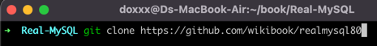

# Real MySQL 8.0

## 책 사용 설명서

### 예제 파일 다운로드

도서 파일을 관리할 디렉터리를 생성합니다.

그 후 위키 북스 [레포지터리](https://github.com/wikibook/realmysql80)를 클론해줍니다.



```bash
디렉터리위치> git clone https://github.com/wikibook/realmysql80
```


잘 다운로드 된 걸 확인할 수 있습니다.

### 예제 데이터 베이스 생성

```bash
mysql -u아이디 -p비밀번호
```


위 명령어를 통하여 mysql을 실행합니다.

```sql
CREATE
DATABASE employees DEFAULT CHARACTER SET utf8mb4 COLLATE utf9mb4_0900_ai_ci;
    
use
employees;
    
source
employees.sql 
```

- MySQL 8.0이 릴리즈 되고난 이후 기본 캐릭터 셋이 latin-1에서 utf8mb4로 변경되었습니다.
  - uft8mb4 : 각 character 는 최대 4 byte 의 UTF-8 인코딩을 지원(이모지와 특수 문자도 문제 없음)
  - 0900 : Unicode 의 collation algorithm 9.0.0 을 지원 (가장 최신의 유니코드 표준).
  - ai : accent insensitivity. 그래서 다음 문자들은같은 문자로 취급함(e, è, é, ê and ë)
  - ci: case insensitivity. 그래서 p 와 P 를 같은 순서로 취급

- source 명령어를 통하여 외부 SQL script file을 실행할 수 있습니다.

## 서문

- NoSQL이 급부상 했던 과거에 비해 현재는 RDBMS는 여전히 중요한 역할을 하고 있다.
- 최근 다양한 프로그래밍 언어에서 ORM 도구를 지원하고있다.
  - ORM : Object Relational Mapping
- 하지만 ORM은 DMBS와의 인터랙션을 블랙박스로 만들어 버리기 때문에, 어떤 쿼리를 실행하는지 알기 어렵다.
- 성능은 곧 비용이기 때문에, ORM을 전적으로 신뢰하지 말고 DBMS에 대한 이해도를 갖춰야한다.

## 1장 소개

## 2장 설치와 설정

### 2.2 MySQL 서버의 시작과 종료

#### 2.2.3 서버 연결 테스트

```bash
mysql -uroot -p --host=localhost --socket=/tmp/mysql.sock
mysql -uroot -p --host=localhost --port=3306
mysql -uroot -p
```

- 여러 가지 형태의 명령행 인자를 넣어 접속을 시도할 수 있다.
- 첫 번째: MySQL 소켓 파일을 이용해 접속
- 두 번째: TCP/IP를 통해 127.0.0.1(로컬 호스트)로 접속
  - 포트를 명시하는 것이 일반적이다.
  - 로컬 서버에 설치된 MySQl이 아니라 원격 호스트에 있는 MySQL 서버에 접속할 때 사용한다.

> MySQL 서버에 접속할 때는 호스트를 localhost로 명시하는 것과 127.0.0.1로 명시하는 것의 의미가 다르다.
>
> `--host=localhost` 옵션을 사용하면 항상 소켓 파일을 통해 접속하게 된다.   
> 이는 `Unix domain socket`을 이용하는 방식으로, TCP/IP를 통한 통신이 아닌 유닉스의 프로세스간 통신(IPC; Inter Process
> Communication)을 이용한다.
>
> 하지만 `127.0.0.1` 을 사용하는 경우에는 자기 서버를 가리키는 루프백(loopback) IP 이기는 하지만 TCP/IP 통신 방법을 이용한다.

- 세 번째: 별도로 호스트 주소와 포트를 명시하지 않는다.
  - 기본값으로 호스트는 localhost가 되며 소켓 파일을 사용하게 된다.
    - 소켓 파일의 위치: MySQL 서버의 설정 파일
  - 유닉스나 리눅스에서 mysql을 실행하는 경우에는 PATH(환경변수)에 등록해둔다.

## 3장 사용자 및 권한

### 3.2 사용자 계정 관리

#### 3.2.2 계정 생성

```sql
CREATE
USER 'user'@'%'
    IDENTIFIED WITH 'mysql_native_password' BY 'password'
    REQUIRE NONE
    PASSWORD EXPIRE INTERVAL 30 DAY
    ACCOUNT UNLOCK
    PASSWORD HISTORY DEFAULT
    PASSWORD REUSE INTERVAL DEFAULT
    PASSWORD REQUIRE CURRENT DEFAULT;
```

- IDENTIFIED WITH
  - 사용자의 인증 방식과 비밀번호를 설정한다.
    - Caching SHA-2 Authentication이 기본이다.
> MySQL 서버의 Caching SHA-2 Pluggable Authentication은 SCRAM(Salted Challenge Response Authentication Mechanism)을 기반으로 한다.
- REQUIRE
  - 암호화된 SSL/TLS 채널을 사용할지 여부를 설정한다.
- PASSWORD EXPIRE
  - 암호의 유효 기간을 설정한다.
- PASSWORD HISTORY
  - 한 번 사용했던 비밀번호를 재사용하지 못하게 설정하는 옵션
  ```sql
  SELECT * FROM mysql.password_history;
  ```
  를 통하여 확인 할 수 있다.
- PASSWORD REUSE INTERVAL
  - 한번 사용했던 비밀번호의 재사용 금지 기간을 설정한다.

### 3.3 비밀번호 관리

최범균님의 TDD로 암호 검사기를 만드는 [영상](https://www.youtube.com/watch?v=6Vt-wKPBbuc)도 맛이 좋다. - 언어 Java

[비밀번호 TDD_레포지터리](https://github.com/doxxx93/test-demo)

### 3.4 권한(Privilege)

- 5.7 버전까지 권한은 Global 권한과 객체 단위의 권한으로 구분 됐다.
  - 글로벌 권한: 데이터베이스나 테이블 이외의 객체에 적용되는 권한
  - 객체 권한: 데이터베이스나 테이블을 제어하는 데 필요한 권한

### 3.5 역할(Role)

- 권한을 묶어서 역할을 사용할 수 있게 됐다.
  ```sql
  CREATE ROLE
      role_emp_read,
      role_emp_write;
  
  GRANT SELECT ON employees.* TO role_emp_read;
  GRANT INSERT, UPDATE, DELETE ON employees.* TO role_emp_write;
  ```
  위와 같이 역할을 생성할 수 있다.
  ```sql
  CREATE USER 'reader'@'127.0.0.1' IDENTIFIED BY 'password';
  CREATE USER 'writer'@'127.0.0.1' IDENTIFIED BY 'password';
  
  GRANT role_emp_read TO 'reader'@'127.0.0.1';
  GRANT role_emp_write TO 'writer'@'127.0.0.1';
  ```
  위와 같이 계정을 생성하고 역할을 부여하면 된다.
- 서버의 역할은 사용자 계정과 거의 같은 모습을 하고 있다.
  - 서버 내부적으로 역할과 계정은 동일한 객체로 취급된다.
