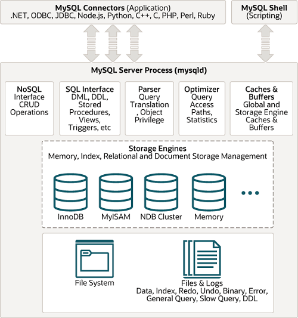
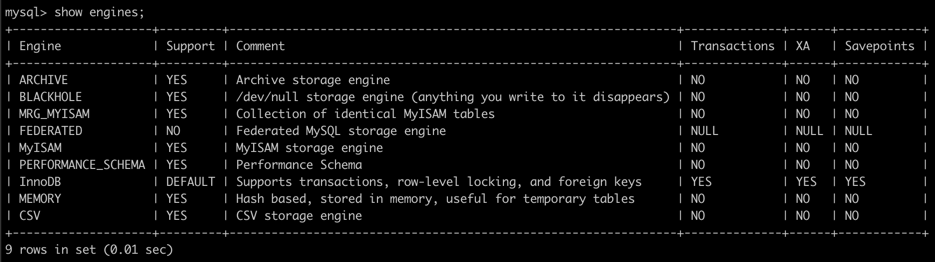
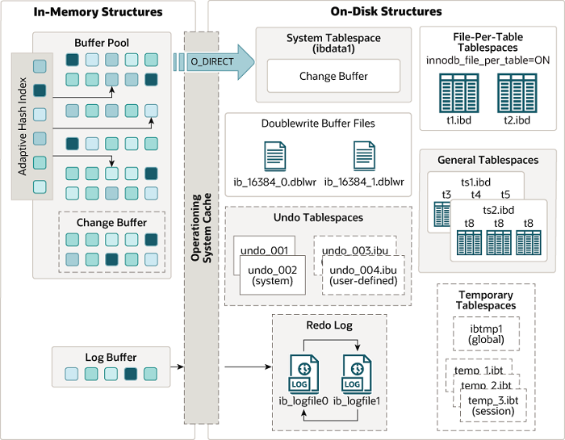
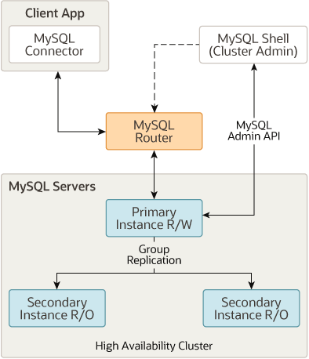
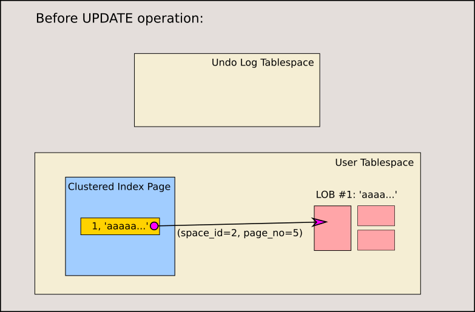
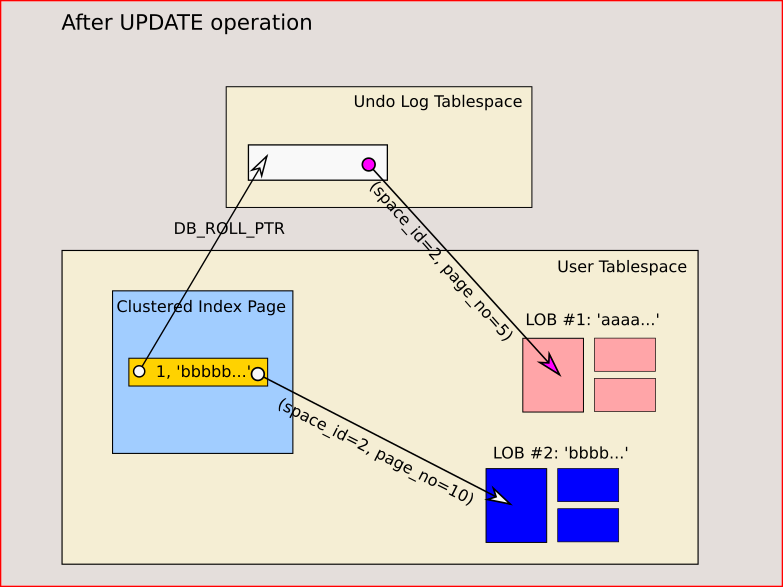
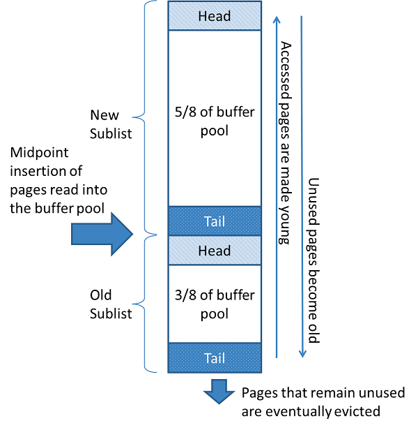

# Real MySQL 8.0

## 4장 아키텍처

InnoDB 스토리지 엔진과 MyISAM 스토리지 엔진을 구분한다.

### 4.1 MySQL 엔진 아키텍처

#### 4.1.1 MySQL의 전체 구조

MySQL 서버는 MySQL엔진과 스토리지 엔진으로 구성된다.



[Overview of MySQL Storage Engine Architecture](https://dev.mysql.com/doc/refman/8.0/en/pluggable-storage-overview.html)
의 그림이다.

- MySQL 엔진
  - 클라이언트로부터의 접속 및 쿼리 요청을 처리하는 커넥션 핸들러
  - SQL파서 및 전처리기, 쿼리의 최적화된 실행을 위한 옵티마이저 등
- 스토리지 엔진
  - 실제 데이터를 디스크 스토리지에 저장하거나 디스크 스토리지로 부터 데이터를 읽어오는 역할
- 핸들러 API
  - 스토리지 엔진에 쓰기 또는 읽기 요청을 핸들러(Handler) 요청이라 하고, 여기서 사용되는 API를 핸들러 API라 한다.

#### 4.1.2 MySQL 스레딩 구조

- MySQL 서버는 프로세스 기반이 아닌 쓰레드 기반으로 작동한다.
  - Foreground, Background 쓰레드로 구성된다.
- 포그라운드 쓰레드(클라이언트 쓰레드)
  - MySQL 서버에 접속한 클라이언트의 수만큼 존재
    - 클라이언트 사용자가 요청하는 쿼리문장을 처리
    - 커넥션이 종료되면 쓰레드 최대 쓰레드 개수에 따라 캐시로 돌아가거나 종료된다.
  - MyISAM 테이블: 디스크 쓰기 작업까지 포그라운드 스레드가 처리
  - InnoDB 테이블: 데이터 버퍼나 캐시까찌만 포그라운드 스레드가 처리, 버퍼<->디스크는 백그라운드 스레드가 처리
  - 각 클라이언트 사용자가 요청하는 쿼리문장을 처리한다.
- 백그라운드 쓰레드

#### 4.1.3 메모리 할당 및 사용 구조

- 글로벌 메모리 영역
  - 하나의 메모리 공간만 할당된다.
  - 모든 쓰레드에 의해 공유된다.
  - 테이블 캐시, InnoDB 버퍼 풀, InnoDB 어댑티브 해시 인덱스, InnoDB 리두 로그 버퍼
- 로컬 메모리 영역(세션 메모리 영역)
  - 클라이언트 쓰레드가 사용하는 메모리 공간
  - 공유되어 사용되지 않는다.
  - 정렬 버퍼, 조인 버퍼, 바이너리 로그 캐시, 네트워크 버퍼

#### 4.1.4 플러그인 스토리지 엔진 모델

- 쿼리가 실행되는 과정은 대부분 MySQL엔진에서 처리되고, 마지막 '데이터 읽기/쓰기' 작업만 스토리지 엔진에 의해 처리된다.
- 핸들러
  - 어떤 기능을 호출하기위해 사용하는 객체
  - MySQL 엔진이 스토리지 엔진을 조정하기 위해 핸들러를 사용한다.
    > MySQL 엔진이 각 스토리지 엔진에게 데이터를 읽어오거나 저장하도록 명령하려면 반드시 핸들러를 통해야 한다

> 하나의 쿼리 작업은 여러 하위 작업으로 나뉘는데,
> 각 하위 작업이 MySQL 엔진영역에서 처리되는지 아니면 스토리지 엔진 영역에서 처리되는지 구분할 줄 알아야 한다.

- MySQL 서버에서 지원되는 스토리지 엔진
  

- **플러그인 아키텍처의 문제점**
  - 플러그인끼리 서로 통신할 수 없다.
  - 캡슐화 되지 않는다.
  - 플러그인 간의 상호 의존 관계를 설정할 수 없어서 초기화가 어렵다.

#### 4.1.5 컴포넌트

> 위의 플러그인의 문제점을 극복하도록 MySQL 8.0 에서 새롭게 도입된 아키텍처이다.
> - 플러그인은 MySQL 서버와 인터페이스 할 수 있고, 플러그인끼리는 통신할 수 없음
> - 플러그인은 MySQL 서버의 변수나 함수를 직접 호출하기 때문에 안전하지 않음(캡슐화 안됨)
> - 플러그인은 상호 의존 관계를 설정할 수 없어서 초기화 어려움

- 사용자에게는 플러그인과 컴포넌트는 동일하게 보인다.

#### 4.1.6 쿼리 실행 구조

- 쿼리파서
  - 기본 문법 오류 처리
- 전처리기
  - 구조 적인 문제점 확인, 존재하지 않거나, 권한상 사용할 수 없는 개체의 토큰 필터
- 옵티마이저
- 실행 엔진
- 핸들러(스토리지 엔진)

#### 4.1.7 복제

- Replication(16장에서 다룸)

#### 4.1.8 쿼리 캐시

- SQL의 실행 결과를 메모리에 캐시
- 삭제 됨

#### 4.1.9 스레드 풀

- Percona Server에서 제공하는 쓰레드 풀
  - 플러그인 형태로 구현
  - 보통, CPU 코어의 개수만큼 쓰레드 그룹을 생성한다

#### 4.1.10 트랜잭션 지원 메타데이터

- 테이블의 구조 정보나 스토어드 프로그램의 코드 관련 정보를 InnoDB에 저장하도록 개선 됐다.

### 4.2 InnoDB 스토리지 엔진 아키텍처



InnoDB는 거의 유일하게 레코드 기반 락을 제공한다.

#### 4.2.1 프라이머리 키에 의한 클러스터링



[참고](https://dev.mysql.com/doc/refman/8.0/en/mysql-innodb-cluster-introduction.html)

[참고2](https://dev.mysql.com/blog-archive/mysql-innodb-cluster-8-0-a-hands-on-tutorial/)

#### 4.2.2 외래 키 지원

> InnoDB 스토리지 엔진 레벨에서 지원하는 기능
> 실제 사용해 봄 - 테스트 데이터 설정, 삭제할 때 종종 써봤는데 유용한 거 같음

```sql
SET
foreign_key_checks=OFF;
SET
foreign_key_checks=ON;
```

#### 4.2.3 MVCC(Multi-Version Concurrency Control)

[참고](https://dev.mysql.com/blog-archive/mysql-8-0-mvcc-of-large-objects-in-innodb/)





#### 4.2.4 잠금 없는 일관된 읽기(Non-Locking Consistent Read)

- InnoDB 스토리지 엔진은 MVCC 기술을 이용해 잠금을 걸지 않고 읽기 작업을 수행한다.
- 변경되기 전의 데이터를 읽기 위해 언두 로그를 사용한다.

#### 4.2.5 자동 데드락 감지

- 언두 로그 레코드를 더 적게 가진 트랜잭션이 롤백의 대상이 된다.

#### 4.2.6 자동화된 장애 복구

- `innodb_force_recovery` 시스템 변수의 내용을 확인하여 진행한다.

#### 4.2.7 InnoDB 버퍼 풀

- InnoDB 스토리지 엔진의 핵심 부분
  - 디스크의 데이터 파일이나 인덱스 정보를 메모리에 캐시해 두는 공간.
  - 쓰기 작업을 지연하는 버퍼 역할도 같이 한다.

- 버퍼 풀의 크기 설정
  - InnoDBV 버퍼 풀은 세마포어로 인해 락(잠금) 레이스 컨디션(경합)을 많이 유발했다.
- 버퍼 풀의 구조
  - LRU(Least Recently Used) 리스트
    - 
    - InnoDB 버퍼풀에 최대한 오래 캐시하여, 디스크 읽기를 최소화 하는 것이 목적이다.
    > 더블 링크드 리스트 형태 + Map 을 활용하여 읽기, 쓰기의 속도 향상
  - 플러시(Flush) 리스트
    - 디스크로 동기화되지 않은 데이터를 가진 데이터 페이지(더티 페이지)의 변경 시점 기준의 페이지 목록
  - 프리(Free) 리스트
    - 버퍼 풀에서 실제 사용자 데이터로 채워지지 않은 비어 있는 페이지들의 목록
    - 쿼리가 새롭게 디스크의 데이터 페이지를 읽어와야 하는 경우 사용

- 버퍼 풀과 리두 로그
  - InnoDB 버퍼 풀은 데이터 베이스 서버의 성능 향상을 위해 데이터 캐시와 쓰기 버퍼링 이라는 두가지 용도가 있다.
    - 버퍼 풀의 메모리 공간을 늘리는 것은 데이터 캐시 기능만 향상시킨다.

> 여긴 진짜 이해를 못하겠습니다 ㅠ

#### 4.2.8 Double Write Buffer

- 더티 페이지를 디스크 파일로 플러시할 때 일부만 기록되는 현상을 파셜 페이지 또는 톤 페이지(torn-page)라고 한다.
- InnoDB는 이러한 문제를 Double-Write 기법으로 해결한다.
  - 더티 페이지를 묶어서 DoubleWrite 버퍼에 기록해놓고, 실제 데이터 파일의 쓰기가 중간에 실패할 때 사용된다.
  - 이 기능을 사용할지 여부는 innodb_doublewrite 시스템 변수로 제어할 수 있다.

#### 4.2.9 언두 로그

- InnoDB 스토리지 엔진은 트랜잭션과 격리 수준을 보장하기 위해 DML 변경 이전 버전의 데이터를 백업한다.
  - 트랜잭션 보장
    - 롤백 대비
  - 격리 수준 보장
    - 트랜잭션 격리 수준 유지와 높은 동시성 제공

#### 4.2.10 체인지 버퍼

- InnoDB는 변경해야 할 인덱스 페이지가 버퍼 풀에 있으면 바로 업데이트를 수행한다.
- 디스크로부터 읽어와서 업데이트해야 한다면, 임시 공간에 저장해 두고 사용자에게 결과를 반환하는 형태로 성능을 향상

#### 4.2.11 리두 로그 및 로그 버퍼

- 리두 로그는 MySQL 서버가 비정상적으로 종료됐을 경우 데이터 파일에 기록되지 못한 데이터를 잃지 않게 해주는 안전 장치이다.
  - 따라서 ACID 중 D에 해당하는 영속성과 가장 밀접한 관계가 있다.

> ACID는 데이터베이스에서 트랜잭션의 무결성을 보장하기 위해 꼭 필요한 4가지 요소
> - 'A' : 원자성(Atomicity)
> - 'C' : 일관성(Consistency)
> - 'I' : 격리성(Isolation)
> - 'D' : 지속성(Durability)
>
> 일관성과 격리성은 서로 다른 두 개의 트랜잭션에서 동일 데이터를 조회하고 변경하는 경우에도 상호 간섭이 없어야 함을 의미한다.

- 리두 로그 아카이빙
  - 데이터 파일에 기록되지 못한 트랜잭션을 복구하기 위해 활성화 되어있다.

#### 4.2.12 어댑티브 해시 인덱스

- InnoDB 스토리지 엔진에서 사용자가 요청하는 데이터에 대해 자동으로 생성하는 인덱스이다.
  - [참고글: MySQL InnoDB의 Adaptive Hash Index 활용](https://tech.kakao.com/2016/04/07/innodb-adaptive-hash-index/)

#### 4.2.13 InnoDB와 MyISAM, MEMORY 스토리지 엔진 비교

> InnoDB 짱짱맨
