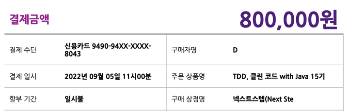
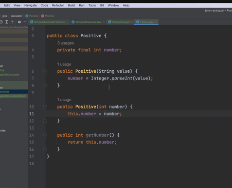
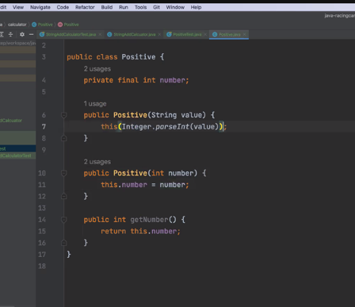
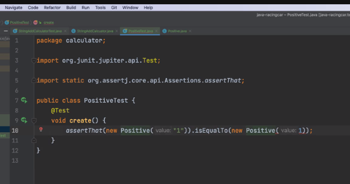

# TDD, 클린코드 with Java

개설과 동시에 결제를 해버린 모습이다.

사실 요새 정말 많은 부담감으로 이도 저도 제대로 하지 못하는 상황이라 고민을 많이 했다.

과정은 9월 19일부터 11월 17일까지 약 8.5주간 진행된다.

13일, 과정을 잘 소화하기 위해서는 하루 약 2~3시간씩을 투자해야된다는 내용의 사전 메일을 받았다.

또한 온라인 과정이라 Git 사용법을 미리 익혀두고 올 것을 권장하는 내용이었다.

19일, 교육 시작 안내 메일을 받았다.

슬랙 채널에 초대되었고, 개발환경 세팅 및 1단계 리뷰 요청을 22일 수업 전까지 마치라는 내용이다.

## NextStep 온라인 코드리뷰 1단계

다른 분들의 질문 사항

- 테스트 메소드명에서는 어디까지 표현해야할 지 여쭤보고 싶습니다. 어떤 규칙을 가지고 일관되게 메소드명을 짜고 추가적인 내용은 `@DisplayName`을 쓰는게 나은지 아니면 최대한 메소드명에 테스트의 역할을
  표현하는게 나은지 고민됩니다.
- 개인적인 의견을 드려보자면, 단위 테스트를 작성하는 경우는 대개 하나의 메서드를 테스트하는 경우가 많기 때문에
  테스트 메서드의 이름은 실제 테스트할 프로덕션 코드의 메서드 이름과 동일하게 짓는 편이고,
  @DisplayName을 통해 테스트의 의도를 최대한 명확히 드러내려고 하는 편입니다.
  아무래도 @DisplayName을 활용하는 것이 동료 개발자분들이 파악하기도 쉽지 않을까 생각해요.

# 1회차 라이브 강의

## TDD에 집착하는 이유

### TDD란?

- TDD란 프로그래밍 의사결정과 피드백 사이의 간극을 의식하고 이를 제어하는 기술이다.

- TDD의 아이러니 중 하나는 테스트 기술이 아니라는 점이다. TDD는 분석 기술이며, 설계 기술이기도 하다.

java regex? 는 무엇?

###
input은 뭐고
output은 뭔지 정의가 중요하다

wrapping의 장점:  

equals와 hashcode를 자연스럽게 써야 한다.

1. 요구 사항 분리
2. TODO 리스트를 만든다
3. 한가지를 TDD 한 서클을 돌린다.
4. Commit 한다.

불변 객체 가변 객체

가변 객체 -> 객체를 적게 생성
불변 객체 -> 버그 발생은 적어지지만 성능이 떨어질 수 있다.
